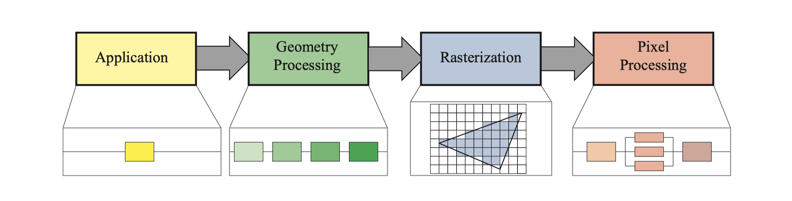
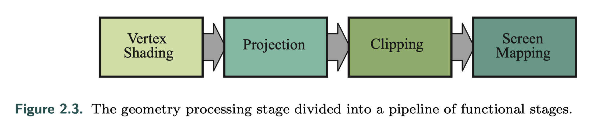
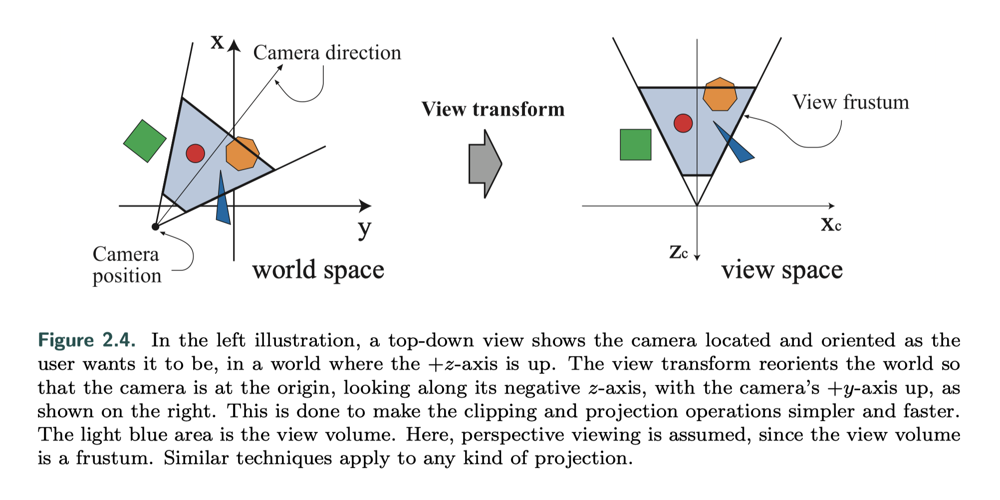
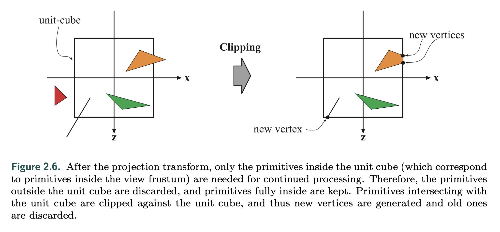
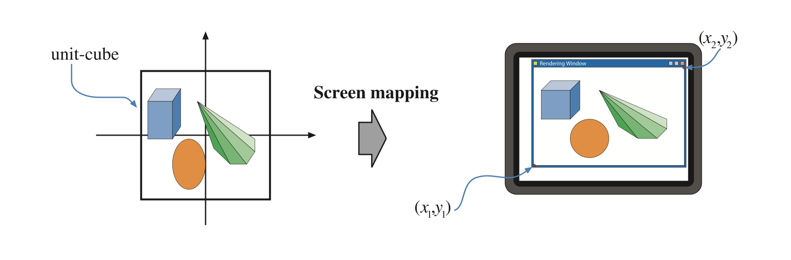
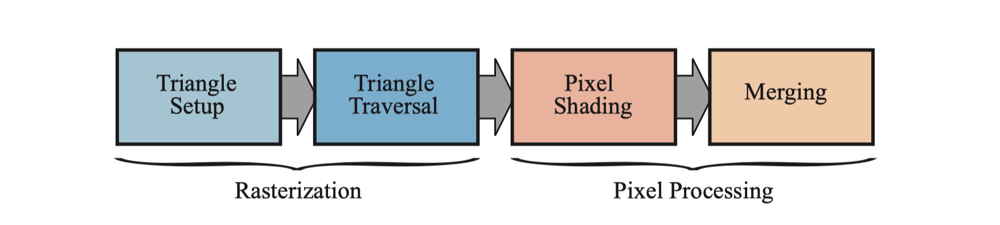

 

这是《Real-time Rendering》的笔记系列第二章。

图形渲染管线的功能可以概括为给定摄像机、三维物体以及光源，渲染出二维的图像。

*The **main function** of the pipeline is to generate, or render, a two-dimensional image, given a virtual camera, three-dimensional objects, light sources, and more.

 

## 1. Architecture 架构 

实时渲染管线可以大致分为四个阶段：应用阶段、几何阶段、光栅化和像素处理。

*A coarse division of the real-time rendering pipeline into four main stages—**application**, **geometry processing**, **rasterization**, and **pixel processing**.

最慢的管线阶段决定渲染速度，渲染速度用FPS（Frames Per Second）或者Hz来表示。

 

 

## 2. The Application Stage 应用阶段 

应用阶段通常在CPU上运行，不能像几何和光栅化阶段那样继续分为若干个子阶段，但几个并行处理器使得CPU可以高效处理这个阶段的任务，称为Superscalar结构。

由于是软件方式实现，开发者对这个阶段可以进行完全控制。有些应用也可以在GPU上计算，这种模式将GPU视为高度并行的通用处理器，而忽略了专门用于渲染图形的特殊功能。

CPU可以处理碰撞检测、加速算法、输入检测，动画，力反馈以及纹理动画，变换仿真、几何变形；以及一些不在其他阶段执行的计算，如层次视锥裁剪等加速算法。

应用阶段的主要任务是，在阶段末端将需要在屏幕上绘制的几何体，也称为绘制图元（Rendering primitives，如点、线、矩形等），输入到几何阶段。

 

 

## 3. Geometry Processing 几何处理 

几何阶段主要负责大部分的逐三角形操作和逐顶点操作，可分为四个阶段：顶点着色、投影、裁剪、屏幕映射。

 

### 3.1 Vertex Shading 顶点着色

这里有两个主要任务：计算顶点的位置，以及评估需要的顶点输出数据比如法线和纹理坐标，顶点着色器可以满足这一需求。

首先需要将物体从模型空间转换到世界空间，并作摄像机变换。之前的blog：[View Transformation 基础视图变换 - Friedsoda]([https://friedsoda.github.io/2020-07/view](https://friedsoda.github.io/2020-07/view))有解释过，这里就不再重复写了，好困。

决定物体的形状和位置之后，还需要对物体的外观进行建模，也就是使用法线、光照、材质等信息进行着色。 *This operation of determining the effect of a light on a material is known as shading. It involves computing a shading equation at various points on the object.

可以在每个顶点处存储各种数据，如位置、法线、颜色或计算着色方程所需的其它信息。顶点着色的结果（颜色、向量、纹理坐标等）计算完成后，会被发送到光栅化阶段以进行插值操作。

 

### 3.2 Optional Vertex Processing 可选的顶点操作

每个管道都有刚刚描述的顶点处理。完成此处理后，GPU上可以按照以下顺序进行几个可选阶段：细分（Tessellation），几何体着色（Geometry Shading）和流输出（Stream Output）。使用取决于硬件功能（并非所有GPU都具有）以及开发需求。它们彼此独立，并且通常不常用，第三章会有详细说明。

**细分**：生成具有适当数量的三角形的曲面，避免距离带来的效果失真。细分阶段本身包含一系列阶段，将这些顶点集转换为（通常）更大的顶点集并创建新的三角形集，可以用相对摄像机距离确定生成的三角形数。

**几何体着色**：就像细分阶段一样，可以利用图元来产生新的顶点。这是一个非常简单的阶段，因为此创建的范围受到限制，输出基元的类型也受限制。它有多种用途，最流行的一种是粒子生成。

**流输出**：将GPU用作几何引擎，输出到数组以进行进一步处理，而不是将处理后的顶点向下发送到要渲染到屏幕的其余管道中。这些数据可以在以后的过程中由CPU或GPU本身使用，通常用于粒子模拟。

 

### 3.3 Clipping 裁剪

当图元完全或部分位于视体（View volume）内部，才需要把它传递到下一个阶段光栅化，裁剪阶段对图元进行分情况处理：

- 完全位于视体内部：进入光栅化阶段
- 完全位于视体外部：丢弃
- 部分位于视体内部：进行裁剪处理

裁剪过程如下图：

Unit-cube之外的部分被裁减掉，生成新顶点，并丢弃原先的顶点。

 

### 3.4 Screen Mapping 屏幕映射

到这一阶段时，顶点坐标仍然是三维的。每个顶点的x、y坐标被转换到屏幕坐标系中，z坐标和屏幕坐标统称为窗口坐标系。

x和y坐标通过平移和缩放来映射到屏幕坐标：

 

 

## 4. Rasterization 光栅化 

给定经过变换和投影后的顶点，即屏幕空间中的二维顶点以及它们的深度值和着色数据（来自几何阶段），通过扫描判断像素是否在图元内，来转换为屏幕上的像素信息，称为**光栅化（rasterization）**，或者扫描转换（Scan conversion）。它可以分为两个子阶段：三角形设定以及三角形遍历，如下图。

 

### 4.1 Triangle Setup 三角形设定

这个阶段计算三角形的微分、边缘方程以及其他信息。这些数据可用于三角形遍历，以及用于插值由几何图形阶段产生的各种着色数据。 该阶段使用固定功能的硬件。

 

### 4.2 Triangle Traversal 三角形遍历

对逐个像素点检查它是否被三角形覆盖，并在重合的部分生成**片元（fragment）。**寻找哪些采样点或者像素在三角形内的过程叫做三角形遍历。

每个片元的属性是由三角形顶点的信息插值而来的，包括深度值和着色数据。这些信息被发送到下一个阶段：像素处理。

 

 

## 5. Pixel Processing 像素处理

像素处理对图元内部的像素（或样本）执行逐个计算和操作。参考光栅化部分的图片，像素处理也分为两个子阶段：像素着色以及融合。

 

### 5.1 Pixel Shading 像素着色

该阶段的输出结果是像素点上的颜色信息。这里使用可编程GPU内核执行，即众所周知的片元着色器（Fragment Shader）进行计算，这一阶段可以包含多种技术，最重要的是**纹理操作。**

 

### 5.2 Merging 融合

像素的颜色信息存储在**颜色缓冲（color buffer）**里，颜色缓冲是颜色的矩形阵列，包含了RGB分量。融合阶段的任务是把像素着色产生的颜色信息与颜色缓冲区里的相结合，这个阶段也称为ROP，standing for “raster operations (pipeline)” or “render output unit,” depending on who you ask（不知道这应该咋翻译ahahahaha）。

与着色阶段不同，融合阶段不是完全可编程的，但它可以高度可配置的，用于实现各种效果。

这个阶段也用于解决可见性的问题。对大多数甚至说是所有的图形硬件，都是用**深度缓冲（z-buffer）**来实现的。但z-buffer只存储一个深度值，不能用于部分透明的图元，需要遵循一定顺序才能处理透明效果，详见第五章关于透明物体处理的叙述。

**模板缓冲（stencil buffer）**是一个屏幕缓冲区，记录渲染图元的位置。通常每像素8bit。通过控制模板缓冲里的数据写进颜色缓冲和深度缓冲，来达到一些想要的效果，比如透明度或颜色样本累积。混合通常可以使用API配置，但不能完全编程。但是某些API支持栅格顺序视图，也称为像素着色器顺序，可启用可编程混合功能。