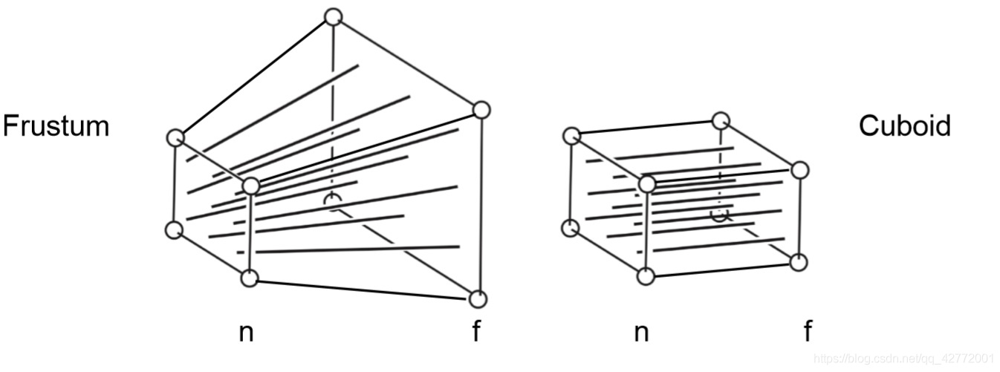

 

将虚拟世界中具有三维坐标的物体(x, y, z)变换到以二维的像素位置(x, y)来表示的屏幕坐标系之中：

1. **模型变换 (modeling tranformation)**
将场景中的物体调整至坐标所在位置

2. **摄像机变换 (camera tranformation)**
得到物体与摄像机的相对位置

3. **投影变换 (projection tranformation)**
便是根据平行投影或透视投影将三维空间投影至标准二维平面$[-1,1]^2$之上

4. **视口变换 (viewport transformation)**
将标准平面$[-1,1]^2$映射到屏幕分辨率范围$[0,width]*[0,height]$之内

 

 

## 1. Modeling tranformation 模型变换

利用基础的变换矩阵将世界当中的物体调整至我们想要的地方

- 基础变换/仿射变换 = 线性变换 + 平移

- 线性变换 = 旋转 + 缩放 + 切变

 
 

## 2. Camera tranformation 摄像机变换

把摄像机的坐标轴（假设为u,v,w分别对应原世界空间中的x,y,z）移动到标准的x,y,z轴

定义以下几个变量：
相机或眼睛位置 (eye postion)：$\boldsymbol{e}$
观察方向 (gaze postion)：$\boldsymbol{g}$
视点正上方向 (view-up vector)： $\boldsymbol{t}$

摄像机坐标系定义如下：

$$
\boldsymbol{w}=-\frac{\boldsymbol{g}}{\|\boldsymbol{g}\|} ,   \boldsymbol{u}=\frac{\boldsymbol{t} \times \boldsymbol{w}}{\| \boldsymbol{t} \times  \boldsymbol{w}\|} ,   \boldsymbol{v}= \boldsymbol{w} \times  \boldsymbol{u}
$$

将摄像机坐标移动到原坐标系：

$$
M_{cam} = \begin{bmatrix}
    \boldsymbol{u} &  \boldsymbol{v} &  \boldsymbol{w} &  \boldsymbol{e} \\
   0 & 0 & 0 & 1 
\end{bmatrix} ^ {-1}
$$

 
 

## 3. Projection tranformation 投影变换

### 3.1 Orthographic projection 正交投影

正交投影将将物体转换到一个$[-1,1]^2$的正方体中。

 

首先定义：

$$
\begin{aligned}
&x=l\equiv left \ plane \\
&x=r\equiv right \ plane \\
&y=b\equiv bottom \ plane \\
&y=t\equiv top \ plane \\
&z=n\equiv near \ plane \\
&z=f\equiv far \ plane 
\end{aligned}
$$

空间转换分为三个步骤，

1. 将原空间范围的左下角移至原点
2. 缩放给定倍数
3. 将缩放后的空间范围移至新空间范围

以二维转换为例：

 

可以得到变换矩阵：

$$
\begin{aligned}
window&=translate(x_l',y_l')\ scale(\frac{x_h'-x_l'}{x_h-x_l},\frac{y_h'-y_l'}{y_h-y_l}) \ translate(-x_l,-y_l) \\
&=\begin{bmatrix} 1 & 0 & x_l'  \\ 0 & 1 & y_l'  \\ 0 & 0 & 1 \end{bmatrix}
\begin{bmatrix} \frac{x_h'-x_l'}{x_h-x_l} & 0 & 0  \\ 0 & \frac{y_h'-y_l'}{y_h-y_l} & 0  \\ 0 & 0 & 0 \end{bmatrix} 
\begin{bmatrix} 1 & 0 & -x_l  \\ 0 & 1 & -y_l  \\ 0 & 0 & 1 \end{bmatrix} \\
&=\begin{bmatrix} \frac{x_h'-x_l'}{x_h-x_l} & 0 & \frac{x_l'x_h-x_h'x_l}{x_h-x_l}   \\ 
0 & \frac{y_h'-y_l'}{y_h-y_l} & \frac{y_l'y_h-y_h'y_l}{y_h-y_l}  \\ 
0 & 0 & 1 \end{bmatrix} 
\end{aligned}
$$

推广到三维：

$$
\begin{bmatrix} 
\frac{x_h'-x_l'}{x_h-x_l} & 0 & 0 & \frac{x_l'x_h-x_h'x_l}{x_h-x_l}   \\ 
0 & \frac{y_h'-y_l'}{y_h-y_l} & 0 & \frac{y_l'y_h-y_h'y_l}{y_h-y_l}  \\ 
0 & 0 & \frac{z_h'-z_l'}{z_h-z_l} & \frac{z_l'z_h-z_h'z_l}{z_h-z_l}  \\ 
0 & 0 & 0 &1 \end{bmatrix} \\
$$

代入数据，可得到正交投影矩阵$M_{orth}$如下：

$$
M_{orth}=\begin{bmatrix} 
\frac{2}{r-l} & 0 & 0 & -\frac{r+l}{r-l}   \\ 
0 & \frac{2}{t-b} & 0 & -\frac{t+b}{t-b}  \\ 
0 & 0 & \frac{2}{n-f} & -\frac{n+f}{n-f} \\ 
0 & 0 & 0 &1 \end{bmatrix} \\
$$

 

### 3.2 Perspective Projection 透视投影

可以看作是先从透视转换到正交，即先把左边的frustum压缩成右边的cuboid形状，再应用正交投影中的$M_{orth}$矩阵：

 

可以用相似三角形来解释： 

 

参考这篇对投影矩阵的解释：

[OpenGL Projection Matrix](http://www.songho.ca/opengl/gl_projectionmatrix.html)

得到的初步变换矩阵：

$$
\begin{aligned}
M_{persp→ortho}=\begin{bmatrix} 
n & 0 & 0 & 0 \\ 
0 & n & 0 & 0 \\ 
0 & 0 & n+f & -fn \\ 
0 & 0 & 1 & 0 \end{bmatrix}
\end{aligned}
$$

将它与正交投影矩阵相乘，可以得到透视投影矩阵：

$$
\begin{aligned}
M_{per}&=M_{ortho}M_{persp→ortho} \\
&=\begin{bmatrix} 
\frac{2n}{r-l} & 0 & \frac{l+r}{l-r} & 0 \\ 
0 & \frac{2n}{t-b} & \frac{b+t}{b-t} & 0 \\ 
0 & 0 & \frac{f+n}{n-f} & \frac{2fn}{f-n} \\ 
0 & 0 & 1 & 0 \end{bmatrix}
\end{aligned}
$$

 
 

## 4. Viewport tranformation 视口变换

把标准立方体$[-1,1]^2$转换到屏幕空间$[0,width]*[0,height]$上：

$$
M_{viewport}=\begin{bmatrix} 
\frac{width}{2} & 0 & 0 & \frac{width}{2} \\ 
0 & \frac{height}{2} & 0 & \frac{height}{2} \\ 
0 & 0 & 1 & 0 \\ 
0 & 0 & 0 &1 \end{bmatrix} \\
$$

 
 

## 5. Summary 总结

把四个变换总结起来得到最后的变换：

$$
M=M_{view}M_{per}M_{cam}M_{model}
$$

