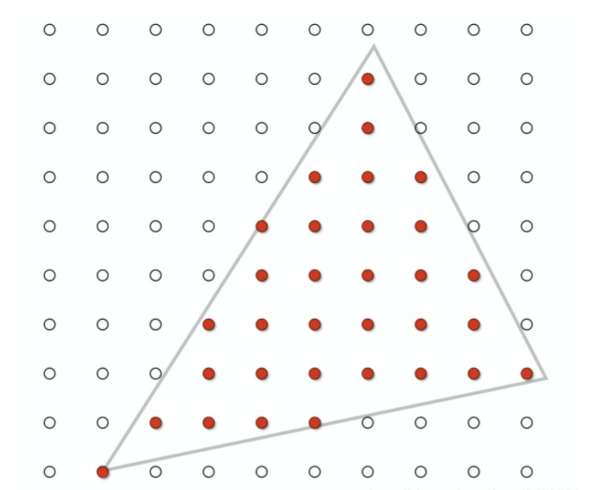
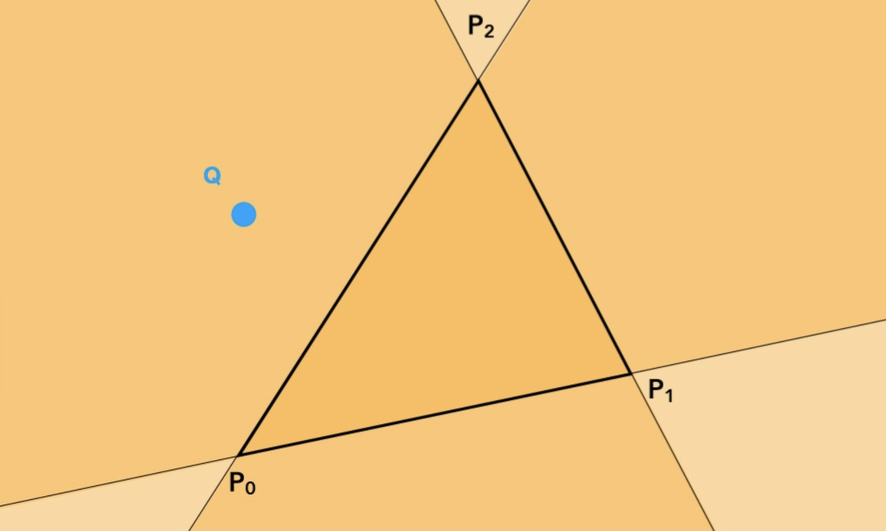
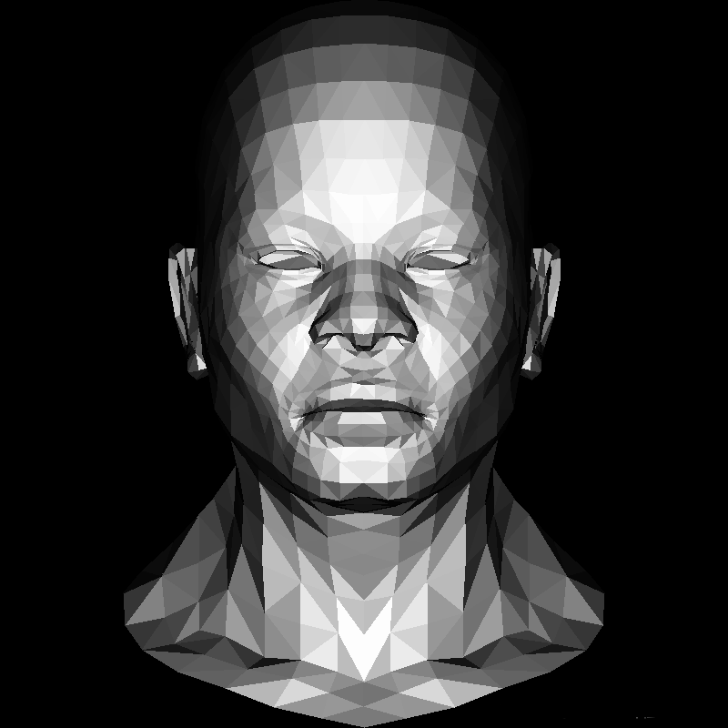
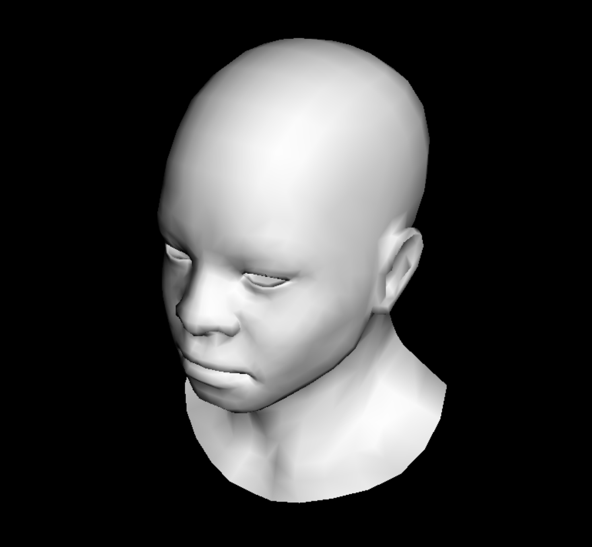
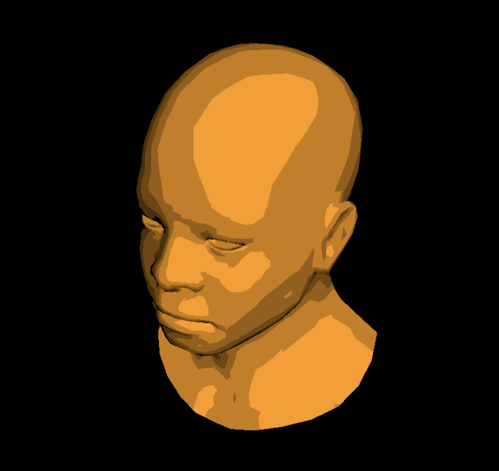
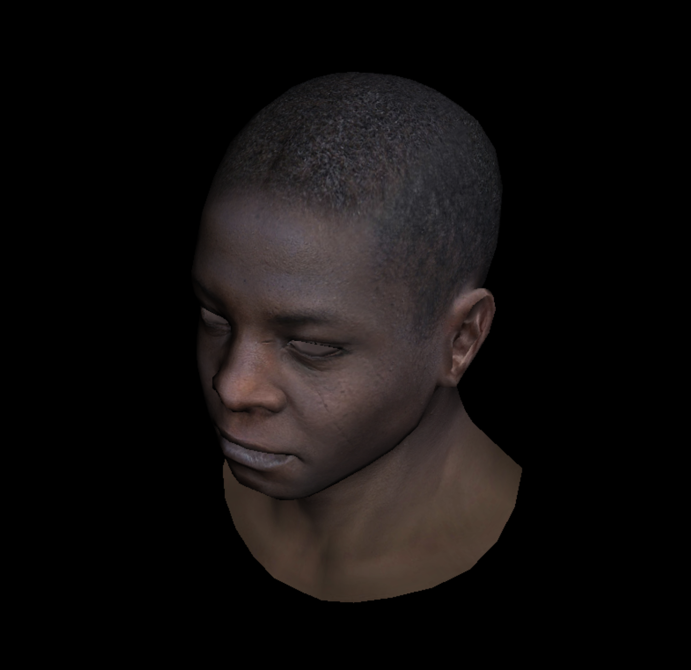
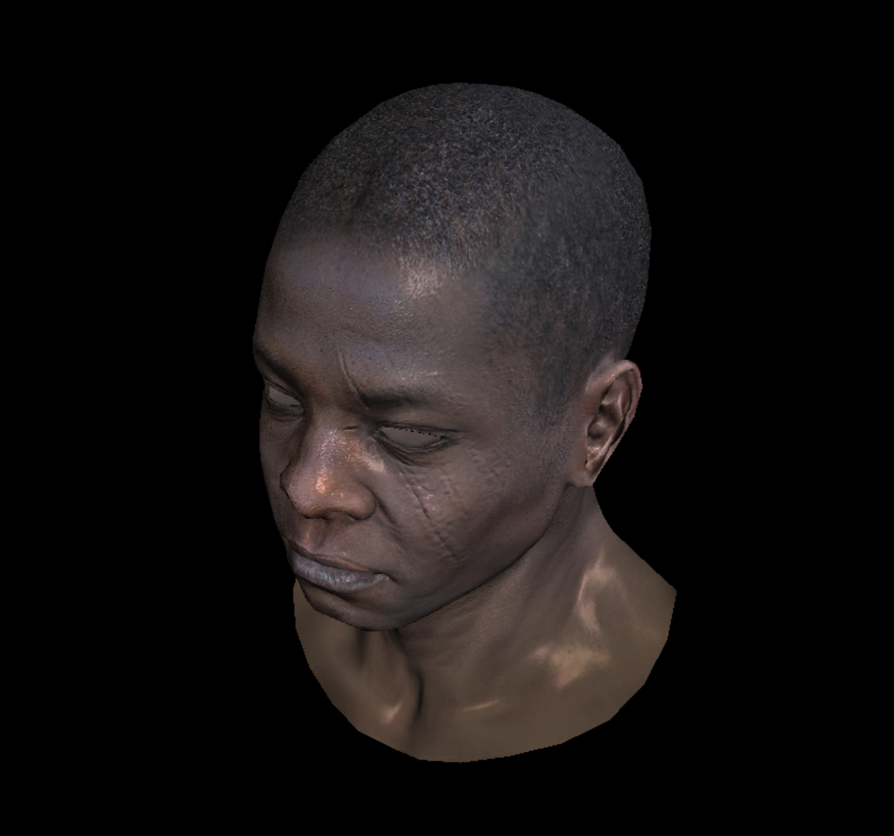

<br/>

## 摘要

用C++写一个简陋的光栅化渲染器。

Github地址：[Friedsoda/MyRenderer: A tiny renderer in C++](https://github.com/Friedsoda/MyRenderer)


<br/>
<br/>


## 三角形光栅化





遍历Bounding box内的每一个像素，判断其是否在三角形内，如果是则绘制这个像素。





这里利用叉乘的性质，计算$ c = \sqrt{a^{2}+b_{xy}^{2}+e^{x}} $，$P_1P_2\times P_1Q $，$P_2P_0\times P_2Q$，如果三者同号则P在三条线段的同一边，即处于三角形内部，如果不同号则在三角形外部。

<br/>
<br/>

## 背面剔除
对一个读入的模型，逐个三角形计算顶点在屏幕上的坐标，进行光栅化。


```c
for (int i = 0; i < model -> nfaces(); i++) { 
    std::vector<int> face = model->face(i); 
    Vec2i screen_coords[3]; 
    Vec3f world_coords[3]; 
    for (int j = 0; j < 3; j++) { 
        Vec3f v = model->vert(face[j]); 
        screen_coords[j] = Vec2i((v.x + 1.) * width/2., (v.y + 1.) * height/2.); 
        world_coords[j]  = v; 
    } 
    Vec3f n = (world_coords[2] - world_coords[0]) ^ (world_coords[1] - world_coords[0]); 
    n.normalize(); 
    // dot product < 0 the light comes from behind
    float intensity = n * light_dir; 
    if (intensity > 0) { 
        triangle(screen_coords[0], screen_coords[1], screen_coords[2], image, TGAColor(intensity * 255, intensity * 255, intensity * 255, 255)); 
    } 
}
```

计算法线n，用法线和光源方向进行点乘，如果结果为负，说明光从该三角形面的背后照射，即这个三角形面位于背面，不需要进行渲染，所以只取法线大于0的三角形进行光栅化。

<br/>
<br/>


## 深度测试 z-buffer 

Z-Buffer算法为每个像素点维持一个深度数组记为zbuffer，初始值置为无穷大（即离摄像机无穷远），随后遍历每个三角形面上的每一个像素点，如果该像素点的深度值z小于zbuffer中的值，则更新zbuffer值为该点深度值z，并同时更新该像素点颜色为该点颜色。

添加了z-buffer后的光栅化算法：

```c
void triangle(Vec3f *pts, float *zbuffer, TGAImage &image, TGAColor color) {
    // bounding box
    Vec2f bboxmin( std::numeric_limits<float>::max(),  std::numeric_limits<float>::max());
    Vec2f bboxmax(-std::numeric_limits<float>::max(), -std::numeric_limits<float>::max());
    Vec2f clamp(image.get_width() - 1, image.get_height() - 1);
    for (int i = 0; i < 3; i++) {
        for (int j = 0; j < 2; j++) {
            bboxmin[j] = std::max(0.f,      std::min(bboxmin[j], pts[i][j]));
            bboxmax[j] = std::min(clamp[j], std::max(bboxmax[j], pts[i][j]));
        }
    }
    
    Vec3f P;
    for (P.x = bboxmin.x; P.x <= bboxmax.x; P.x++) {
        for (P.y = bboxmin.y; P.y <= bboxmax.y; P.y++) {
            Vec3f bc_screen  = barycentric(pts[0], pts[1], pts[2], P);
            if (bc_screen.x < 0 || bc_screen.y < 0 || bc_screen.z < 0) continue;
            P.z = 0;
            for (int i = 0; i < 3; i++)
                P.z += pts[i][2] * bc_screen[i];
            // Compare to z-buffer value, if P.z > z-buffer, then draw it
            if (zbuffer[int(P.x + P.y * width)] < P.z) {
                zbuffer[int(P.x + P.y * width)] = P.z;
                image.set(P.x, P.y, color);
            }
        }
    }
}
```

应用z-buffer的效果：




<br/>
<br/>

## 视图变换与着色器


之前的模型都是以正交投影展示，为了模拟真实视觉，更多采用透视投影。添加视图变换功能以及摄像机移动的功能，可以从不同角度渲染模型。首先在render.cpp中定义Ishader类，包含了顶点着色器和片元着色器的功能。


```c
struct IShader {
    virtual ~IShader();
    virtual Vec4f vertex(int iface, int n) = 0;
    virtual bool fragment(Vec3f bar, TGAColor &color) = 0;
};
```


这里用Gouraud Shading方法：用每个面的法线向量插值得到所有点的法线向量。对于每个顶点，将所有共享这个点的面的法线向量相加求均值。接着再用重心坐标插值，得到每一个像素的颜色。

在顶点着色器中，通过摄像机、投影、视口变换来得到屏幕上的顶点坐标，用法线与光源来计算intensity值，传到片元着色器中，片元着色器通过插值得到所有像素的颜色。片元着色器的返回值是bool（要不要取消绘制这个像素，默认值为false）。


```c
struct GouraudShader : public IShader {
    Vec3f varying_intensity;

    virtual Vec4f vertex(int iface, int n) {
        Vec4f gl_Vertex = embed<4>(model->vert(iface, n)); // read vertex
        gl_Vertex = Viewport * Projection * ModelView * gl_Vertex; // transform
        varying_intensity[n] = std::max(0.f, model->normal(iface, n) * light_dir); // get diffuse lighting intensity
        return gl_Vertex;
    }

    virtual bool fragment(Vec3f bar, TGAColor &color) {
        float intensity = varying_intensity * bar; // interpolate intensity
        color = TGAColor(255, 255, 255) * intensity;
        return false;
    }
};
```

使用方法是对每一个三角形面，逐个顶点调用顶点着色器，接着再把着色器的输出值（顶点的屏幕坐标、法线、插值系数等信息）传到三角形绘制函数中。


```c 
GouraudShader shader;
for (int i = 0; i < model->nfaces(); i++) {
    Vec4f screen_coords[3];
    for (int j = 0; j < 3; j++) {
        screen_coords[j] = shader.vertex(i, j);
    }
    triangle(screen_coords, shader, image, zbuffer);
}
```


在三角形绘制函数中，通过深度测试后，满足片元着色器条件的点会被绘制出来。


```c 
bool discard = shader.fragment(c, color);
if (!discard) {
    zbuffer.set(P.x, P.y, TGAColor(frag_depth));
    image.set(P.x, P.y, color);
}
```

初步效果：




插值后可以渲染出平滑的模型。
实现了着色器功能后，就可以开始添加纹理贴图、光照等功能。

<br/>
<br/>

## 纹理贴图

通过修改着色器，可以产生不同的效果，例如修改颜色和插值的效果：

```c
virtual bool fragment(Vec3f bar, TGAColor &color) {
    float intensity = varying_intensity * bar;
    if (intensity > .85) intensity = 1;
    else if (intensity > .60) intensity = .80;
    else if (intensity > .45) intensity = .60;
    else if (intensity > .30) intensity = .45;
    else if (intensity > .15) intensity = .30;
    else intensity = 0;
    color = TGAColor(255, 155, 0) * intensity;
    return false;
}
```




同样地，纹理使用定义的uv值，插值到每一个像素上。

```c
struct Shader : public IShader {
    Vec3f varying_intensity;
    mat<2,3,float> varying_uv;   

    virtual Vec4f vertex(int iface, int nthvert) {
        varying_uv.set_col(nthvert, model->uv(iface, nthvert));
        varying_intensity[nthvert] = std::max(0.f, model->normal(iface, nthvert)*light_dir); 
        Vec4f gl_Vertex = embed<4>(model->vert(iface, nthvert)); 
        return Viewport * Projection * ModelView * gl_Vertex; 
    }
    
    virtual bool fragment(Vec3f bar, TGAColor &color) {
        float intensity = varying_intensity * bar; 
        Vec2f uv = varying_uv * bar; 
        color = model->diffuse(uv)*intensity;   
        return false;                             
    }
};
```

可以贴上纹理了：




<br/>
<br/>


## 法线贴图

法线贴图把法线向量存储在一张纹理中，然后用贴图的方式来造成视觉上的凹凸效果。可以用切线空间和世界空间两种实现方式，这里用的是世界空间下的方法：

```c
struct Shader : public IShader {
    mat<2,3,float> varying_uv;  
    mat<4,4,float> uniform_M;   //  Projection * ModelView
    mat<4,4,float> uniform_MIT; //  (Projection * ModelView).invert_transpose()

    virtual Vec4f vertex(int iface, int nthvert) {
        varying_uv.set_col(nthvert, model->uv(iface, nthvert));
        Vec4f gl_Vertex = embed<4>(model->vert(iface, nthvert)); 
        return Viewport * Projection * ModelView * gl_Vertex; 
   }

    virtual bool fragment(Vec3f bar, TGAColor &color) {
        Vec2f uv = varying_uv * bar;            
        Vec3f n = proj<3>(uniform_MIT * embed<4>(model->normal(uv))).normalize();
        Vec3f l = proj<3>(uniform_M * embed<4>(light_dir        )).normalize();
        float intensity = std::max(0.f, n * l);
        color = model->diffuse(uv) * intensity;     
        return false;   
    }
};
```

这里已经引入了光照模型的概念，使用了法线与光照之间的角度来计算漫反射。


<br/>
<br/>


## 高光模型

光照模型就不再赘述了... 在前一节的基础上加入了高光，片元着色器修改如下：

```c
virtual bool fragment(Vec3f bar, TGAColor &color) {
    Vec2f uv = varying_uv * bar;
    Vec3f n = proj<3>(uniform_MIT * embed<4>(model->normal(uv))).normalize();
    Vec3f l = proj<3>(uniform_M * embed<4>(light_dir)).normalize();
    Vec3f r = (n * (n * l * 2.f) - l).normalize();
    float spec = pow(std::max(r.z, 0.0f), model->specular(uv));
    float diff = std::max(0.f, n * l);
    TGAColor c = model->diffuse(uv);
    color = c;
    for (int i = 0; i < 3; i++)
        color[i] = std::min<float>(5 + c[i] * (diff + .6 * spec), 255);
    return false;
}
```

效果：（总是看这个大哥的头好腻了噜





