

 

## 光照模型

### 泛光模型

泛光模型只考虑环境光的影响：
$$
I_{env} = K_aI_a
$$

其中$K_a$是物体表面对环境光的反射率，$I_a$是入射环境光的亮度。

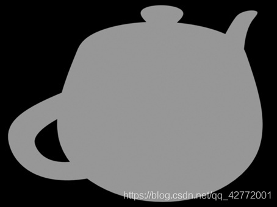

这个模型只能得到物体的平面结构，但体现体积感还需要添加下面的漫反射模型。

 

### Lambert漫反射模型
漫反射指的是光从一定角度入射之后，从这个点向四面八方反射，且各方向反射的光的强度相等。

模拟漫反射首先考虑入射光的角度：

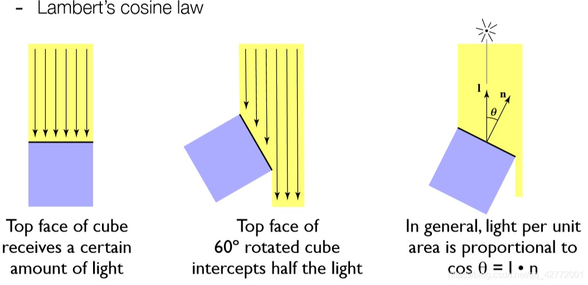

入射角度越倾斜损失的能量越大，应该将光强乘上$cosθ=l·n$，其中$l$是入射光方向，$n$为平面法线方向。

光源与照射点的距离也需要考虑，离得越近强度越大。得到以下公式：

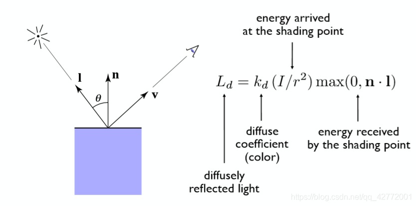

$k_d$为漫反射系数，$I$为入射光强，取max是为了剔除夹角大于90°的光。

将泛光模型和漫反射模型结合，可以得到如下结果：

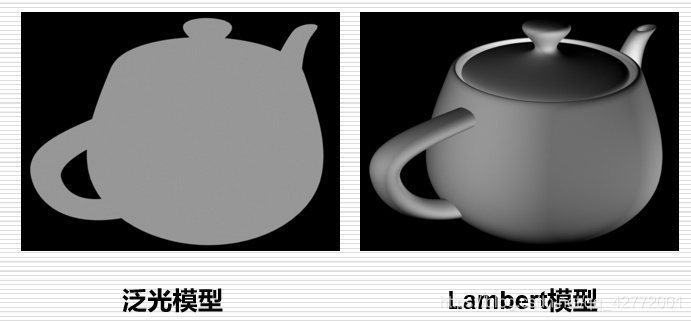

观察图片，加上高光才会更真实，所以需要用到反射模型。

 

### Phong反射模型

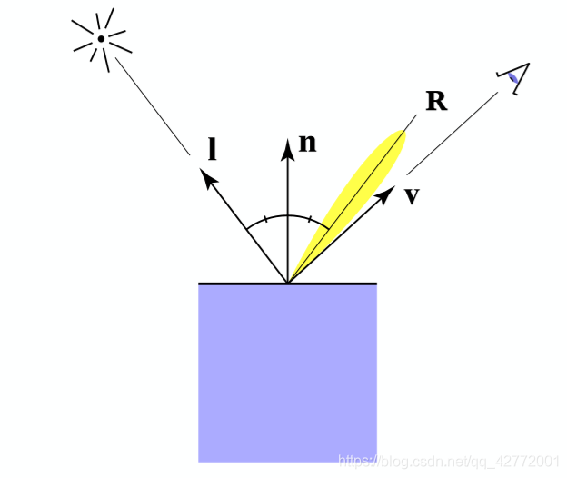

在Phong反射模型中会考虑镜面反射角度$R$与观察角度$v$的夹角：

$$
L_s=k_s(I/r^2)max(0,cosα)^p
$$

其中$k_s$为镜面反射系数，添加指数p的原因是加速衰减。

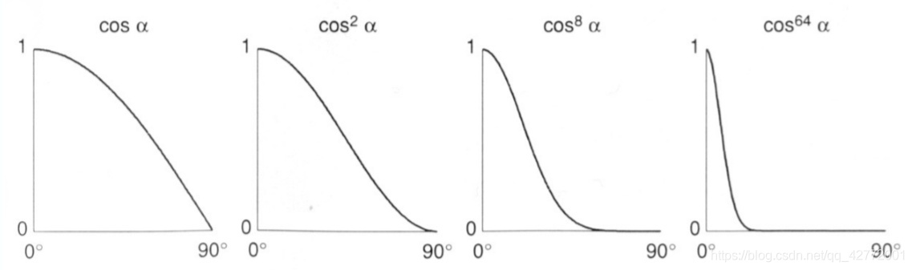

将以上的模型累加得到结果：

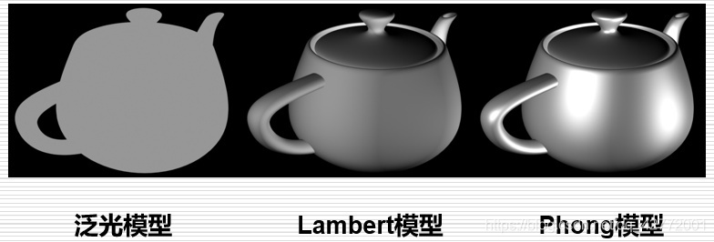

对计算反射方向与人眼观察方向角度进行优化，就有了下面的Blinn-Phong反射模型。

 

### Blinn-Phong反射模型

避免计算反射方向$\hat{v}$，为此引入新的矢量：半程向量$\hat{h}$，对$\hat{v}$和$\hat{l}$取平均后再归一化来得到：

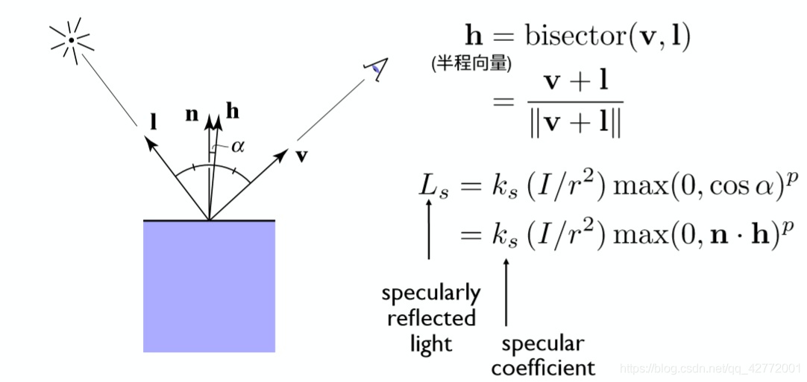

这种方法的优点是加速了角度计算，提升计算的效率，具体来说，算出的近似角度是正确角度的一半。

总结上面的几种光照：

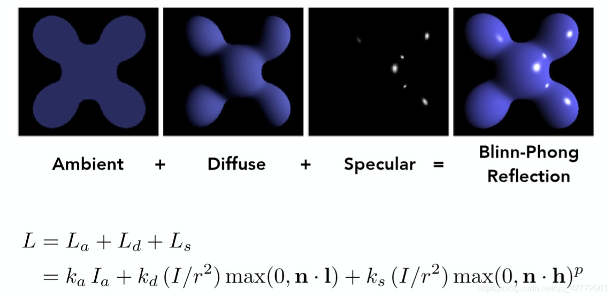

 
 

## 着色方法
在光照模型中涉及法线向量，法线可能对应三角形面，也可能对应顶点。这涉及到了着色频率的问题，可以分类为面着色、顶点着色、像素着色，即是三种不同的着色方法。

### Flat Shading
以一个面作为着色单位，利用每个面的法线向量进行一次Blinn-Phong反射光照模型的计算，将颜色赋予整个面，效果如下：

计算很快，但是效果很差。

 

### Gouraud Shading
Gouraud Shading对每个三角形的顶点进行着色，顶点法线计算方法是将所有共享该点的面法线向量相加求均值，再标准化。对于三角形内部的点，利用重心坐标（[参考链接](https://zhuanlan.zhihu.com/p/144360079)）来插值得到它的**颜色**：

$$
c=αc_0+βc_1+γc_2
$$

$c_0$、$c_1$、$c_2$是三个顶点的颜色，$α$、$β$、$γ$是三角形内一点的重心坐标。

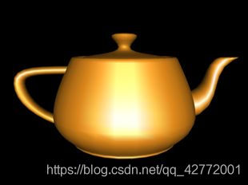

可见对顶点计算，效果有明显提升。

 

### Phong Shading
Phong Shading对上面的方法进行了改进，通过插值**法线**来真正对每一个点都进行光照模型的计算：

$$
n=αn_0+βn_1+γn_2
$$

得到每个点的法线后，再进行Blinn-Phong模型计算，效果对比如下：

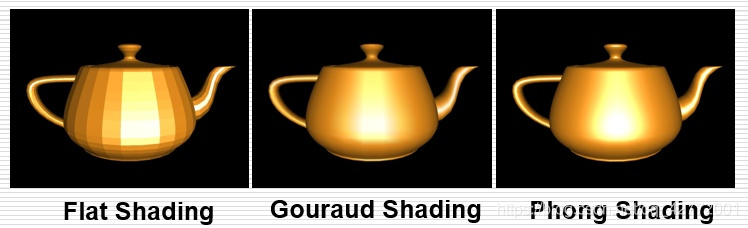

不同精度下的对比：

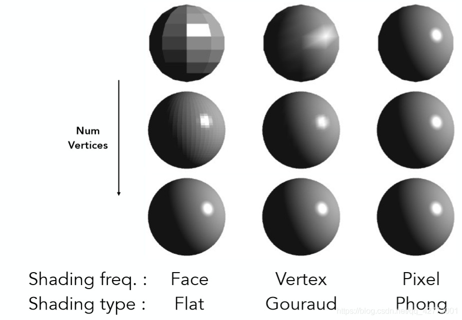

