

 

## 纹理映射方法

纹理映射是将三维物体每个点的颜色信息存储在一张2d的Texture里，根据映射关系计算出漫反射系数，经过计算纹理就被贴在了物体上。

计算方法：纹理坐标用(u,v)表示，纹理空间之内任意一个二维坐标都在[0,1]之内。对每个光栅化的屏幕坐标算出uv坐标，再利用查询texture对应的颜色，作为漫反射系数$K_d$。

 
 

## 纹理尺寸引发的问题

### 纹理过小

把小尺寸的纹理贴在大尺寸的物体上，会有很多像素共享一个颜色，造成失真的效果。

#### 双线性插值(Bilinear Interpolation)

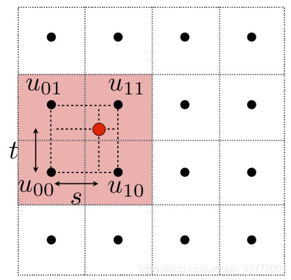

对于一个点，取出离它最近的4个纹理坐标，分别算出在水平及竖直方向偏移的比率$s$、$t$，先利用$s$进行一次插值：

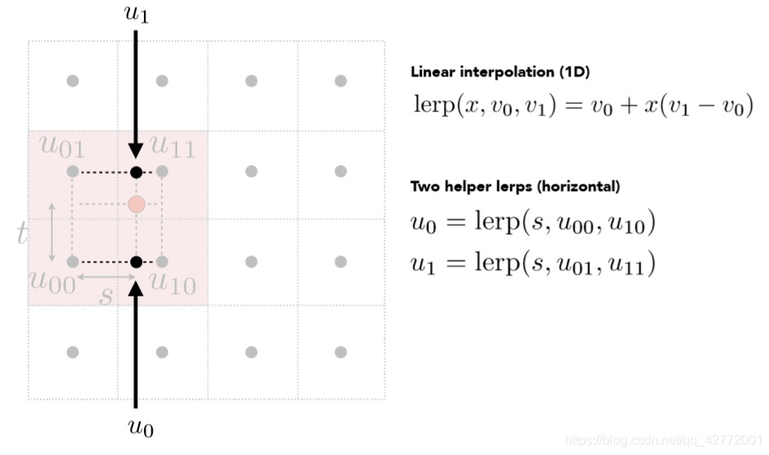

接着再用$t$再进行一次插值：

$$
f(x,y)=lerp(t,u_0,u_1)
$$

 

### 纹理过大

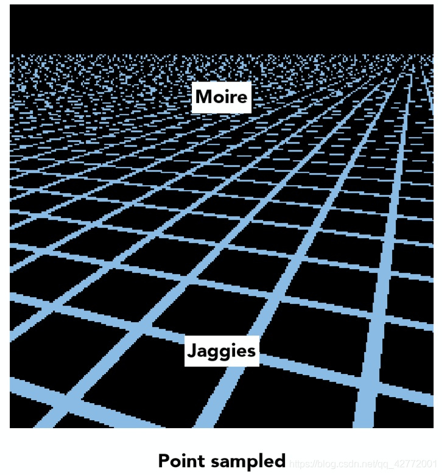

上图所示的摩尔纹现象，是因为根据近大远小原理，远处的一个像素点可能对应了纹理中的一片范围，即纹理过大。本质上是采样频率过低，这时候可以采用Supersampling，把一个像素点分为更多采样点来取得纹理，但这样计算量过大，不适合实际应用。

那么，可以将纹理区域求均值，即下面的Mipmap技术。

#### Mipmap

对于一张图片，远小近大的程度不同，可能会对应不同数量的纹理点，这时候需要分成多个level来处理：

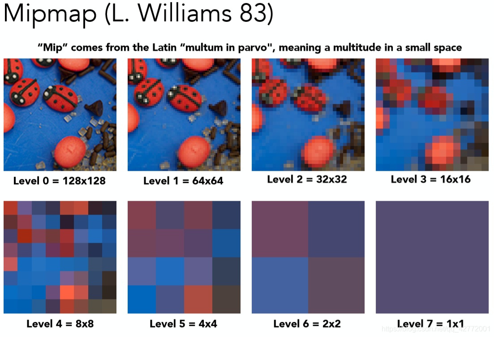

根据屏幕像素的footprint大小选定不同level的texture，相当于在原始texture上进行区域查询，我们利用相邻像素点来估算footprint大小再确定level：

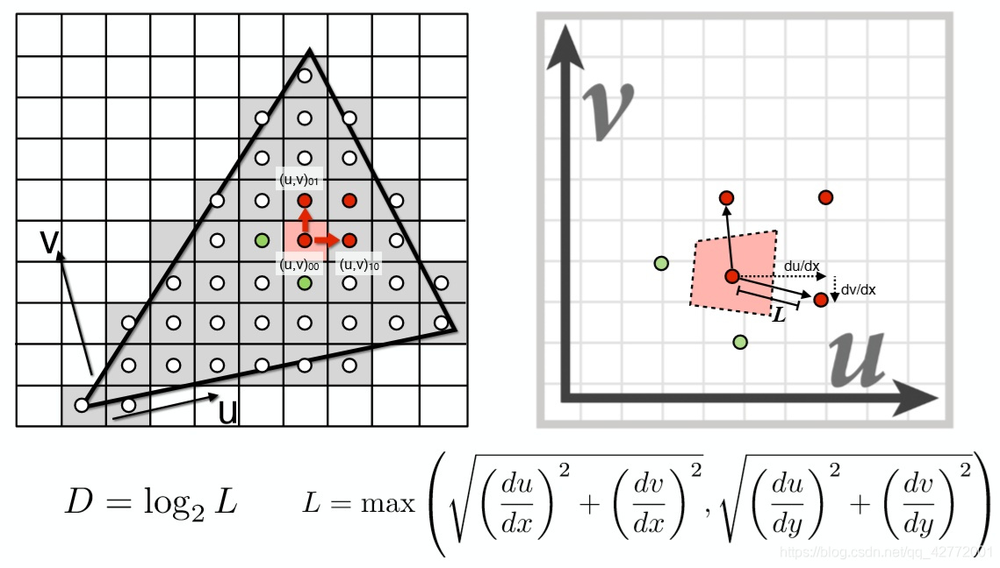

在屏幕空间中取当前像素点的右方和上方的两个相邻像素点，分别查询这3个点对应纹理坐标，计算出纹理空间中当前像素点与它们的距离，二者取最大值，计算公式如图所示，距离的log2值就是level D。

此时计算出的D是一个连续值，可以采用四舍五入或者**三线性插值**的方法。

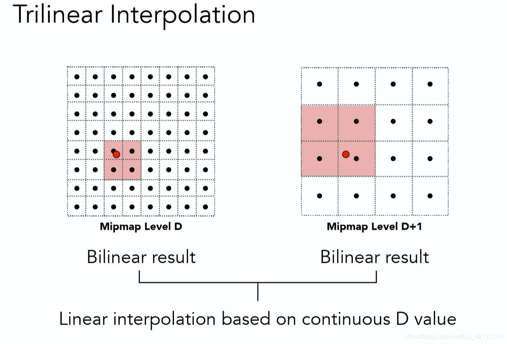

 

#### 各向异性过滤Mipmap
上面的Mipmap方法默认每个区域都是正方形，但实际上对应的形状并不是正方形，如下图：

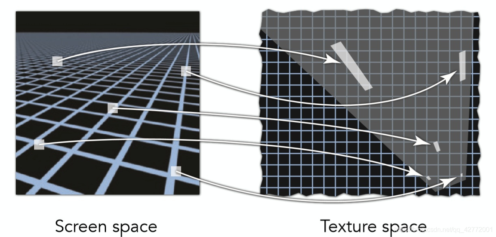

所以需要从不同的方向算level D0、D1，再选择一个适合的区域。

 
 

## 纹理映射应用

### 法线贴图 (Normal Maps)

前面内容中提到，Texture中可以存储颜色信息，那么它也可以存储法线向量，利用(u,v)坐标查询法线而不是使用物体本来的法线，可以达到不同的效果，称为法线贴图。

法线向量存储需要利用切线空间，存储切线空间下的法线向量，相比直接存储object space的坐标，能避免因为人物变形而导致法线错误。

参考：[【D3D11游戏编程】学习笔记二十四：切线空间（Tangent Space）](https://blog.csdn.net/bonchoix/article/details/8619624)

 

### 凹凸贴图 (Bump Maps)

法线贴图直接存储法线信息，而凹凸贴图存储的是该点的相对高度(可为负值)，可以体现物体表面的凹凸情况，利用高度信息计算出该点法线向量，即比法线贴图多了一步计算的过程。 

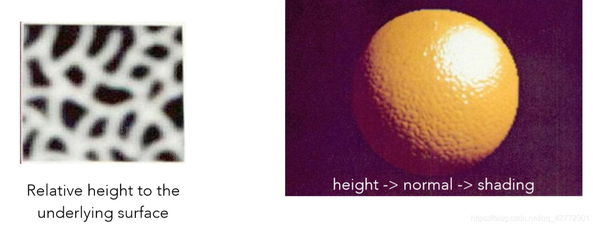

通过高度计算发现的方法如下，从二维：

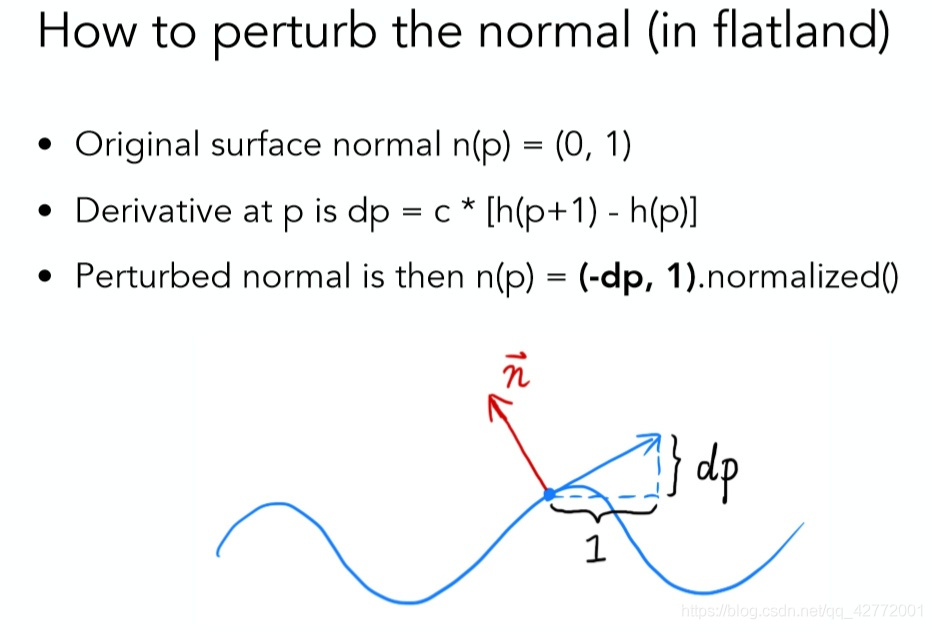

扩展到三维的情况：

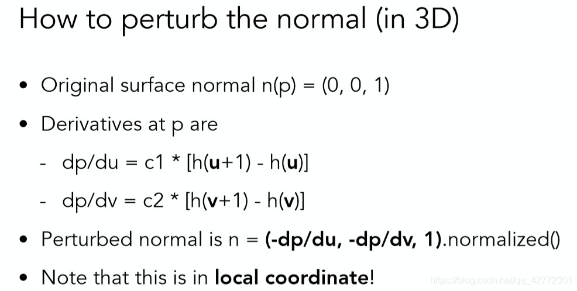

所有计算出的法线都是局部坐标，即切线空间下，因此还需要左乘[t b n]矩阵转到相机坐标系。

 

### 移位贴图 (Displacement Maps)

移位贴图与凹凸贴图类似，凹凸贴图是逻辑上的高度改变，而移位贴图是物理上的高度改变，下图物体阴影的边缘可以发现这点：

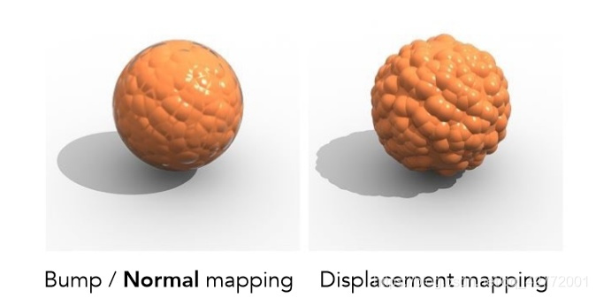

 

### 环境光映射 (Environment Maps) 

将环境光存储在贴图中，当光照离物体的距离很远，物体上的各个点光照方向几乎没有区别，此时唯一变量是人眼观察方向，因此各个方向的光源就可以用一个球体进行存储，即任意一个3D方向都标志着一个texel：

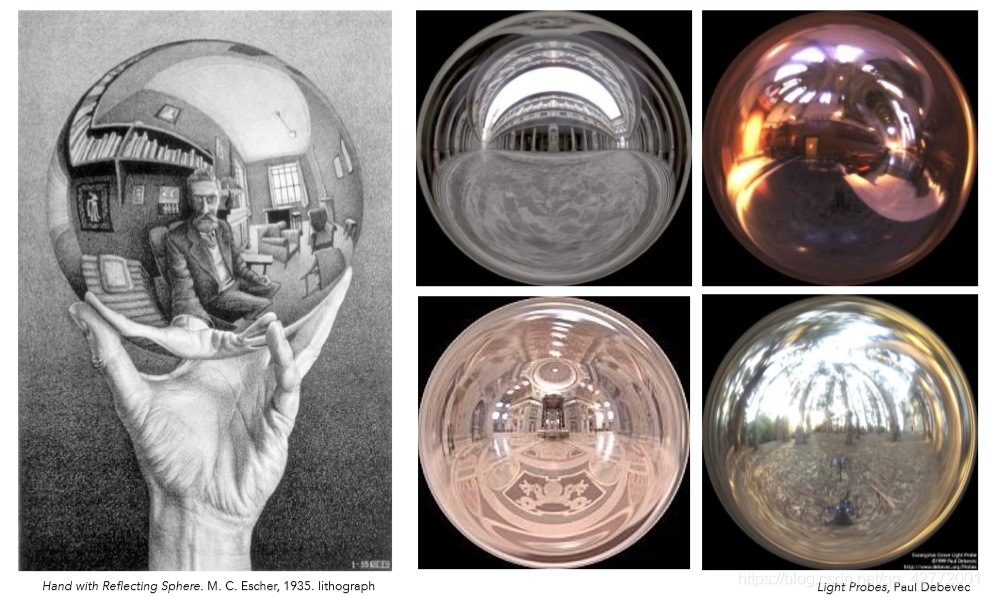

对于Blinn-Phong模型，方法是增加一项反射，利用观察方向相对法线的反射方向查询环境映射的颜色值：

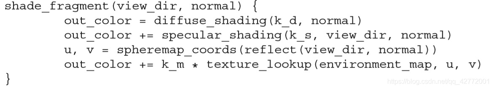

光线追踪中，光线未能撞击物体的时候，利用光线方向求得展开之后贴图上的(u,v)坐标，再查询颜色返回：

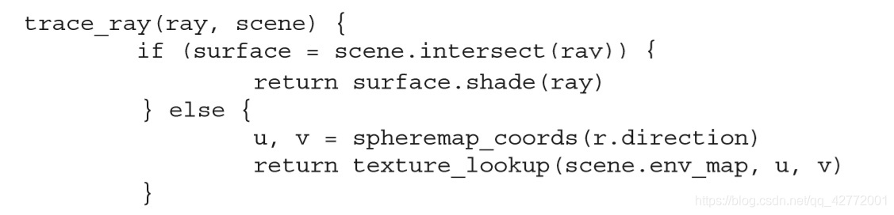

 

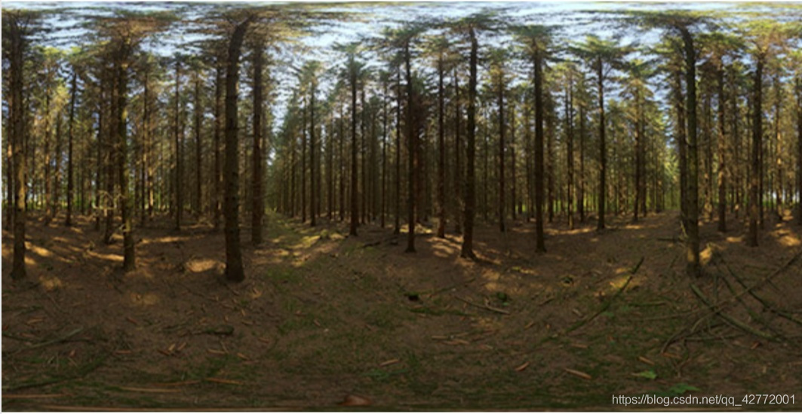

上图可以观察到用球体来存储环境光的缺点，上方和下方有较为严重的扭曲，因此可以用Cube Map，也就是天空盒存储：

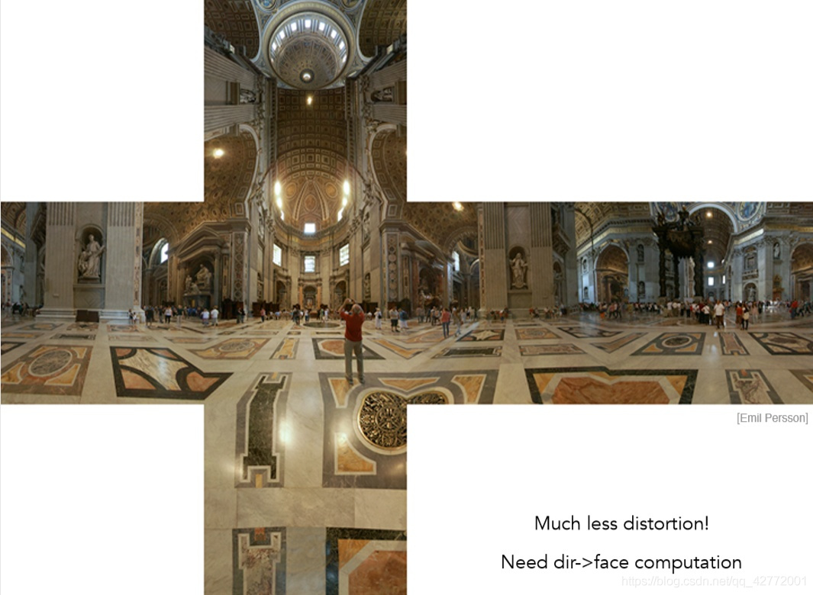

一个天空盒用6幅Texture，减轻扭曲现象，但需要多一步从方向到面上的计算：

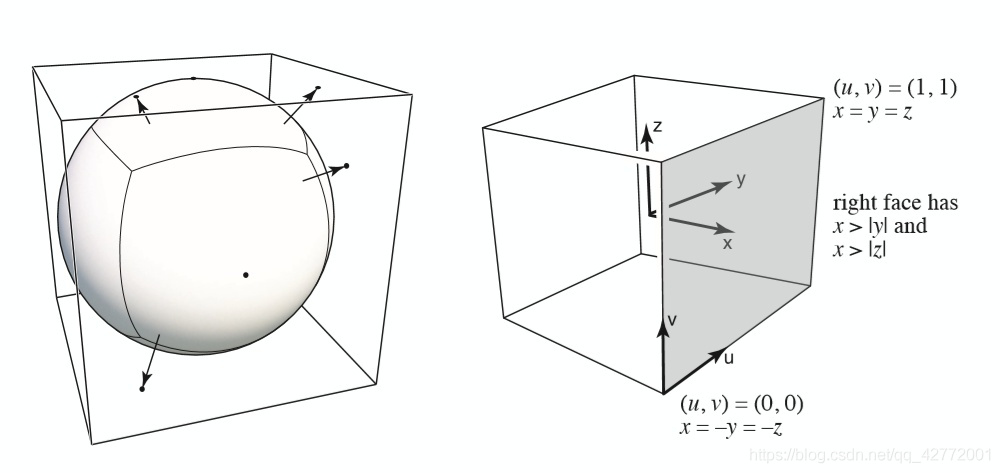

利用方向计算出与对应平面的交点坐标，剔除平面所对应的一维，剩下两维坐标标准化后即为(u,v)坐标。

 

### 阴影贴图 (Shadow Maps)

物体没有被光照射到的地方会产生阴影，此时需要阴影贴图来模拟这种现象。

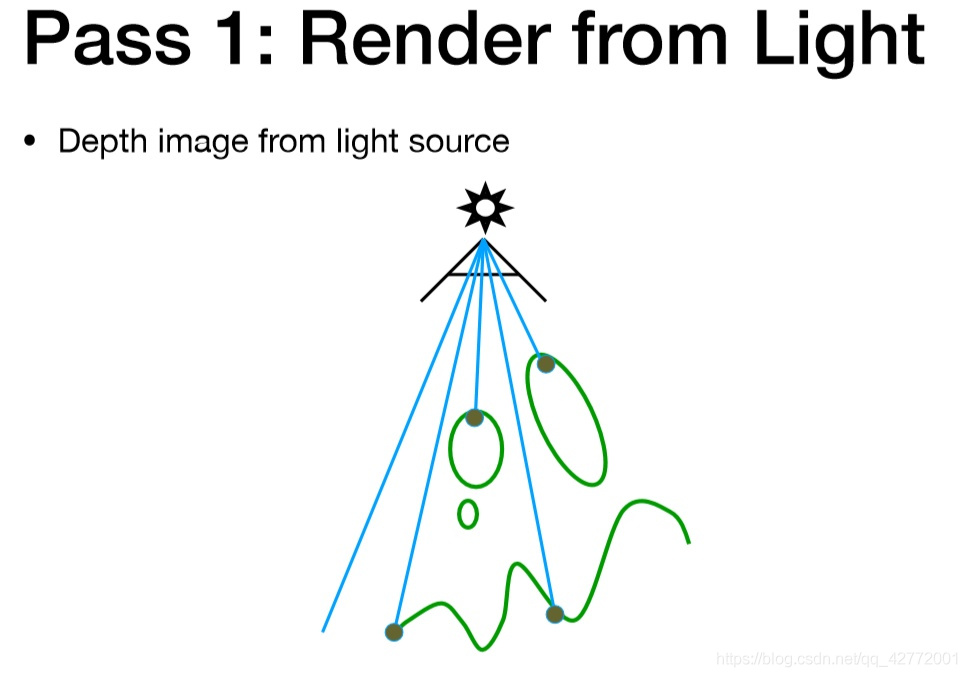

第一步，把光源当做一个摄像机，渲染整个场景一遍，得到从光源视角的深度Buffer，记为$d_{map}$。

 

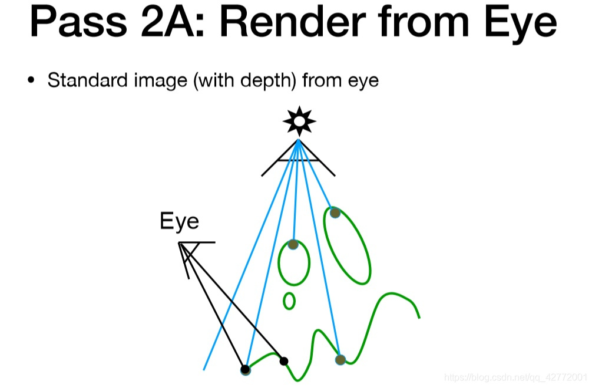

第二步，从真正的人眼观察角度（摄像机位置）去渲染场景。

 

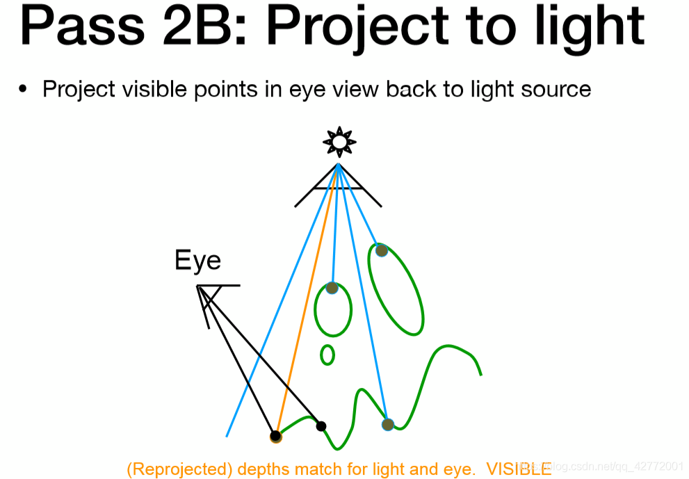

将观察角度所有可见点，利用光源视角下的投影矩阵重新投影回光源，得到光源视角下的屏幕坐标，找到该屏幕坐标在$d_{map}$上的深度值，如果该点在$d_{map}$的深度值与投影回光源的点的实际深度值相等，说明此点被光源照射，即不在阴影中，如上面黄色线的情况。

 

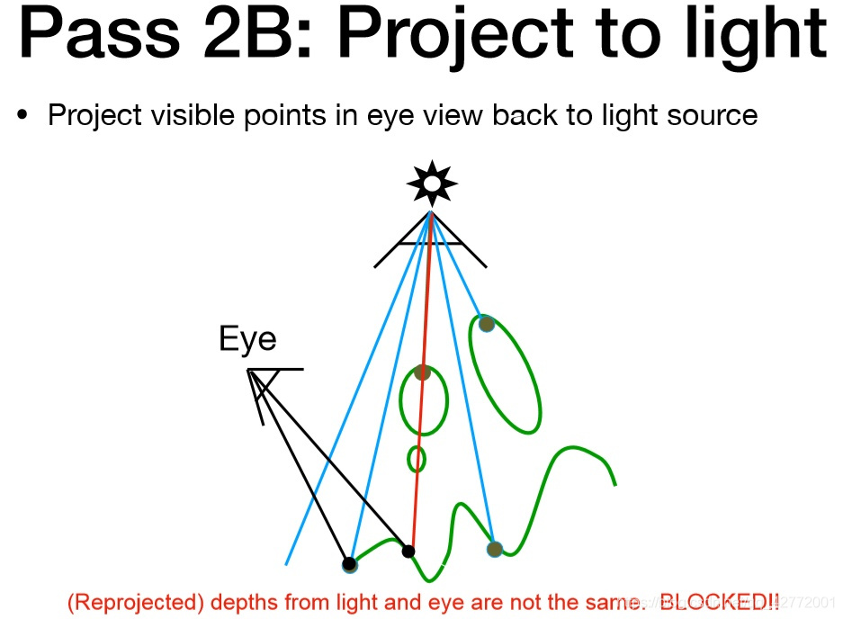

如果在$d_{map}$上的深度值小于投影回去的实际深度值，则该点不被光源看见，即前方有物体遮挡，因此判定它在阴影中，如上面红色线的情况。

 

通过筛选，在阴影中的点不进行Blinn-Phong模型中镜面反射与漫反射的计算，最终效果如下：

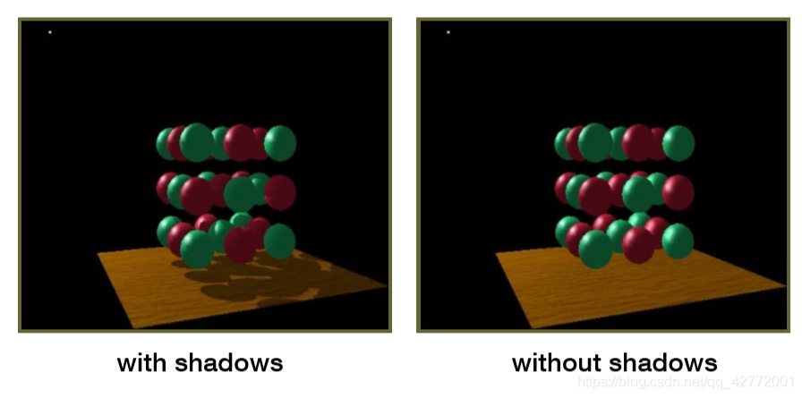

对应可视化的阴影贴图如下，距离光源越近颜色越黑（深度值小）：

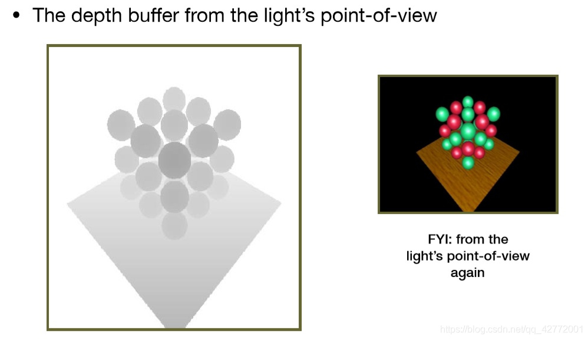

 

阴影贴图的几个notes:

1. 深度值是浮点数，不会严格判断相等，会使用tolerance

2. 上面的计算结果属于硬阴影，只适用于点光源

 

软硬阴影示意：

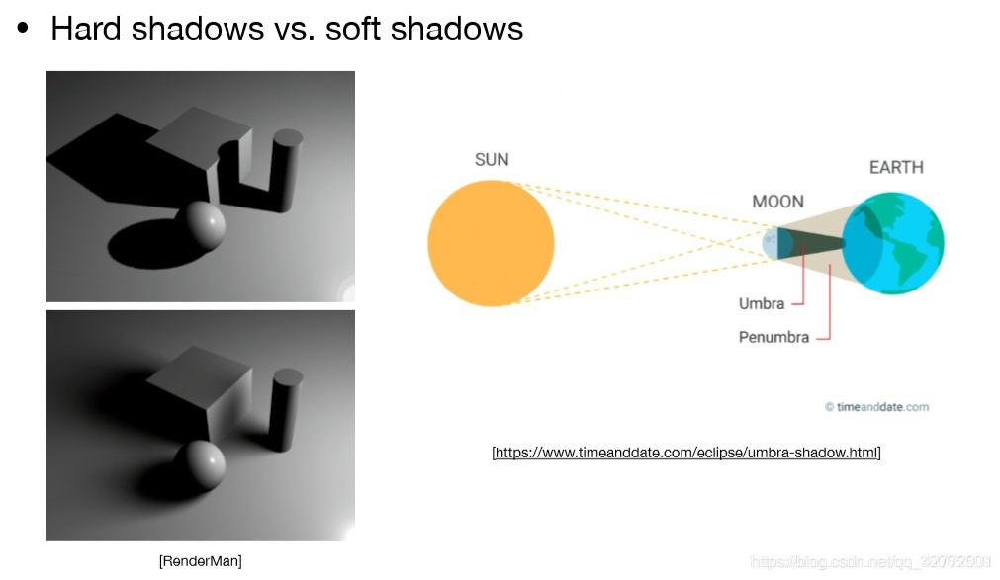

