<br/>

## 实现透明效果

在实时渲染中，实现透明效果需要控制模型的**透明通道（Alpha Channel）**。Unity中通常使用两种方法来控制透明效果：一种是**透明度测试（Alpha Test）**，它其实无法得到真正的半透明效果；另一种是**透明度混合（Alpha Blending）**。

两种方法的基本原理如下：

- **透明度测试**：采用极端机制，如果一个片元的透明度不符合条件（通常是小于某个阈值），对应片元会直接被舍弃；符合条件就会按照不透明物体去处理。即这种方式得到的结果只有完全透明（看不到）和完全不透明的物体。
- **透明度混合**：使用透明度与颜色值混合。它需要关闭深度写入（但没有关闭深度测试），即仍然会在深度值不符合条件时不渲染这个片元，但不会更新深度值。对于透明度混合来说，深度值是只读的。

对于不透明物体来说，深度缓存使得渲染顺序可以不被考虑。但如果加入透明效果，情况就会变得复杂。透明度测试不需要关闭深度写入（Zwrite），而透明度混合需要。

<br/>
<br/>

## 关于渲染顺序

使用透明度混合，渲染顺序会对结果产生影响（无论是透明与不透明物体还是两个透明物体）。

渲染引擎会先进行排序：

1. 先渲染所有不透明物体，并开启深度测试和深度写入。
2. 把半透明物体按照距离摄像机远近进行排序，从后往前渲染。

但半透明物体的排序也会遇到很多问题，比如循环重叠等情况。在Unity中，解决这一问题需要使用**渲染队列（Render queue）**。使用Subshader中的**Queue**标签来声明模型将归于哪个渲染队列，每个队列用整数索引号表示其渲染顺序，索引号越小则越早渲染。Unity提前定义了5个队列，在它们中间也可以自定义新的队列：

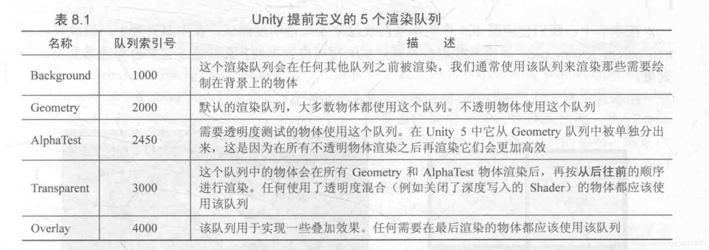

透明度测试的写法：

```c
SubShader {
	Tags { "Queue"="AlphaTest" }
	Pass {
		...
	}
}
```

透明度混合的写法：

```c
SubShader {
	Tags { "Queue"="Transparent" }
	Pass {
		ZWrite Off
		...
	}
}
```

<br/>
<br/>

## 透明度测试
透明度测试采用极端机制，如果一个片元的透明度不符合条件（通常是小于某个阈值），对应片元会直接被舍弃；符合条件就会按照不透明物体去处理。即这种方式得到的结果只有完全透明（看不到）和完全不透明的物体。

通常会在片元着色器中使用clip函数来进行透明度测试。当传入clip的参数有任意分量为负，则舍弃当前像素的输出颜色。

在属性中定义：

```c
Properties
{
    _Color ("Main Tint", Color) = (1,1,1,1)
    _MainTex ("Main Tex", 2D) = "white" {}
    _Cutoff ("Alpha Cutoff", Range(0, 1)) = 0.5
} 
```

Cutoff是透明度测试的阈值。

接着定义Subshader的标签，透明度测试的物体放在AlphaTest队列中，RenderType标签用于着色器替换，IgnoreProjector使物体不受投影器影响。

```c
Tags {"Queue"="AlphaTest" "IgnoreProjector"="True" "RenderType"="TransparentCutout"}
```

在片元着色器中，用clip函数进行操作：

```c
fixed4 texColor = tex2D(_MainTex, i.uv);

// if texColor < _Cutoff, then discard
clip(texColor - _Cutoff);
```

效果：

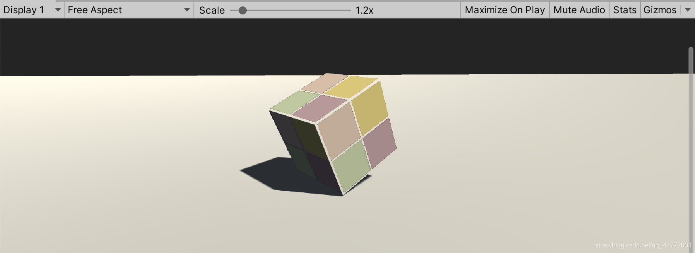

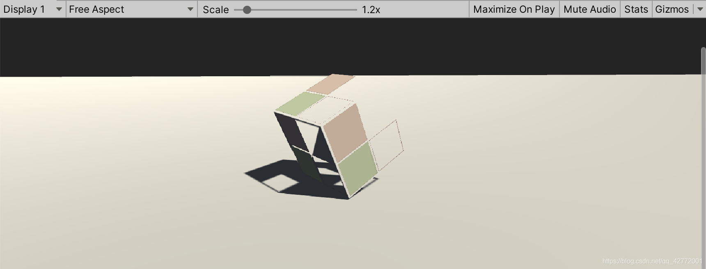


可见，通过调整阈值得到的透明效果很不自然，看起来像一整个面缺失，即前面提到的极端效果。


<br/>
<br/>


## 透明度混合

透明度混合使用透明度与颜色值混合。它需要关闭深度写入（但没有关闭深度测试），即仍然会在深度值不符合条件时不渲染这个片元，但不会更新深度值。对于透明度混合来说，深度值是只读的。

需要使用Unity提供的Blend命令，根据透明度情况与缓冲区的颜色进行混合：


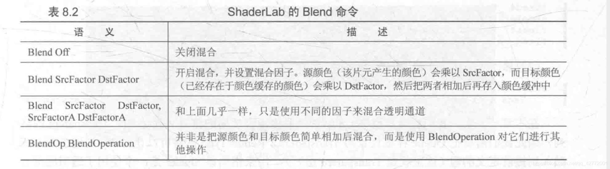


替换变量：`fixed _AlphaScale;`

在Pass中关闭深度写入，把当前片元着色器颜色混合因子设为SrcAlpha，颜色缓冲区混合因子设为OneminusSrcAlpha：

```c
Pass {
    Tags {"LightMode"="ForwardBase"}

    ZWrite Off
    Blend SrcAlpha OneMinusSrcAlpha
```

片元着色器中，设置返回值的透明通道：

```c
...
return fixed4(ambient + diffuse, texColor.a * _AlphaScale);
```

只有Blend命令开启混合，透明通道才有意义。

效果如下：


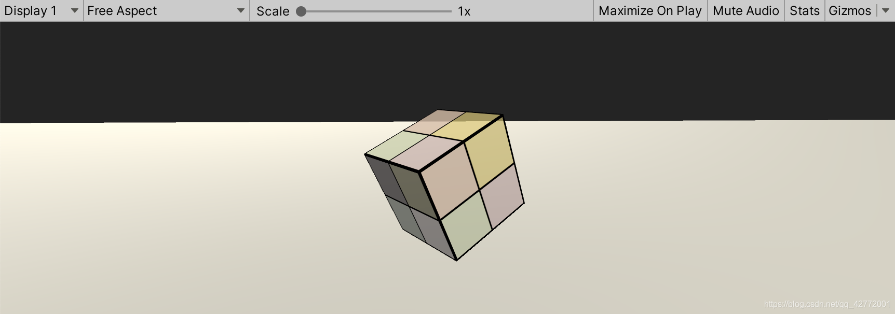


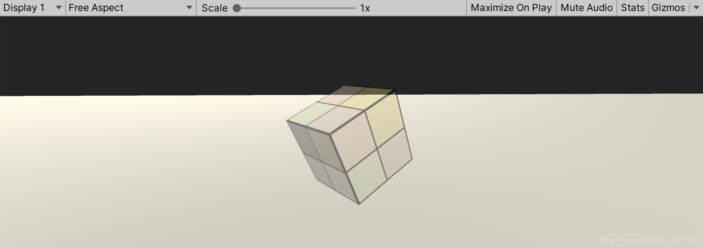


<br/>
<br/>

## 开启深度写入的半透明效果

关闭了深度写入之后，遇到交叠物体会出现错误。


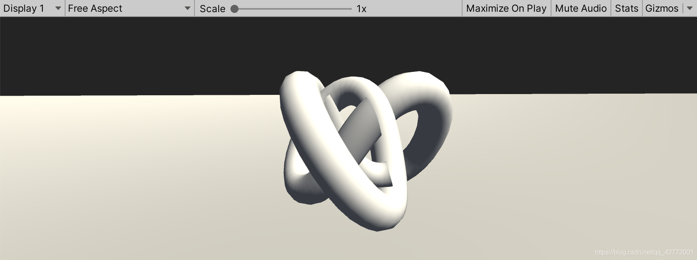


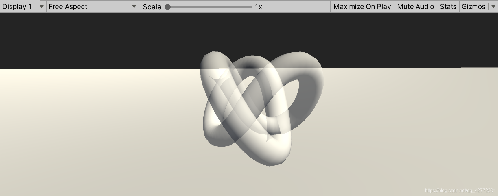


所以为了能同时使用深度写入，会使用两个Pass的方式来渲染，一个Pass开启深度写入（但不输出颜色），还有一个Pass进行正常的透明度混合。

shader与上节的基本一致，增加了一个Pass，颜色通道的写掩码设置为0：

```c
// Zwrite only
Pass {
    ZWrite On
    ColorMask 0
}
```

修改后，交叠情况没有错误了：


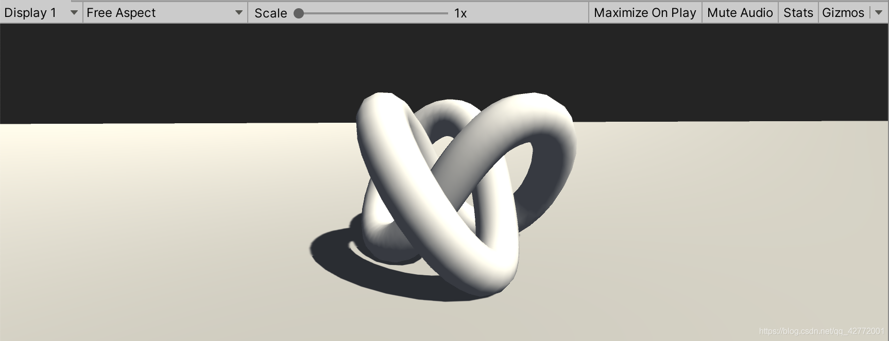


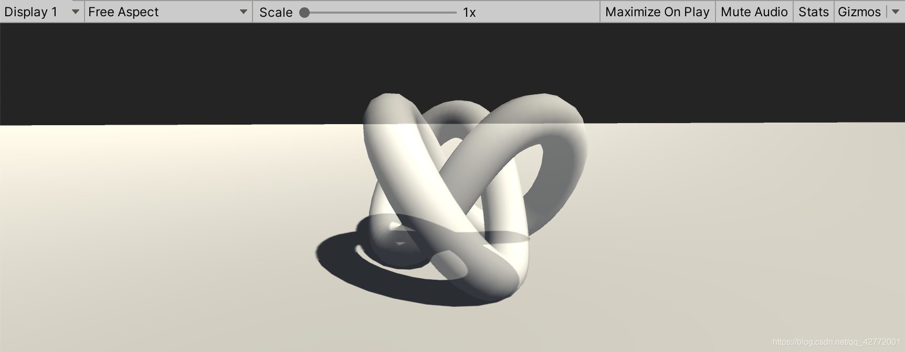


<br/>
<br/>

## Shaderlab混合命令

混合是一个逐片元的操作，已知源颜色S和目标颜色D，用一个混合等式来求得输出颜色O。


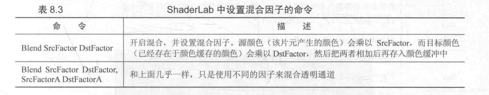


混合公式如下：

$$
O_{rgb}=SrcFactor×S_{rgb}+DstFactor×D_{rgb} \\
O_a=SrcFactorA×S_a+DstFactorA×D_a
$$

Shaderlab支持的几种混合因子：

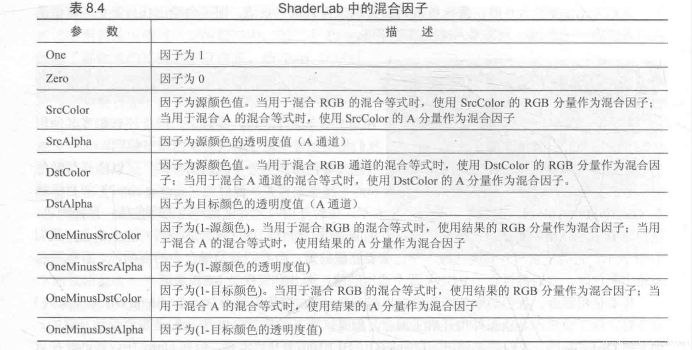

除了加法操作，也有减法等其他逻辑操作。

一些利用混合因子模拟Photoshop的操作如下：

```c
// 透明度混合 Normal
Blend SrcAlpha OneMinusSrcAlpha

// 柔和相加 Soft Additive
Blend OneMinusDstColor One

// 正片叠底 Multiply
Blend DstColor Zero

// 两倍相乘 2x Multiply
Blend DstColor SrcColor

// 变暗 Darken
BlendOp Min
Blend One One	// When using Min operation, these factors are ignored

// 变亮 Lighten
BlendOp Max
Blend One One // When using Max operation, these factors are ignored

// 滤色 Screen
Blend OneMinusDstColor One
// Or
Blend One OneMinusSrcColor

// 线性减淡 Linear Dodge
Blend One One
```

效果：


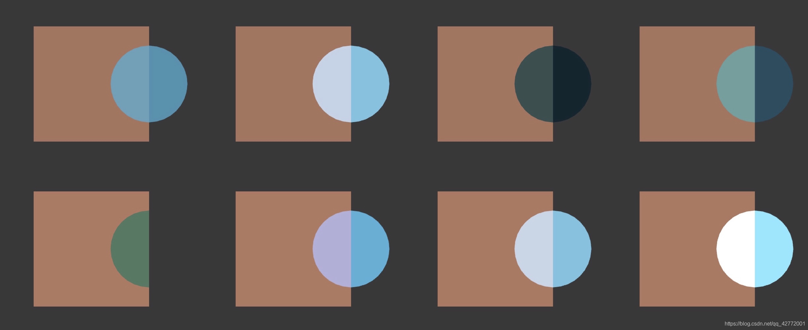


<br/>
<br/>

## 双面渲染透明效果

在现实中，对于透明的物体，我们能够观察到它们的内部结构。默认情况下引擎剔除了物体的背面，如果要得到双面渲染的效果，可以使用Cull指令来控制剔除哪个面的渲染图元。

语法：`Cull Back | Front | Off`

做法和之前透明度混合一样，只是需要分为两个Pass，先渲染背面，再渲染正面。

最终效果：


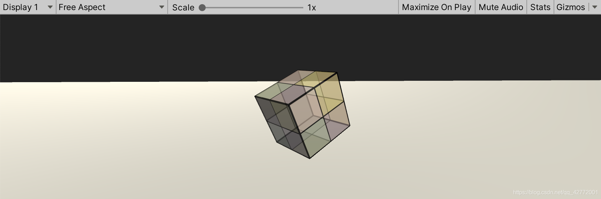

