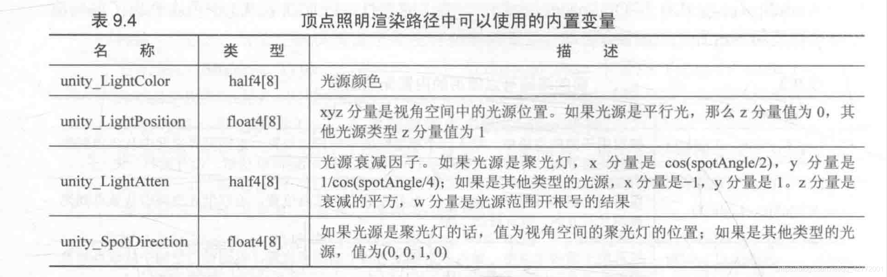

<br/>

## 渲染路径

在Unity中，需要为每个Pass用LightMode标签指定它使用的**渲染路径（Rendering path）**：


<br/>

### 前向渲染 (Forward Rendering)

前向渲染的原理是：有两个缓冲区，利用深度缓冲区来决定一个片元是否可见，如果可见就更新颜色缓冲区中的颜色值，用伪代码表示如下：

```py
Pass {
	for (each primitives in this model) {
		for (each fragment covered by this primitive) {
			if (failed in depth test) {
				discard;
			} else {
				// 通过深度测试则更新颜色缓冲区
				float4 color = Shading(materialInfo, pos, normal, lightDir, viewDir);
				writeFrameBuffer(fragment, color);
			}
		}
	}
}
```

对于每个逐像素光源，如果场景中有N个物体，每个物体受M个光源影响，渲染整个场景需要N*M个Pass，计算量很大。

在Unity中，前向渲染有3种处理光照（照亮物体）的方式：逐顶点、逐像素、球谐函数（Spherical Harmonics, SH）。处理模式取决于光源类型和渲染模式，渲染模式指的是重要程度important/not important。

当渲染一个物体时，Unity会给光源作重要性排序，最多有4个光源逐顶点处理，剩下的光源按SH处理。判断规则如下：

- 最亮的平行光按逐像素处理
- Not important渲染模式会按逐顶点或者SH处理
- Important 渲染模式按逐像素处理
- 根据以上规则得到的逐像素光源小于Quality Setting中的逐像素光源数量（Pixel Light Count），会有更多光源按逐像素处理

前向渲染有两种Pass：


前向渲染可以使用的内置光照变量：


可以使用的光照函数：


<br/>


### 顶点照明渲染 (Vertex Lit Rendering)
顶点照明渲染配置要求低、运算性能最高，但同时得到的效果比较差，它不支持逐像素的效果，如阴影、法线映射、高精度高光反射。它是前向渲染的一个子集。

Unity中的顶点照明渲染通常在一个Pass中就可以完成。在这个Pass中，会计算所有光源对该物体的照明（逐顶点）。它在Unity5以上的版本中，它被作为遗留渲染路径，未来可能被移除。

一个顶点照明渲染Pass最多可访问8个逐顶点光源，如果数目小于8，剩下的光源会被设置成黑色。

可使用的内置变量：




可使用的内置函数：


<br/>


### 延迟渲染 (Deferred Rendering)
在前向渲染的基础上，延迟渲染会使用额外的缓冲区，称为G-buffer，它储存了（离摄像机最近的）表面的其他信息，如法线、位置、用于光照计算的材质属性。

延迟渲染主要包括两个Pass。第一个Pass不进行光照计算，仅通过深度缓冲技术计算哪些片元可见，如果可见，就把相关信息存储到G-buffer中。在第二个Pass，利用G-buffer的信息进行真正的光照计算。

```py
Pass 1 {
	for (each primitives in this model) {
		for (each fragment covered by this primitive) {
			if (failed in depth test) {
				discard;
			} else {
				// 通过深度测试则存储到Gbuffer
				writeGFrameBuffer(materialInfo, pos, normal, lightDir, viewDir);
			}
		}
	}
}

Pass 2 {
	for (each pixel in screen) {
		if (the pixel is valid) {
			// 读取Gbuffer信息
			readGBuffer(pixel, materialInfo, pos, normal, lightDir, viewDir);
			// 进行光照计算
			float4 color = Shading(materialInfo, pos, normal, lightDir, viewDir);
			// 更新帧缓冲
			writeFrameBuffer(pixel, color);
		}
	}
}
```


延迟渲染使用的Pass数量和光源数目没有关系，即延迟渲染的复杂度不依赖于场景的复杂度，而是缓冲区大小（屏幕空间大小），它们可视为一张张2D图像，计算实际上是在这些图像空间中进行的。

<br/>

延迟渲染适用于光源数目很多、使用前向渲染会有性能瓶颈的情况，它也有一些缺点：

- 不支持真正的抗锯齿功能
- 不能处理半透明物体
- 对显卡有一定要求


<br/>
<br/>

## 光源类型

Unity一共支持4种光源类型：**平行光**、**点光源**、**聚光源**和**面光源（Area light）**。面光源仅在烘焙时发挥作用，本节不涉及。

Shader中使用光源的位置、方向、颜色、强度以及衰减，这些属性和它们的几何定义息息相关。

<br/>

### 平行光 (Directional light)
平行光没有具体的位置，通常作为太阳的角色在场景中出现。

它可以放置在场景的任何位置，几何属性只有方向，到场景中所有点的方向都是一样的。而且由于没有位置，所以也没有衰减的概念，即光强不会随着距离而改变。


<br/>

### 点光源 (Point light)

点光源的照亮空间有限，由空间中的一个球体定义，表示从一个点发出、向所有方向延伸的光。

点光源有位置属性，方向属性是由点光源位置减去某点的位置，颜色和强度可以在面板中调整。点光源强度会衰减，从球体中心（最强）到球的边界（最弱，为0），中间的衰减值可以由一个函数定义。


<br/>

### 聚光灯 (Spot light)
聚光灯表示由特定位置出发，向特定方向延伸的光，在空间中由一个锥体定义。

它具有半径（Range）、锥体张开角度（Spot angle）和相似于点光源的位置、颜色、强度属性。衰减原理也相似，但衰减函数比点光源更加复杂，因为需要判定一个点是否在锥体内。


<br/>
<br/>

### 多光源的例子

shader仍然使用Blinn-Phong模型（和之前的一样），只是需要修改为两个Pass，第一个是Base Pass，它处理最重要的平行光。

在片元着色器计算环境光，和之前的模型基本一致，衰减值设置为0。

```c
// The attenuation of directional light is always 1
fixed atten = 1.0;

return fixed4(ambient + (diffuse + specular) * atten, 1.0);
```

接着为其他光源定义Additional Pass，这里需要打开混合，因为需要在帧缓存中和之前的结果相加：

```c
Blend One One
```

片元着色器中，不需要计算环境光、自发光，由于处理的可能是平行光/点光源/聚光灯，在计算光源的五个属性时，位置、方向和衰减属性需要根据情况来计算。

方向，如果是平行光，没有位置的概念，所以直接使用_WorldSpaceLightPos0，其他需要减去世界空间下的顶点位置：

```c
#ifdef USING_DIRECTIONAL_LIGHT
    fixed3 worldLightDir = normalize(_WorldSpaceLightPos0.xyz);
#else
    fixed3 worldLightDir = normalize(_WorldSpaceLightPos0.xyz - i.worldPos.xyz);
#endif
```

处理衰减，由于平行光以外的光源比较复杂，这里使用了一张纹理查找表：

```c
#ifdef USING_DIRECTIONAL_LIGHT
    fixed atten = 1.0;
#else
    #if defined (POINT)
        float3 lightCoord = mul(unity_WorldToLight, float4(i.worldPos, 1)).xyz;
        fixed atten = tex2D(_LightTexture0, dot(lightCoord, lightCoord).rr).UNITY_ATTEN_CHANNEL;
    #elif defined (SPOT)
        float4 lightCoord = mul(unity_WorldToLight, float4(i.worldPos, 1));
        fixed atten = (lightCoord.z > 0) * tex2D(_LightTexture0, lightCoord.xy / lightCoord.w + 0.5).w * tex2D(_LightTextureB0, dot(lightCoord, lightCoord).rr).UNITY_ATTEN_CHANNEL;
    #else
        fixed atten = 1.0;
    #endif
#endif
```


在场景中新建一个胶囊体，放置一个平行光和一个点光源（设置为粉红色）：


4个点光源和平行光：


<br/>
<br/>

## 光照衰减

上节的实践中，对光照衰减的处理是查找内部的纹理_LightTexture0，但它也存在不直观、无法自定义函数公式的缺点。但这种方法在一定程度上可以提高性能，因此这是Unity默认使用的方法。

也可以用数学公式去实现，但就无法通过内置变量得到光源的范围、聚光灯朝向、张开角度等信息，所以效果可能反而不尽人意。


