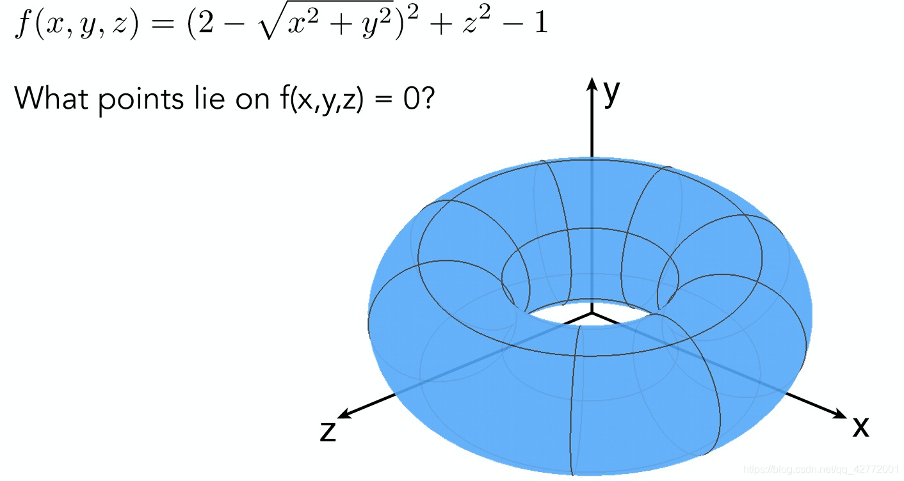
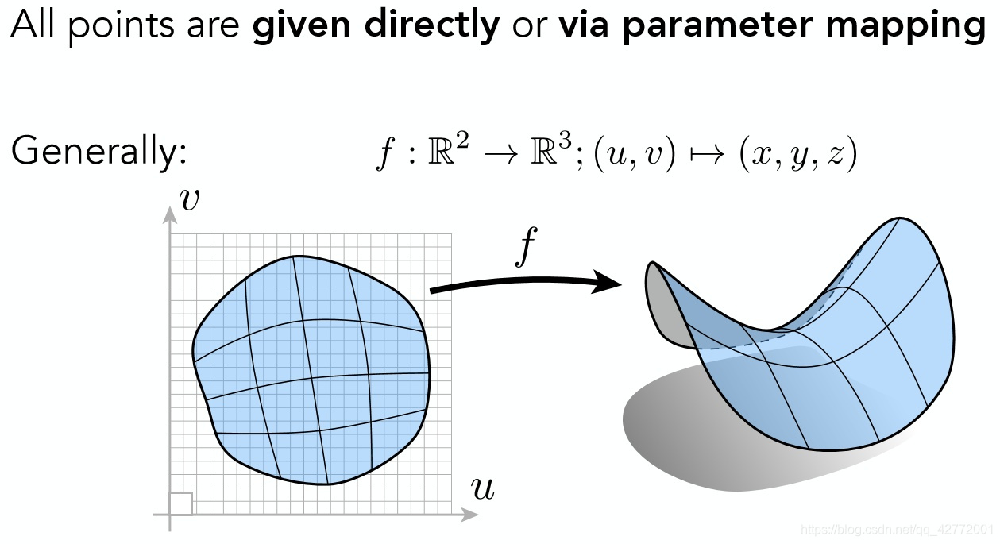
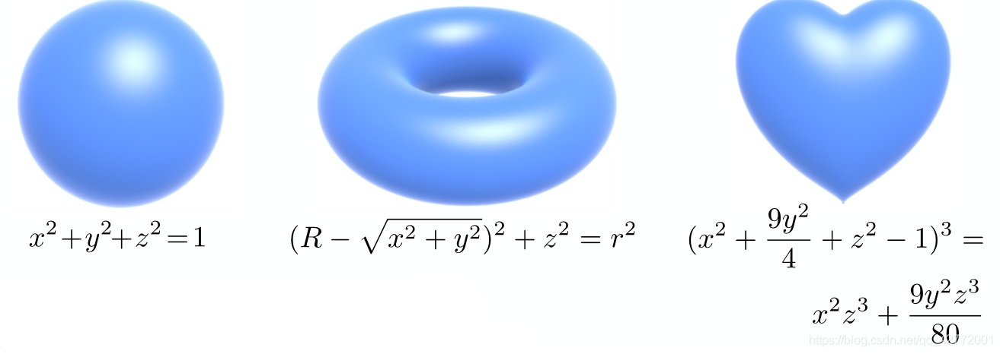
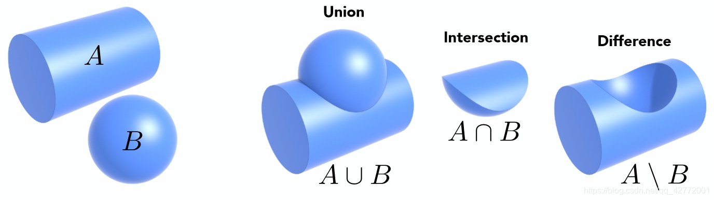
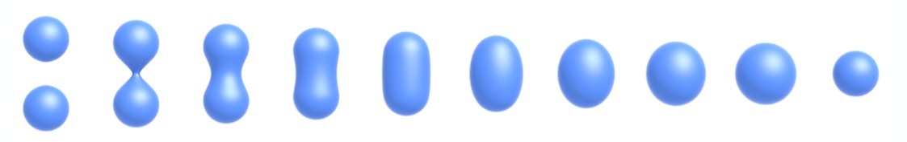
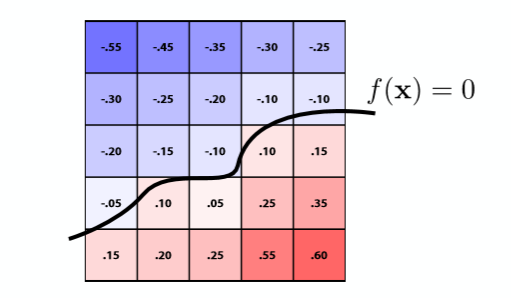
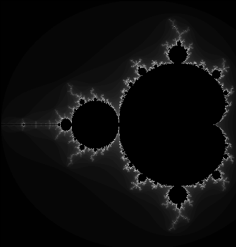
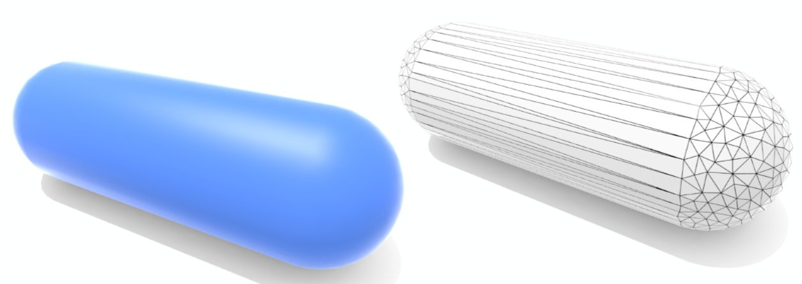

 

## 两种曲面的特点

### 隐式曲面

隐式曲面不会直接给出点的信息，只会给出该曲面上所有点满足的关系，比如这个例子：

{:height="70%" width="70%"}

如果不给出图片，很难直接知道哪些点在这个曲面上。但有一个好处是，给定一个具体的点，直接代入方程就能判定这个点和曲面的关系。在应用中，也就是能够轻易判定光线与物体是否相交。

 

### 显式曲面

直接给出所有点，或者通过映射关系直接得到，如下图：

{:height="70%" width="70%"}

两种曲面的关键区别就是能不能直接表示出所有的点。这两种方式各有好处，需要根据具体情况选择。

 
 

## 隐式曲面

### 代数曲面 (Algebraic Surfaces)

通过代数表达式表示一些几何形状：

{:height="70%" width="70%"}

对于更复杂的几何形体，单纯的代数表达式很难表示，所以有了下面的CSG。

 

### Constructive Solid Geometry (CSG)

CSG指的是对各种几何做布尔运算，如并、交、差，应用于建模软件中。

{:height="70%" width="70%"}

 

### 符号距离函数 (Signed Distance Function)

除了布尔操作，还可以通过距离函数来对几何体进行混合：

{:height="70%" width="70%"}

符号距离函数(SDF)定义的是到几何体的距离。

 

### 水平集 (Level Set)

与SDF类似，用函数值为0的地方作为曲线，但水平集是在空间中用格子去近似一个函数：

{:height="70%" width="70%"}

运用双线性插值的方法就可以得到任意点的函数值。

 

### 分型几何(Fractals)

分型几何是指许多自相似的形体最终所组成的几何形状。

{:height="50%" width="50%"}

 
 

## 显式曲面

### 点云 (Point Cloud)

{:height="30%" width="30%"}

由众多点构成的曲面，存储着所有点的信息。

 

### 多边形网格 (Polygon Mesh)

就是用多边形来模拟模型的面，比如普遍使用的.obj文件，不用赘述了。

{:height="70%" width="70%"}

 

### 贝塞尔曲面 (Bézier Surfaces)

参考链接：

[计算机图形学十：贝塞尔曲线与贝塞尔曲面](https://zhuanlan.zhihu.com/p/144399638)

