 

## 算法原理

### Step 1:  Ray Casting

从人眼或摄像机向近投影平面上的每一个像素点发射一条光线，判断与场景物体的交点。

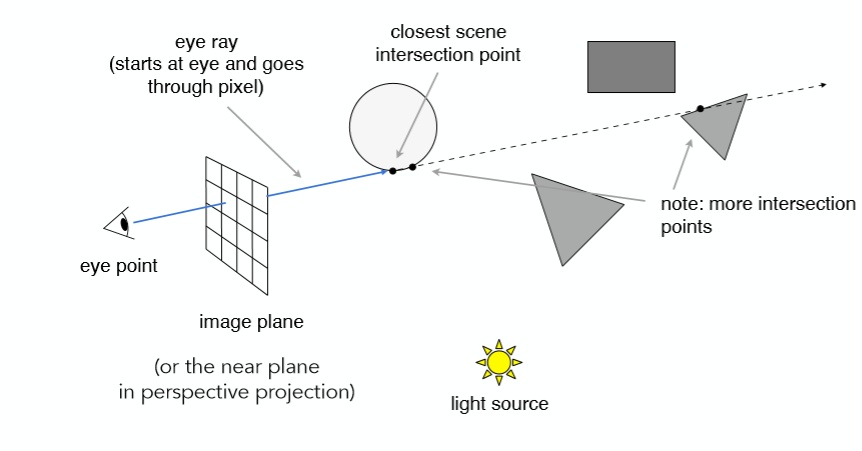 

考虑遮挡关系，只找最近的交点。接着连接该交点和光源，只要判断连线之间是否有物体存在，就得出该交点是否在阴影之中。

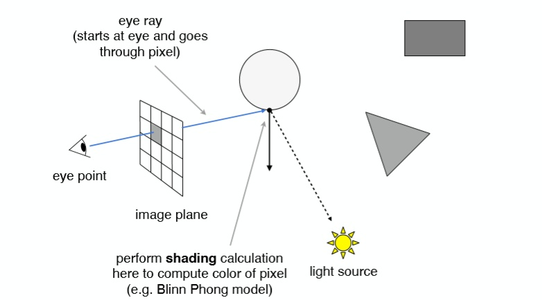

接着利用Blinn-Phong模型对这个点进行局部光照模型计算，遍历所有近投影平面上的像素就能得到一张完整的图像。但如果光线追踪仅仅是在第一步Ray Casting就停止的话，效果与局部光照模型是一样的，因此需要第二步。

 

### Step 2:  Recursive (Whitted-Style) Ray Tracing

考虑第一步中所做的Ray Casting，该条光线第一个与圆球物体相交，假设该圆球是一个玻璃球，则会发生镜面反射，如图：

除了镜面反射之外也存在折射，同时反射与折射出去的光线可能与场景中的物体再次碰撞，发生第二次折射与反射：

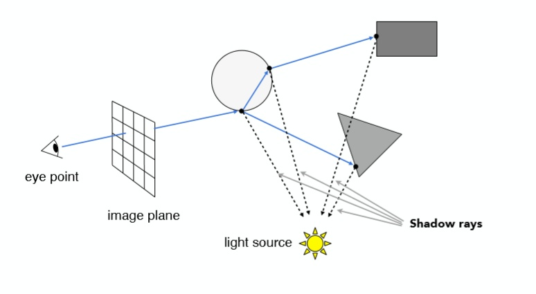

 

因此每一个交点的颜色贡献来自直接光照、反射方向间接光、折射方向间接光（如果有折射的话）。下一步将这些所有交点与光源连接，称这些线为Shadow rays（检测阴影），计算所有点的局部光照结果，按照光线能量权重累加，最终得到近投影平面上该像素点的颜色。

参考伪代码：

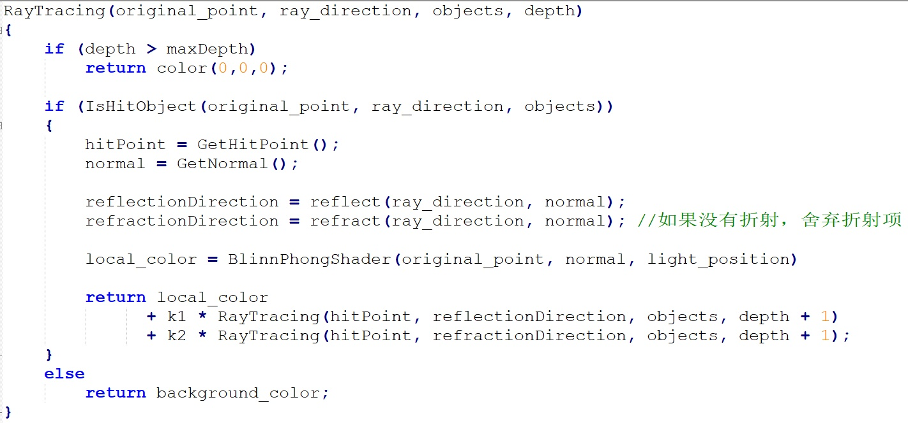

 
 

## 光线计算

### 表示方法

将每一条光线想象成一条射线，那么光线都由起点及方向这两个属性所固定。

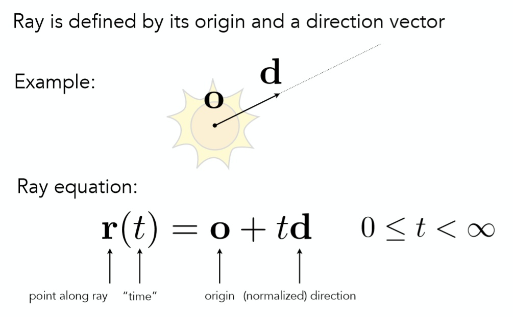

 

### 光线与隐式曲面求交

以球体为例，同时满足光线方程和球体方程即为交点，所以可以把光线方程代入球体方程，然后用解一元二次方程的形式得到t的值。

 

### 光线与显式曲面求交

真正在图形学中大量运用的其实是显式曲面，经常需要计算光线与三角形面的交点。

对于任意一个平面：

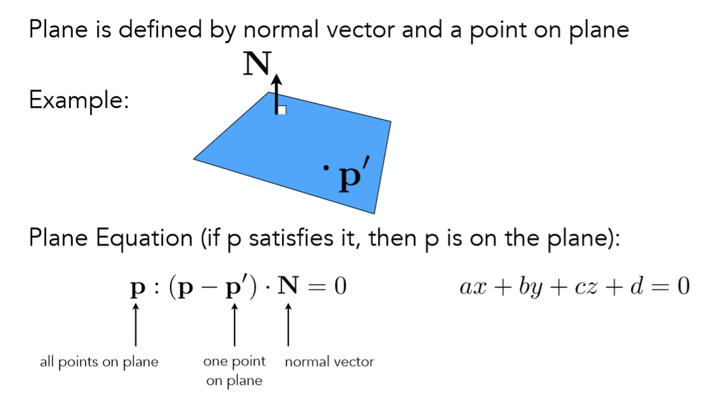

这里对显示曲面的求交又转化为了类似隐式曲面求交的方法，对于任意一个三角面来说，它一定处于一个平面之上，只需求出光线与平面的交点，再判断该交点是否在三角形内，就可以得到光线是否与三角形面相交，如下图：

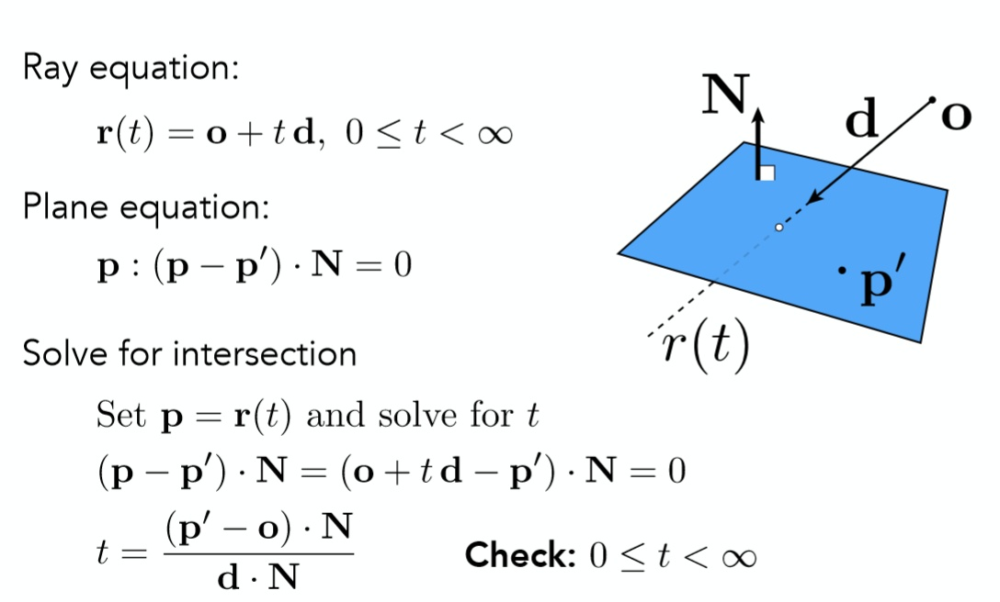

 

这样计算有点繁琐，有更简便的方法：直接将点用重心坐标的形式表示，利用克莱姆法则求解线性方程组。

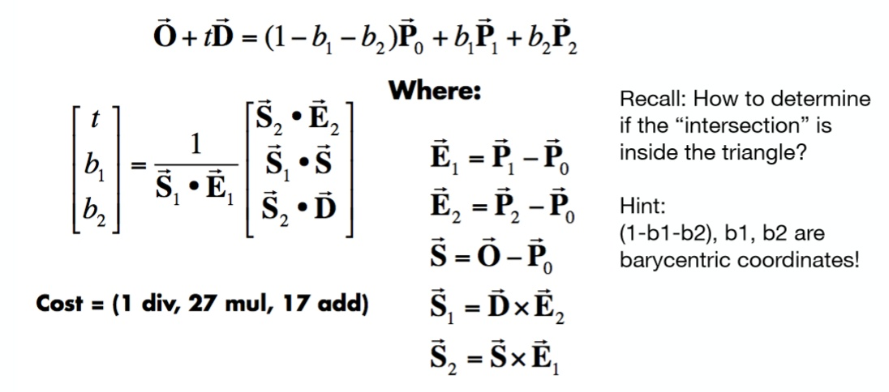

 

### 反射方向计算

已知$\mathbf l$和$\mathbf n$：

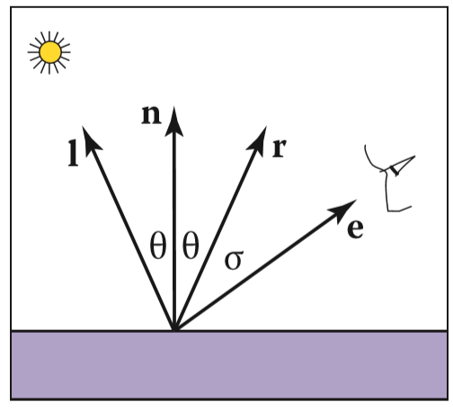

参考之前局部光照模型，可以用$\mathbf r=2\mathbf n(\mathbf l·\mathbf n)-\mathbf l $计算出反射方向$\mathbf r$。

 

### 折射方向计算

折射方向的推导由斯奈尔定理(Snell’s Law)得到：

$$
nsinθ=n_tsinφ   \tag{1} \label{eq1}
$$

其中$n$，$n_t$分别代表反射平面两边的反射率，如下图所示左半部分为$n$，右半部分为$n_t$：

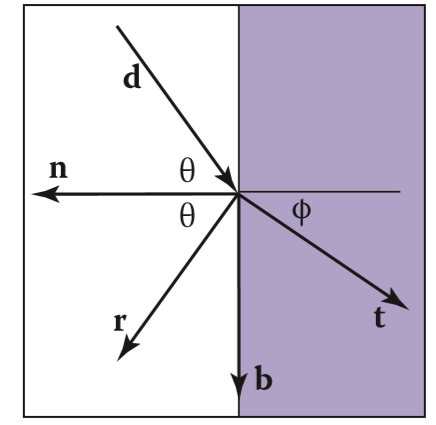 

根据$sin^2+cos^2=1$以及$\eqref{eq1}$式，可以推出$cosφ$如下：

$$
cos^2φ=1-\frac{n^2}{n_t^2}(1-cos^2θ)   \tag{2} \label{eq2}
$$

这仅仅是求得反射角度，更希望得到的是向量形式的方向$\mathbf t$，因此根据上图可得到如下关系(图中皆为单位向量)：

$$
\mathbf t=sinφ\mathbf b-cosφ\mathbf n \tag{3} \label{eq3}
$$

其中$\mathbf b$是未知的，但是可以根据入射光线$\mathbf d$推出：

$$\begin{aligned}
\mathbf d&=sinθ\mathbf b-cosθ\mathbf n \\
\mathbf b&=\frac{\mathbf d+\mathbf ncosθ}{sinθ}  
\end{aligned}  \tag{4} \label{eq4} $$

如此$\eqref{eq3}$式当中所有的变量都已知，计算得到折射方向$\mathbf t$如下：

$$\begin{aligned}
\mathbf t&=\frac{n(\mathbf d+\mathbf ncosθ)}{n_t}-\mathbf ncosφ \\
&=\frac{n(\mathbf d-\mathbf n(\mathbf d·\mathbf n))}{n_t} - \mathbf n\sqrt{1-\frac{n^2(1-(\mathbf d·\mathbf n)^2)}{n_t^2}} 
\end{aligned}  \tag{5} \label{eq5} $$

 

*需要注意[菲涅耳反射(Fresnel Reflection)](https://www.cnblogs.com/starfallen/p/4019350.html)。

 
 

## 加速光线追踪

### 轴对齐包围盒 Axis-Aligned Bounding Box 

在复杂场景中，这个算法的计算量是`像素数量 x 三角形面数量 x 弹射次数`，啊也过于庞大了！所以需要加速光线追踪。

用一个包围盒包围住物体，只要计算光线与包围盒是否相交。其中AABB盒与三条对称轴对齐，以二维的AABB为例子，三维以此类推。

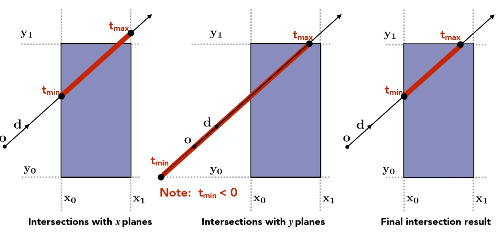 

可以得到$t_{enter}=max(t_{min})$，  $t_{exit}=min(t_{max})$

考虑多种情况，比如光线出射点在盒子内以及盒子在反方向等，判定光线与包围盒相交的条件可以简化为：$t_{enter}<t_{exit}$ && $t_{exit}≥0$

 

AABB对计算效率的提升：

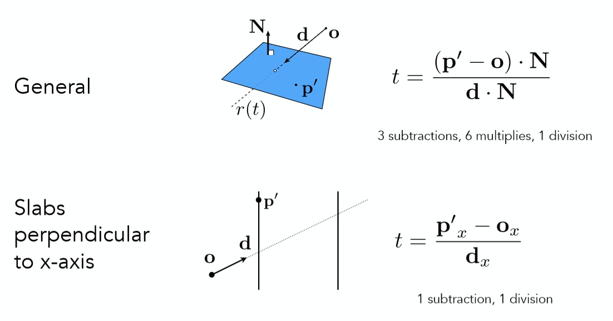 

 

### 均匀空间划分 Uniform Spatial Partitions (Grids)

AABB并不应只局限于以物体模型为单位，可以更加精细的考虑到以三角面为单位。另外对于场景中的包围盒来说，应该要有一种数据结构将其统领起来。更好地划分场景形成不同的AABB，能使划分之后的包围盒有更佳的加速效果。

均匀划分是最简单的一种方式。

具体步骤是找一个包围盒，然后均匀划分：

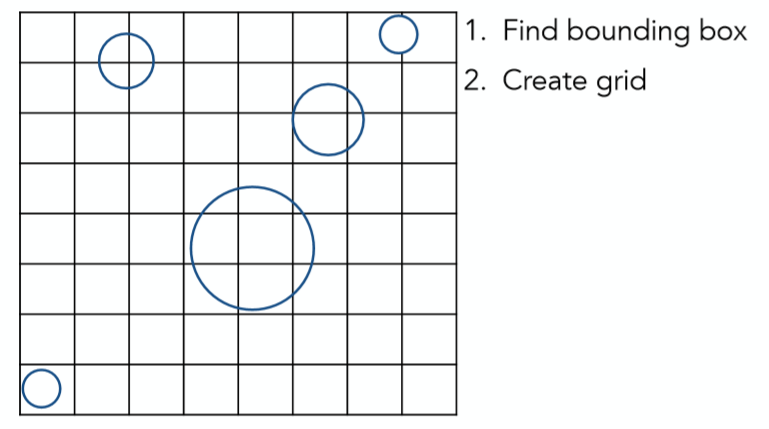

接着在每个重叠小包围盒上存储物体模型信息：

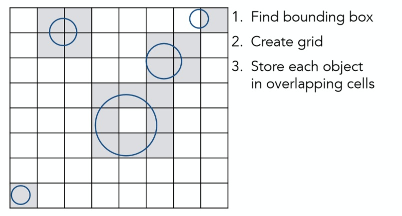

紧接着，根据光线的方向与判断出所有相交的方格(这一步可以利用bresenham算法)，倘若方格中存储有物体，再进一步与方格中的物体模型或是三角形面求交。

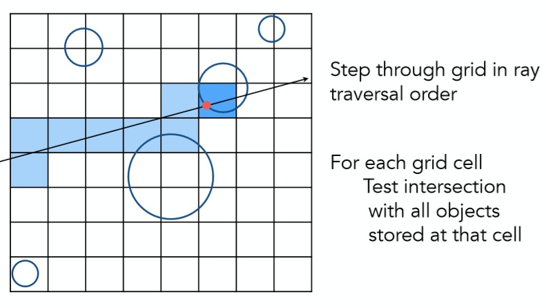

简单来说就是将空间划分为多个均匀的小的AABB，再根据光线方向找出相交grid，再判断grid中是否存储了模型信息，若有则进一步求交。

它适用于三角形均匀分布的情况：

 

如果说场景较为空旷，物体较小且分离得比较开，那么均匀分割的效果就会很差，有很多无效的方格与光线的求交过程。

 

### KD-Tree 空间划分

三种划分方式：

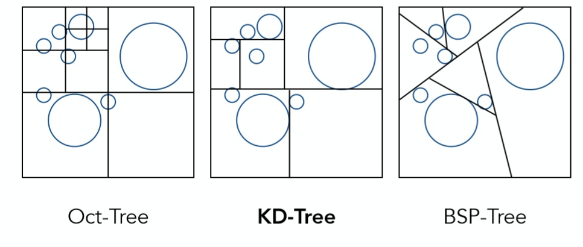 

**Oct-Tree**：也就是八叉树，每次将空间分为8个相等的部分，再递归的对子空间进行划分，当划分的子空间足够小或是空间中三角形面的数量很少的时候会停止划分。显著缺点是随着维度的上升划分的空间数量会呈指数级增长。

**KD-Tree**：每次将空间划分为两部分，划分依次沿着x-axis，y-axis，z-axis，即如图中所示，第一次横着将2维空间分为上下，第二次再竖着将上下两个子空间分别划分为左右部分，依次递归划分，终止条件与八叉树类似。

**BSP-Tree**：与KD-Tree类似，唯一不同的是划分不再沿着固定一轴，可以任意方向划分，缺点自然是划分的空间没有规则性，求交困难。

 

KD-Tree首先判断光线是否与最外层的包围盒相交，如果相交则进一步判断是否与对应的两个子空间相交。

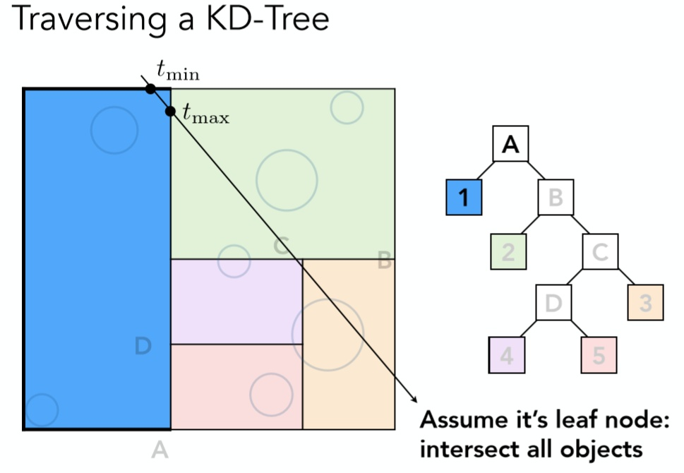 

 

如果光线与之相交，进一步判断与存储与叶子节点的物体信息求交。左半边判断完之后，接着判断右半部分。

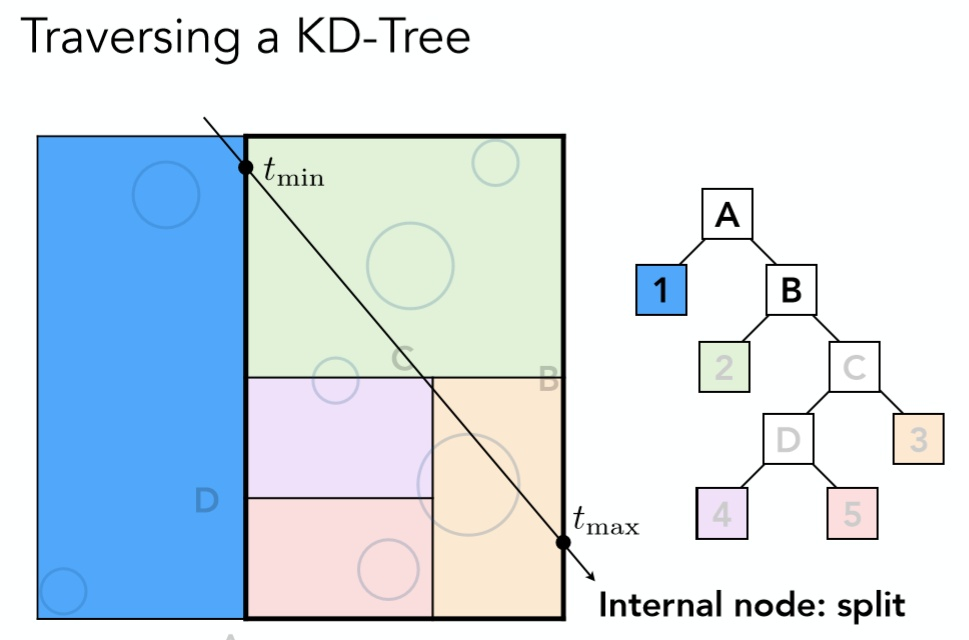 

 

同样如果对于有半部分存在相交情况，则对于右半部分的所有子空间递归执行。 

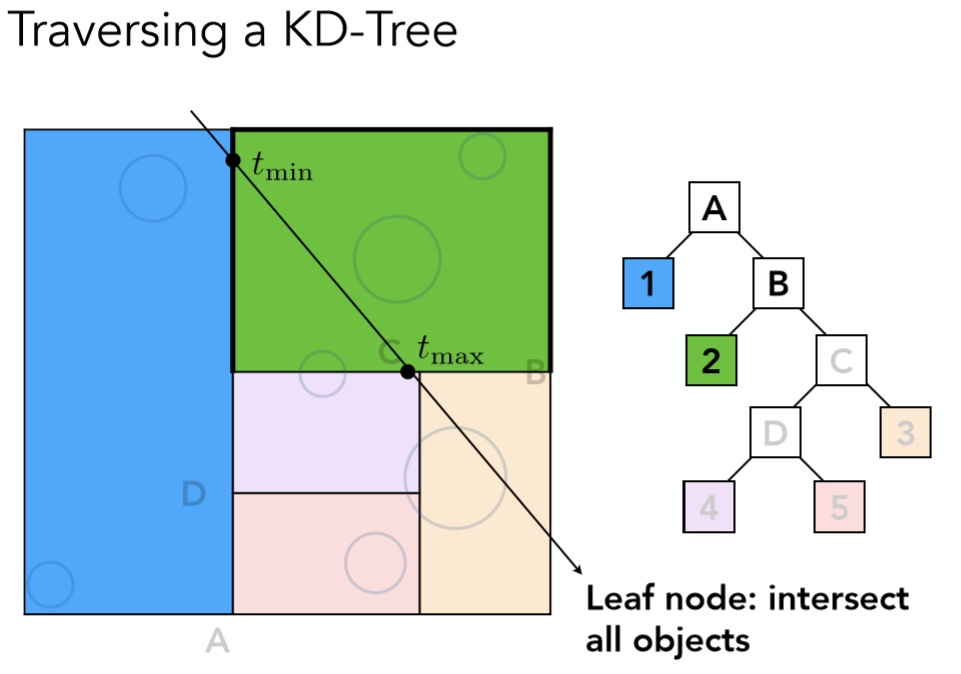 

优点：利用KD-Tree的结构来构建AABB的好处是倘若光线与哪一部分空间不相交，那么则可以省略该部分空间所有子空间的判断过程，在原始的纯粹的AABB之上更进一步提升了加速效率。

缺点：缺点是判断包围盒与三角面的是否相交较难，因此划分的过程不是那么想象的简单，其次同一个三角面可能被不同的包围盒同时占有，这两个不同包围盒内的叶节点会同时存储这一个三角形面。

 

### Bounding Volume Hierarchy (BVH)

BVH是目前比较广泛使用的方法，与前几种方法最显著的区别就是，不再以空间作为划分依据，而是从对象的角度考虑，即三角形面。

第一步同样找出场景的整体包围盒作为根节点。

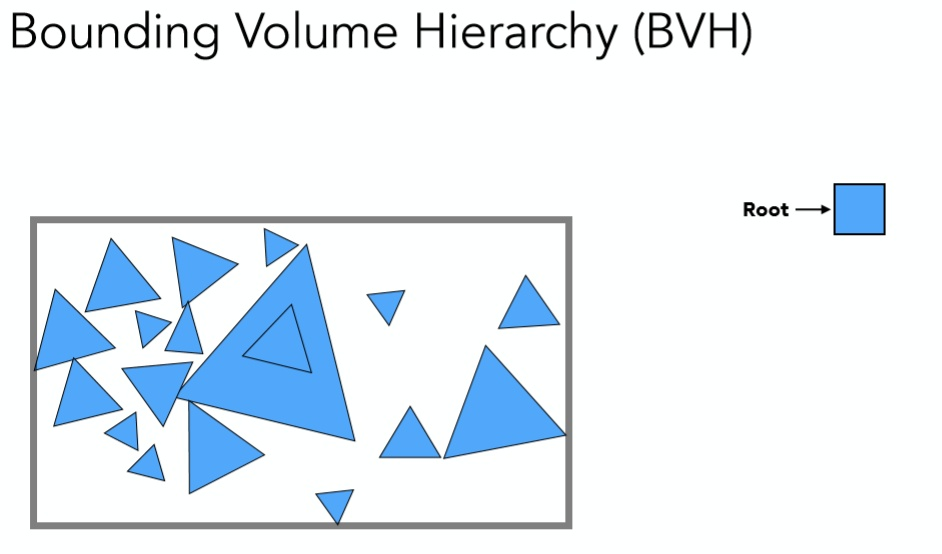

 

第二步找到合适的划分点，将最大包围盒内的三角形面分为两部分，再分别重新计算新的包围盒。

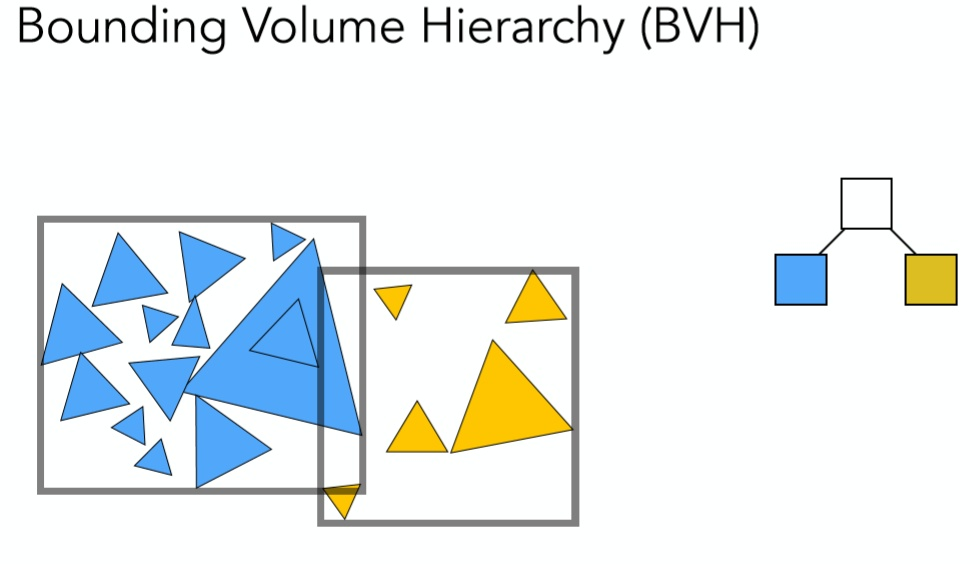

 

注意到这里，包围盒会重叠，但一个三角形面只会被存储在唯一的包围盒内，而这也就解决了KD-Tree的缺点，接着与KD-Tree的建立类似，递归的对所有子空间重复该步骤。

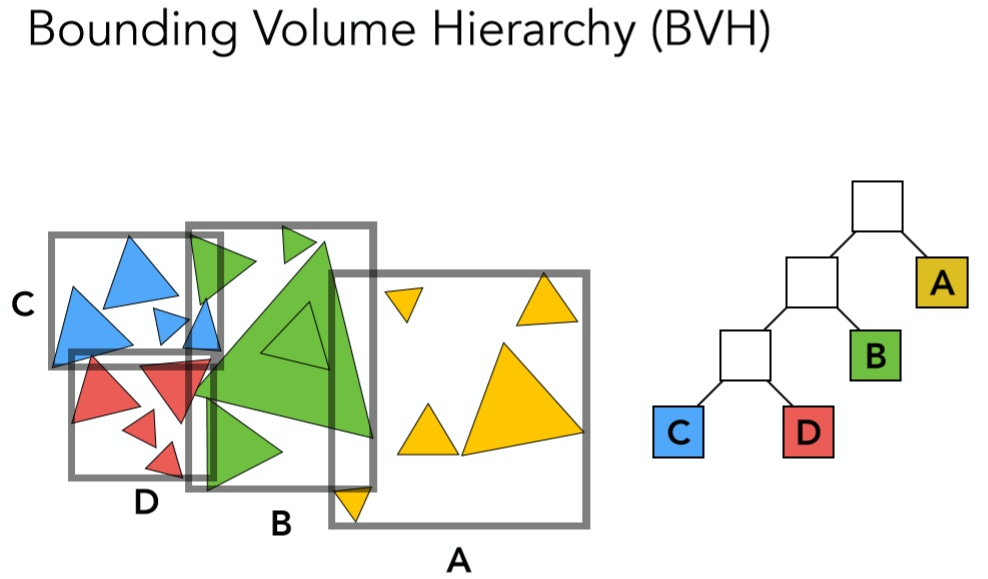

最终可以建立出如上图的所示的树形结构，图片只进行了左半部分的划分。

 

tips：

每次划分一般选择最长的那一轴划分，假设是x轴，那么划分点选择所有三角面的重心坐标在x坐标上的中位数进行划分，如此便能保证划分的三角形左右两边三角形数量尽可能差不多，当然也就使得树形结构建立的更加平衡，可以提高效率。

与KD-Tree一样，中间节点不存储物体三角面信息，只在叶节点中存储，终止条件可设定为当前包围盒内三角形数量足够少。

伪代码参考：

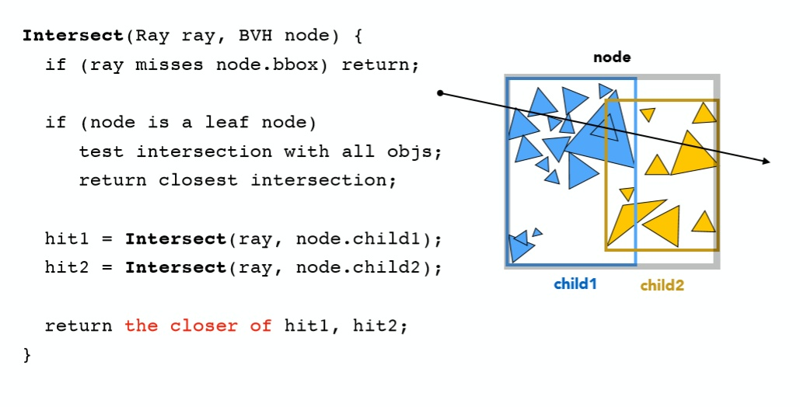

