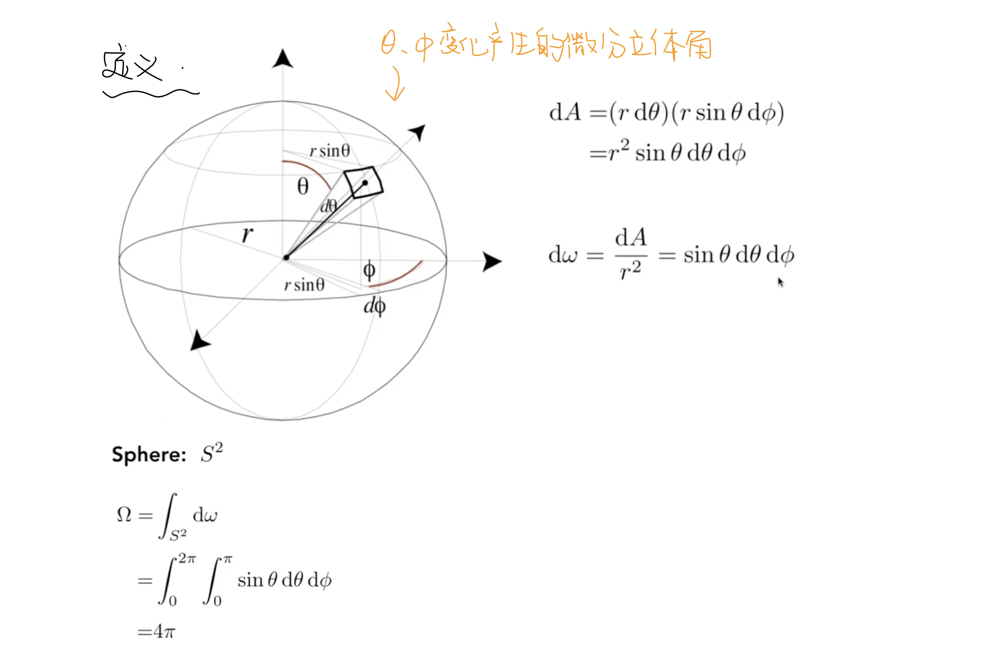
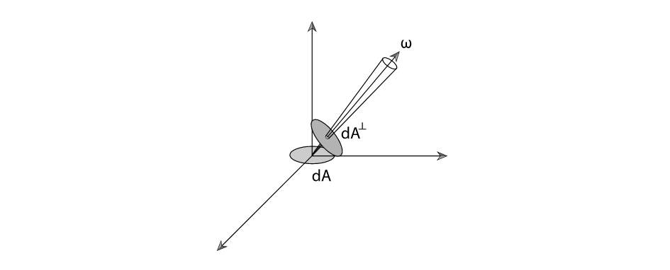

 

所谓辐射通量或者说辐射功率，其实就是在辐射能量的基础之上除以时间，也就是单位时间的能量。同样也可以用物理当中的功率来进行类比。

 

然后是这三个真的好乱的概念：

**Radiant itensity**其实就是指从一个光源出发某一方向上的亮度

**Irradiance**指某一微小平面所接受到的光线亮度

**Radiance**衡量的是一条传播光线所具有的亮度(不受传播方向影响而改变)

 
 

### Radiant intensity 辐射强度

Radiant intensity一句话来说,就是从光源发出的**每单位立体角(solid angle)上的功率**。

 

这里解释一下立体角，对应二维空间中圆的弧度在三维空间中球上的拓展：

即立体角度所对应球上的投影面积比上半径的平方，整个球的立体角为$4π$。

那么对于Radiant intensity的定义当中，微分立体角$dω$计算如下：

 
 

### Irradiance 辐射照度

同样用一句话来说，irradiance是指**每单位照射面积所接收到的power**。

这个概念可以用来解释之前Blinn-Phong模型中乘以余弦值的原因，同样也可以解释光线越远越加衰减的例子：

 
 

### Radiance 光亮度

所谓radiance就是指每单位立体角，每单位垂直面积的功率，直观来看的话，很像是Intensity和irradiance的结合，它**同时指定了光的方向与照射到的表面所接受到的亮度**。

但这里有一个细微的区别，在irradiance中定义的**每单位照射面积**，而在radiance当中，为了更好的使其成为描述一条光线传播中的亮度，且在传播过程当中大小不随方向改变，所以在定义中关于接收面积的部分是**每单位垂直面积**，而这一点的不同也正解释了图中式子分母上的$cosθ$。

即图中的$dA$是irradiance中定义所对应的，而$dA^⊥$才是radiance中所定义的面积。二者之间的关系为$dA^⊥=dAcosθ$。

 
 

### Irradiance & Radiance

由它们的定义：

$$
L(p,ω)=\frac{dE(p)}{dωcosθ}
$$

进一步推导：

观察积分后的式子，$E(p)$就是点p的irradiance，其物理含义是上文所提到过的点p上**每单位照射面积的功率**，而$L_i(p,ω)$指入射光**每立体角，每垂直面积的功率**，因此积分式子右边的$cosθ$解释了面积上定义的差异，而对$dω$积分，相当于对所有不同角度的入射光线做一个求和。

该积分式子的物理含义便是，一个点(微分面积元)所接收到的亮度(irradiance)，由所有不同方向的入射光线亮度(radiance)共同贡献得到。

 
 

## BRDF 双向反射分布函数

利用辐射度量学，可以这样定义光的反射：

从直观的理解来说，不同物体表面材质自然会把一定方向上的入射亮度($dE(ω_i)$)反射到不同的方向的光线上($dL_r(ω_r)$)。比如理想光滑表面会把入射光线完全反射到镜面反射方向，其它方向完全没有；理想粗糙表面会把入射光线均匀的反射到所有方向。

因此所谓BRDF就是描述这样一个从不同方向入射之后，反射光线分布情况的函数，定义如下：

它接收两个参数，入射光方向$ω_i$,反射光方向$ω_r$，函数值为反射光的radiance与入射光的iiradiance的比值。(从某个方向接受到的光能有多少反射到另外一个方向)

 

### The Reflection Equation 反射方程

即摄像机所接受到的$ω_r$方向上的反射光，是由所有不同方向上入射光线的irradiance贡献得到的，而不同方向入射光线的irradiance对反射方向$ω_r$的贡献程度则由物体表面材质决定，所以乘上了一个BRDF函数。

入射光线的radiance不仅仅是光源所引起的，还有可能是其他物体上着色点的反射光线的radiance，恰好反射到当前的着色点p(即间接光照)，同时其他物体上的反射光线的radiance依然也是由直接光照和间接光照构成，因此这与whitted-style当中的光线追踪过程十分类似，也是一个递归的过程。解方程比较难，在后面会写到。

 

### The Rendering Equation 渲染方程

渲染方程在反射方程的基础之上添加了一个自发光项(Emission Term)：

$$
L_o(p,ω_o)=L_e(p,ω_o)+\int_{Ω^+}L_i(p,ω_i)f_r(p,ω_i,ω_o)(n·ω_i)dω_i
$$

其中$L_e(p,ω_o)$为自发光项，反射方程中的$cosθ$用$n·ω_i$代替。 (所有光线方向均指向外)

 

参考对渲染方程的理解：

[渲染方程做了什么？- miccall](https://zhuanlan.zhihu.com/p/35886937)