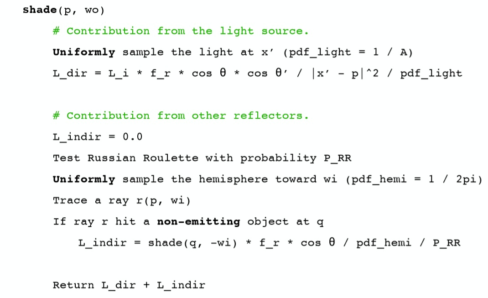

 

## Monte Carlo Integration 蒙特卡洛积分

**蒙特卡洛积分的目的**：当一个积分很难通过解析的方式得到答案的时候可以通过蒙特卡洛的方式近似得到积分结果。

对于这样一个函数，很难去用一个数学式子去表示，因此无法用一般解析的方法直接求得积分值，这时候可以采用蒙特卡洛的思想。

**蒙特卡洛积分的原理**：对函数值进行多次采样求均值作为积分值的近似

想象一下如果对上图这个函数值进行均匀采样的话，其实就相当于将整个积分面积切成了许许多多个长方形，然后将这些小长方形的面积全部加起来。

定义如下：

希望求出一个函数$f(x)$在积分域$[a,b]$上的积分值，选定一个采样的分布$p(x)$，通过对该分布来进行多次的函数值采样。

 

推导：

求均值的做法其实也是对期望的逼近，因此有：

$$
\frac{1}{N}\sum_{i=1}^N\frac{f(X_i)}{p(X_i)}≈\mathbb{E}_{x\sim p(x)}[\frac{f(x)}{p(x)}]
$$

那么对于这样一个服从某一分布的期望的计算套公式直接计算得：

$$\begin{aligned}
\mathbb{E}_{x\sim p(x)}[\frac{f(X_i)}{p(X_i)}]
&=\int_a^b\frac{f(x)}{p(x)}p(x)dx  \\
&=\int_a^bf(x)dx
\end{aligned}$$

通过以上推导即可明白蒙特卡洛的近似正是对积分值的一个无偏估计。

 

本文中所有采样都使用均匀采样，因此推出：

蒙特卡洛在此来说就是一个**帮助求得困难积分值**的方法。

 
 

## Monte Carlo Path Tracing 蒙特卡洛路径追踪

回顾渲染方程：

$$
L_o(p,ω_o)=L_e(p,ω_o)+\int_{Ω^+}L_i(p,ω_i)f_r(p,ω_i,ω_o)(n·ω_i)dω_i
$$

解出以上方程的解主要有两个难点：积分的计算和递归形式。

在进入具体计算之前，对渲染方程做出一点小修改，即舍弃自发光项（因为除了光源其他物体不会发光）：

$$
L_o(p,ω_o)=\int_{Ω^+}L_i(p,ω_i)f_r(p,ω_i,ω_o)(n·ω_i)dω_i
$$

从具体例子出发，首先仅考虑直接光照：

修改过之后的方程其实就只是一个单纯的积分计算了，其物理含义为着色点p到摄像机或人眼的Radiance值。

对于一个困难积分只要选定一个被积分变量的采样分布即可通过蒙特卡洛的方法得到积分结果的近似值，而此时的被积分值为$ω_i$，选定$ω_i~p(ω_i)$，得出积分近似结果：

$$
L_o(p,ω_o)≈\frac{1}{N}\sum_{i=1}^N\frac{L_i(p,ω_i)f_r(p,ω_i,ω_o)(n·ω_i)}{p(ω_i)}
$$

 

单独仅仅考虑直接光照是不够的，还需要间接光照，即当采样的$ω_i$方向碰撞到了别的物体。

此时采样的光线碰撞到了另一个物体的Q点，该条路径对着色点P的贡献是，在点Q的直接光照再乘上反射到该方向上的百分比。这是一个类似光线追踪的递归过程，不同在于该方法通过对光线方向的采样从而找出可行的路径，这也正是为什么叫路径追踪的原因。

伪代码如下：

 
 

这个方法还是有缺陷的。

通过每次对光线方向的采样从而解出方程，假设每次采样100条，那么从人眼出发的第一次采样就是100条，在进行第二次反射之后就是10000条，依次类推，反射越多次光线数量会快速增长，计算量过大。因此每次只能采样一个方向。

 

每次如果只采样一个方向，计算结果偏差会很大，虽然蒙特卡洛积分是无偏估计，但样本越少显然偏差越大。因此需要重复多次寻找到多条路径，将多条路径的结果求平均。

通过对经过像素的光线重复采样，每次在反射的时候只按分布随机选取一个方向，解决了只对经过像素的光线采样一次，而对反射光线按分布采样多次所导致的光线爆炸问题。

 

但还没完（好长啊天），此时shade函数的递归没有出口，永远不会停下。这里不没有采用类似光线追踪给出递归出口的方法，而是采用了**俄罗斯轮盘赌（Russian Roulette）**。

将其应用在路径追踪当中，首先设定一个概率$P$, 有$P$的概率光线会继续递归并设置返回值为$L_o/P$，有$1-P$的概率光线停止递归，并返回0。光线一定会在某次反射之后停止递归，并且计算的结果依然是无偏的，因为Radiance的期望不变。

$$
E=P*(L_o/P)+(1-P)*0=L_o
$$

此时shade函数变更如下：

 

还有最后一个问题，就是路径追踪效率低下。

在每次计算直接光照的时候，通过均匀采样任选一个方向，但很少光线可以hit光源，尤其当光源较小的时候，大量采样的光线都被浪费。

因此在计算直接光照的时候改进为**直接对光源进行采样**，这样所有采样光线都一定会击中光源(如果中间没有别的物体)。

假设光源的面积为$A$，那么对光源进行采样的$pdf=1/A$，但渲染方程是对光线方向积分，如果依然使用蒙题卡洛的方法，要将其修改为对光源面积$dA$的积分，换言之就是需要找到$dA$与$dω_i$的关系。

关系式中的$cosθ’$是为了计算出光源上微分面积元正对半球的面积，之后再按照立体角的定义$dω=\frac{dA}{r^2}$，除以着色点x与光源采样点x’距离的平方。

渲染方程改写如下：

$$\begin{aligned}
L_o(p,ω_o)&=\int_{Ω^+}L_i(x,ω_i)f_r(x,ω_i,ω_o)cosθdω_i  \\
&=\int_AL_i(x,ω_i)f_r(x,ω_i,ω_o)\frac{cosθcosθ’}{\|x’-x\|^2}dA
\end{aligned}$$

 

现在可以利用蒙特卡洛方法计算直接光照的积分值，对于间接光照，依然采用先前的方法进行光线方向的均匀采样。

最终的shade函数：

计算直接光照的时候还需要判断光源与着色点之间是否有物体遮挡，只需从着色点x向光源采样点x’发出一条检测光线，判断是否与光源之外的物体相交。 

 

现在终于写完了！