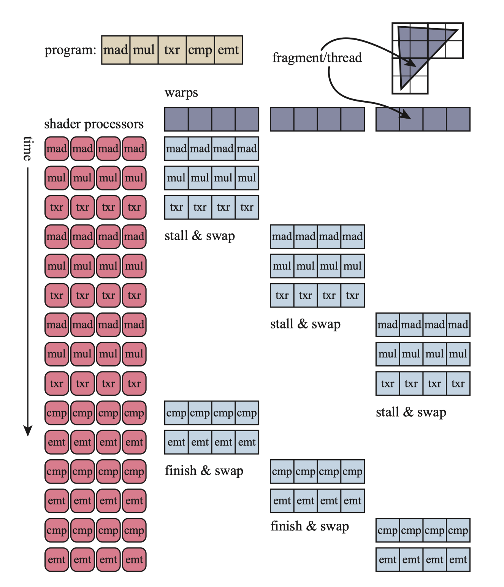
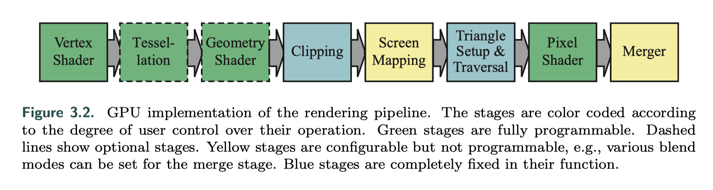
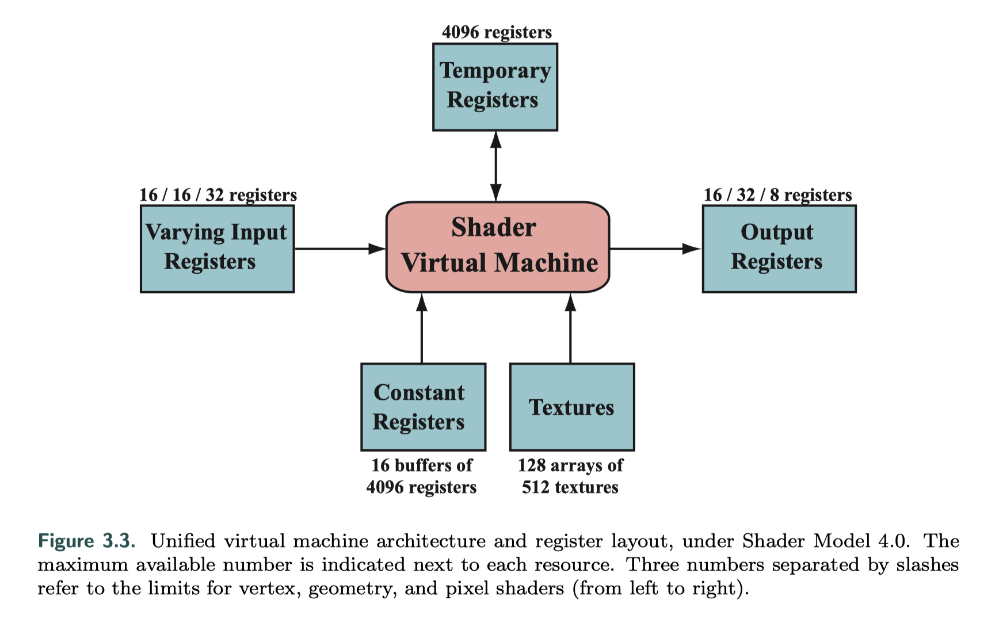
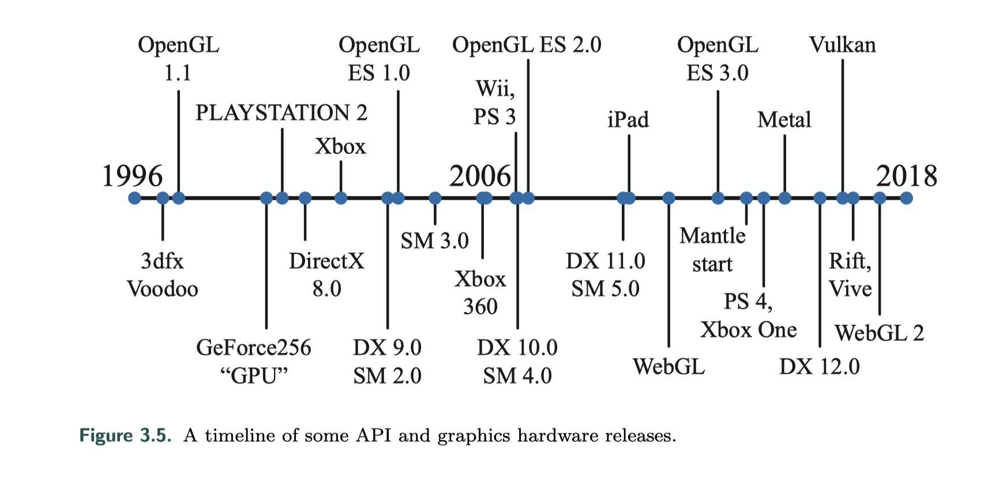
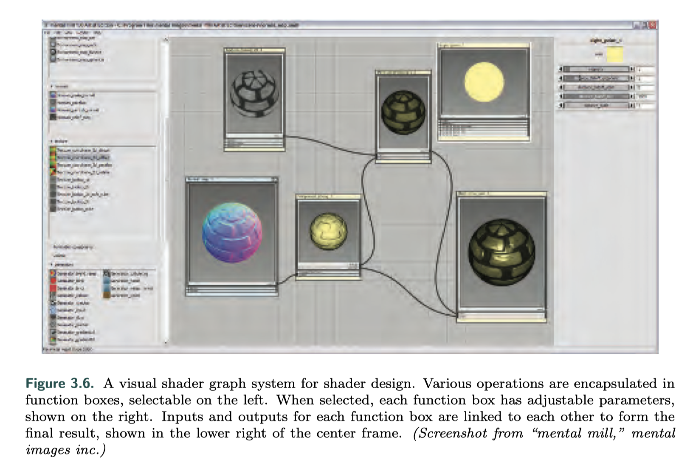
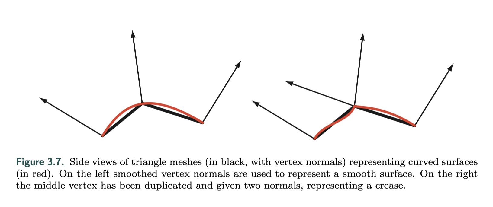
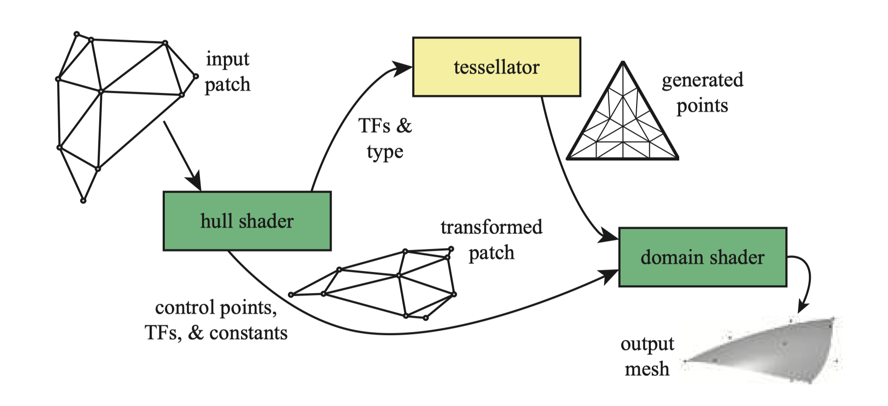
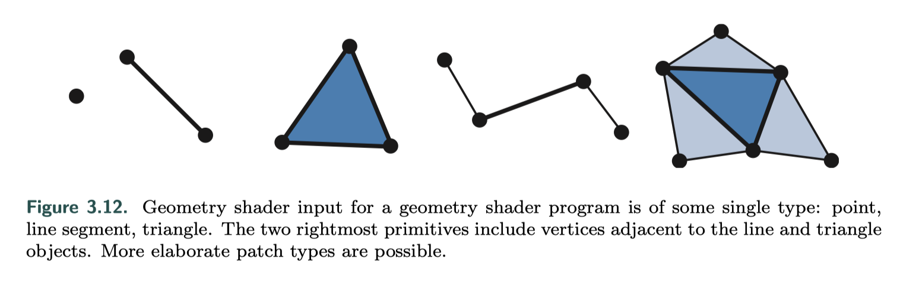

 

这是《Real-time Rendering》的笔记系列第三章。

在前一章叙述的渲染管线里，像素计算、深度测试等等操作被频繁使用，这些过程如果让专用硬件来实现高度并行，就可以大大提升性能。这章讲的是GPU的原理和功能等等等。

 

## 1. Data-Parallel Architectures 数据并行架构

GPU和CPU采用的是不同的并行方法。

GPU的大多芯片区域用于一大批、通常是数千个处理器使用，称为shader cores。GPU是流处理器，它依次处理相似数据（一组顶点或者像素）的有序集合，以达到大规模并行的效果。这些调用尽可能独立，从而不需要相邻数据、也不共享可写内存。注意有时候会打破这个规则来实现新的效果，但代价是潜在的延迟，因为处理器可能需要等待。

GPU针对吞吐量进行了优化，定义为可以处理数据的最大速率。由于专用于cache存储器和控制逻辑的芯片面积较小，因此每个着色器内核的等待时间通常比CPU处理器遇到的等待时间长得多。

GPU把指令执行逻辑和数据分离开来，称为**SIMD（Single instruction, multiple data）**。与使用单独的逻辑和调度单元来运行每个程序相比，SIMD的优点是用于处理数据和交换的消耗大量减少。每个着色器调用称为一个线程，和CPU的线程不同，它包含着色器输入值使用的一点内存，以及着色器执行所需的任意寄存器。使用相同着色器程序的线程将被分组，这种分组NVIDIA称为**warp**，AMD称为**wavefront**。每个线程都映射到SIMD通道。

上图是一个示例。三角形的片元/线程被聚集成warp（请问wrap到底怎么翻译……），图片简化了，每组有32个线程，图上只画了4个。着色器程序长度是5个指令，处理器集合执行第一组直到在txr条件上停顿，因为这里需要时间获取数据。这时候第二组就被切换进来，同样执行指令直到停顿，反复直到第一组满足继续运行的条件，就切换到第一组。

 

 

## 2. GPU Pipeline Overview GPU管线

GPU实现了第二章描述的某些阶段：几何处理、光栅化和像素处理流水线，这些阶段分为具有不同可配置性或可编程性的几个硬件阶段，如下图所示，绿色是完全可编程，黄色是可配置不可编程，蓝色是完全固定。

顶点着色器是完全可编程的阶段，用于实现几何处理；几何着色器是完全可编程的阶段，可在图元的顶点上运行；镶嵌和几何着色器都是可选的，并非所有GPU都支持它们，尤其是在移动设备上。

裁剪、三角形设置、三角形遍历由固定功能硬件实现；像素着色器阶段是完全可编程的，尽管合并阶段不可编程的，但它高度可配置，可设置为执行多种操作如修改颜色、z缓冲区以及其他与输出相关的缓冲区。

 

 

## 3. The Programmable Shader 可编程着色器

现代着色器程序使用统一的着色器设计，这意味着顶点、像素、几何和镶嵌相关的着色器共享一套公共编程模型。在内部，它们具有相同的指令集体系结构（ISA）。

目前的着色语言都是C-like，比如HLSL、CG、GLSL。DirectX的HLSL可以编译为虚拟机字节码，也称为中间语言（IL或DXIL）。这种中间语言可视为一个作为着色语言编译器的虚拟机。这个虚拟机是一个处理多种类型寄存器和数据源、预编了一系列指令的处理器。

着色语言虚拟机可以理解为一个处理多种类型寄存器和数据源、预编了一系列指令的处理器。32位单精度浮点的标量和矢量是其基本数据类型；也随后支持32位整型。浮点矢量通常包含数据如位置（xyzw），法线，矩阵行 ，颜色（rgba），或者纹理坐标（uvwq）。而整型通常用来表示，计数器，索引，或者位掩码。也支持综合数据类型比如结构体，数组，和矩阵。而为了便于使用向量，向量操作如调和（swizzling，也就是向量分量的重新排序或复制），和屏蔽（masking，只使用指定的矢量元素），也能够支持。

虚拟机的输入和输出如下图：

在Shader Model 4.0下统一核心虚拟机架构以及寄存器布局。每个资源旁边都会显示最大可用数量。用斜杠分隔的三个数字从左到右表示顶点、几何和像素着色器的限制。

一个绘制调用（Draw Call）会调用图形API来绘制一系列的图元，会驱使图形管线的运行。

每个可编程着色阶段拥有两种类型的输入：

- uniform输入，在一个draw call中保持不变的值（但在不同draw call 之间可以更改）

- varying 输入，shader里对每个顶点和像素的处理都不同的值。纹理是特殊类型的uniform输入，曾经一直是一张应用到表面的彩色图片，但现在可以认为是存储着大量数据的数组。

 

现代GPU上 ，图形运算中常见的运算操作执行速度非常快。通常情况下，最快的操作是标量和向量的乘法和加法，以及他们的组合如乘加运算（multiply- add）和点乘 （dot-product）运算；其他操作，比如倒数（reciprocal）、平方根（square root）、正弦（sine）、余弦（cosine）、指数（exponentiation）、对数（logarithm）运算，往往会稍微更加昂贵，但依然相当快捷。纹理操作非常高效，但他们的性能可能受到诸如等待检索结果的时间等因素的限制。

**流控制（flow control）**是指使用分支指令来改变代码执行流程的操作。这些指令用于实现高级语言结构，如if和case语句，以及各种类型的循环。Shader支持两种类型的流控制。静态流控制（Static flow control）是基于统一输入的值的。这意味着代码的流在调用时是恒定的；静态流控制的主要好处是允许在不同的情况下使用相同的着色器（例如不同数量的光源）。动态流控制（Dynamic flow control）基于不同的输入值，但动态流控制远比静态流量控制更强大，但同时也需更高的开销，特别是在调用shader之间，代码流不规律改变的时候。

评估一个shader的性能，是评估其在一段时间内处理顶点或像素的个数。如果流对某些元素选择if分支，而对其他元素选择else分支，这两个分支必须对所有元素进行评估（并且每个元素的未使用分支将被丢弃）。

 

 

## 4. The Evolution of Programmable Shading and APIs

可编程着色的思想追溯到1984年Cook的Shade trees，消费级图形硬件是3dfx Interactive于1996年10月1日首次成功引入的。图形硬件和API的发展可以参考下图：

- GeForce256是第一个被称为GPU的硬件，它不可编程但可以配置；

- 2001年初NVIDIA的GeForce 3是第一个支持可编程顶点着色器的GPU，该着色器通过DirectX 8.0和OpenGL扩展公开；

- 2002年，DirectX 9.0发布，其中包括Shader Model 2.0，具有真正可编程的顶点和像素着色器，着色编程语言 HLSL也是随着DirectX 9.0的发布而问世；

- 2004年，Shader Model 3.0推出，进行了增量改进，并添加了动态流控制，新一代主机的问世，Microsofts Xbox 360(2005)和Sony Play Station(2006)都配备了Shader Model 3.0级别的GPU；
- 2007年，Shader Model4.0发布，包含于DirectX 10.0中，OpenGL以扩展的方式支持，新增了几个着色器和流输出等新特性，包含支持所有Shader类型（顶点、几何、像素着色器）的一套统一着色模型（uniform programming model）；

- 2009年发布了DirectX 11和Shader Model 5.0，添加了细分阶段着色器和计算着色器，也称为DirectCompute，OpenGL在4.0版中添加了细分，在4.3版中添加了计算着色器；
- API的下一个重大变化是由AMD在2013年推出的Mantle API所引起，它消除大部分图形驱动程序的开销并将此控件直接交给开发人员，以及进一步支持有效的CPU多处理，在Mantle中开创的构想被Microsoft采纳，并在2015年以DirectX 12的形式发布；
- 苹果在2014年发布了自己的低开销API，称为Metal，在iPhone 5S和iPad Air等移动设备上首次可用；
- AMD将其Mantle工作捐赠给了Khronos Group，后者于2016年初发布了自己的新API，名为Vulkan，与OpenGL一样可在多个操作系统上工作。 Vulkan使用一种称为SPIRV的新高级中间语言，可用于着色器表示和一般GPU计算，且预编译的着色器是可移植的； Vulkan也可以用于非图形GPU计算，因为它不需要显示窗口。 Vulkan与其他低开销驱动程序的显著区别是，旨在与从工作站到移动设备的各种系统一起使用；
- 在移动设备上规范是使用OpenGL ES，ES代表嵌入式系统，因为此API是为移动设备而开发的；
- OpenGL ES的一个主题是基于浏览器的WebGL，第一个版本发布于2011年，可在大多数移动设备上使用，它的功能等效于OpenGL ES 2.0。它是跨平台的，可以在各种设备上使用，驱动程序由浏览器支持，代码是解释性的而不是编译性，大多数浏览器都内置了调试器，可以检查在任何网站上运行的代码。

 

 

## 5. The Vertex Shader 顶点着色器

顶点着色器是处理三角形网格的第一阶段。顶点着色器只负责处理传入的顶点，既不能创建也不能破坏顶点，并且一个顶点生成的结果不能传递到另一顶点。通常，顶点着色器程序将顶点从**模型空间（Model Space）**变换到**齐次裁剪空间（Homogeneous Clip Space）**，一个顶点着色器至少且必须输出此变换位置。

三角形网格由一组顶点表示，除了位置之外，每个顶点还有其他可选属性如颜色或纹理坐标。表面法线也定义在网格顶点上，在渲染时，通常使用三角形网格来表示基础曲面，并且使用顶点法线来表示表面的方向，而不是三角形网格本身。如下图，顶点被复制并给定两个法线，表示折痕：

随后的章节介绍了几种顶点着色器效果，例如用于动画关节的顶点混合和轮廓渲染。顶点着色器的其他用途包括：

- 对象生成；
- 使用蒙皮和变形技术对角色的身体和面部进行动画处理；
- 程序变形，例如标志、布料或水的移动；
- 镜头变形、热雾、水波纹、页面卷曲和其他效果；
- 用顶点纹理获取来应用地形高度场；

顶点着色器的输出可以通过几种不同的方式使用。一般用于图元光栅化并将生成的各个像素片段发送到片元着色器程序；在某些GPU上，数据也可以发送到细分阶段或几何着色器，或存储在内存中。

 

 

## 6. The Tessellation Stage 细分阶段

细分阶段允许渲染曲面。此阶段是可选的GPU功能，最早在DirectX 11中可用（并且是DirectX 11必需的），在OpenGL 4.0和OpenGL ES 3.2中也支持。

曲面描述通常比提供相应的三角形本身更紧凑，除了节省内存外，细分还可以防止CPU和GPU之间的总线成为实现形状逐帧变化的动画物体或人物的瓶颈。通过为给定视图生成适当数量的三角形，可以有效地渲染表面。例如，如果一个球远离相机，则仅需要几个三角形；近距离观察时，最好用数千个三角形来表示。这种控制细节水平的能力还允许应用程序控制性能，例如，在较弱的GPU上使用较低质量的网格以保持帧速率。通常用平整表面表示的模型可以转换为三角形的细网格，然后根据需要进行变形，或者可以对其进行细分以降低执行昂贵的阴影计算的速度。

细分可以分成三个阶段，用DirectX的术语来说是hull shader、tessellator、以及domain shader；在OpenGL中，hull shader是细分控制着色器（tessellation control shader），domain shader是细分评估着色器（tessellation evaluation shader），固定功能的tessellator称为图元生成器（primitive generator）。各个阶段的功能：

hull shader的输入是由控制点组成的特殊补丁片元（？patch primitive），这些点定义了细分曲面、贝塞尔曲面或其他类型的曲面。hull shader具有两个功能：告诉镶嵌器应生成多少个三角形以及以什么配置生成；以及对每个控制点执行处理。它可以根据需要添加或删除控制点。最后它将控制点集以及细分控制数据输出到domain shader，如下图。其中TF是细分因子tessellation factors (TFs)，tessellator创建一组顶点及其重心坐标，由domain shader进行处理和生成三角形网格。

tessellation是管线中的固定功能阶段，仅和细分着色器一起使用，它的任务是为domain shader添加新顶点。hull shader向它发送曲面类型信息，如三角形、四边形或等值线（isoline）。等值线是线带（line strips，好晕这几个词都不会翻译）的集合，有时用于渲染头发。hull shader也可以发送0、负数和NaN来表示丢弃一个patch。

 

 

## 7. The Geometry Shader 几何着色器

几何着色器可以将图元转换为其他图元，而细分阶段无法执行此操作。比如通过让每个三角形创建线边缘，将三角形网格转换为线框视图。几何着色器是在2006年底随DirectX 10发行版添加到硬件加速的图形管道中的，OpenGL 3.2和OpenGL ES 3.2也提供支持。

几何着色器的输入是单个对象及对象相关的顶点，而对象通常是网格中的三角形，线段或简单的点。另外，扩展的图元可以由几何着色器定义和处理。它可以改变新传递进来的图元的拓扑结构，且可以接收任何拓扑类型的图元，但是只能输出点、折线（line strip）和三角形条（triangle strips）。

几何着色器设计用于修改传入的数据或进行有限数量的复制，例如用来有效地创建级联的阴影贴图，从点数据创建变量化的粒子，沿轮廓拉伸鳍以进行毛发渲染，以及为阴影算法找到对象边缘。

DirectX 11增加了几何着色器使用实例化的功能。几何着色器最多可以输出四个流，在渲染管道上发送一个流以做进一步处理。

 

### 7.1 Stream Output 流输出

GPU的管线的标准使用方式是发送数据到顶点着色器，然后对所得到的三角形进行光栅化处理，并在像素着色器中处理它们。 数据总是通过管线传递，无法访问中间结果，所以Shader Model 4.0引入了流输出的想法。

在顶点着色器（以及可选的几何着色器中）处理顶点之后，除了将数据发送到光栅化阶段之外，也可以输出到流，也就是一个有序数组中进行处理。事实上，可以完全关掉光栅化，然后管线纯粹作为非图形流处理器来使用。以这种方式处理的数据可以通过管线回传，从而允许迭代处理。如原书的第10.7节所述，这种操作特别适用于模拟流动的水或其他粒子特效。

 

 

## 8. The Pixel Shader 像素着色器

就是Opengl的片元着色器。它用于进行逐像素计算颜色的操作，让复杂的着色方程在每一个像素上执行。在顶点和几何着色器执行完其操作之后，图元会被裁剪、屏幕映射，结束几何阶段，到达光栅化阶段，在光栅化阶段中先经历三角形设定和三角形遍历，之后来到像素着色阶段。

 

 

## 9. The Merging Stage 融合阶段

 

 

## 10. The Compute Shader 

