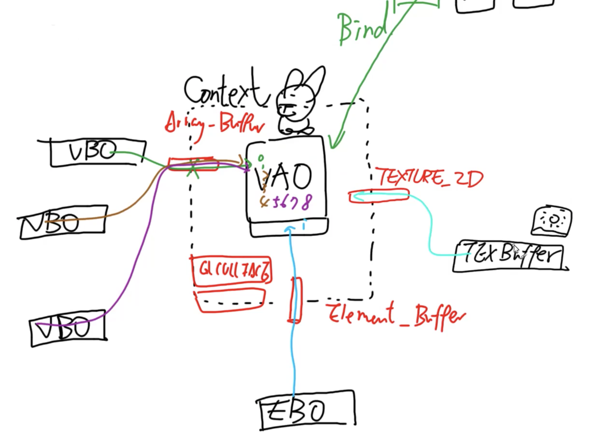
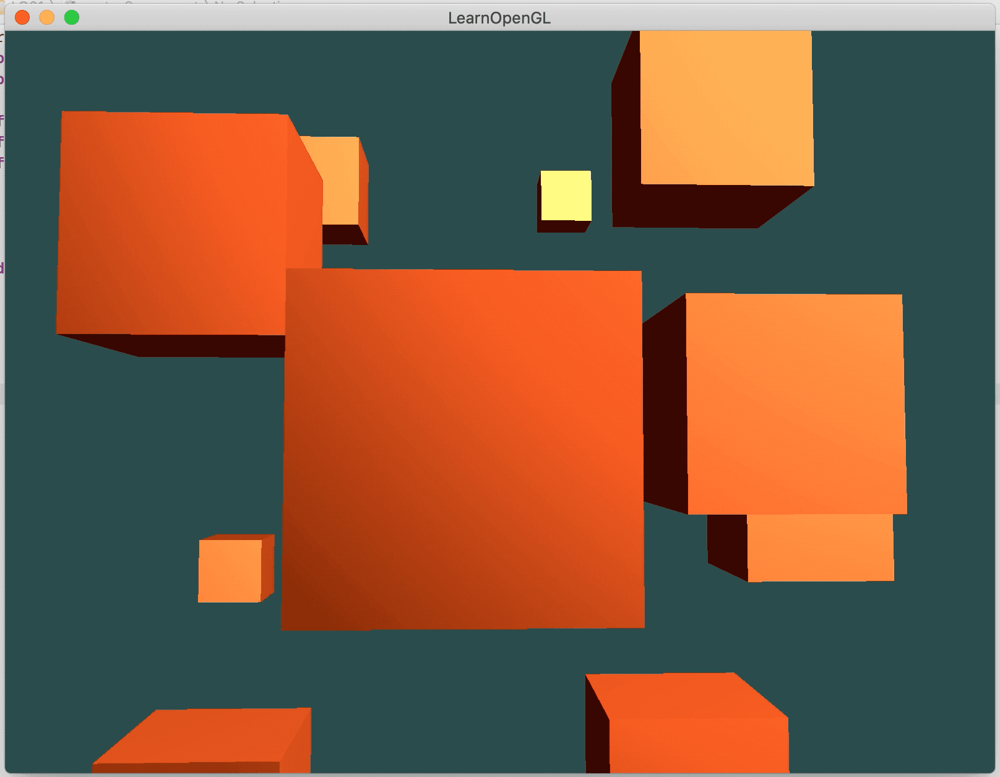
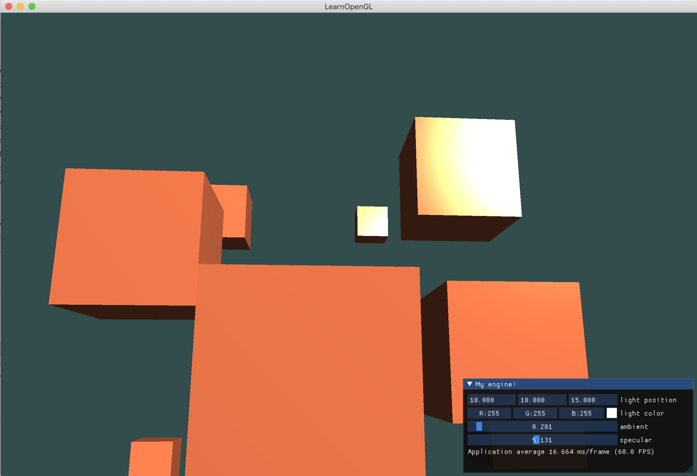
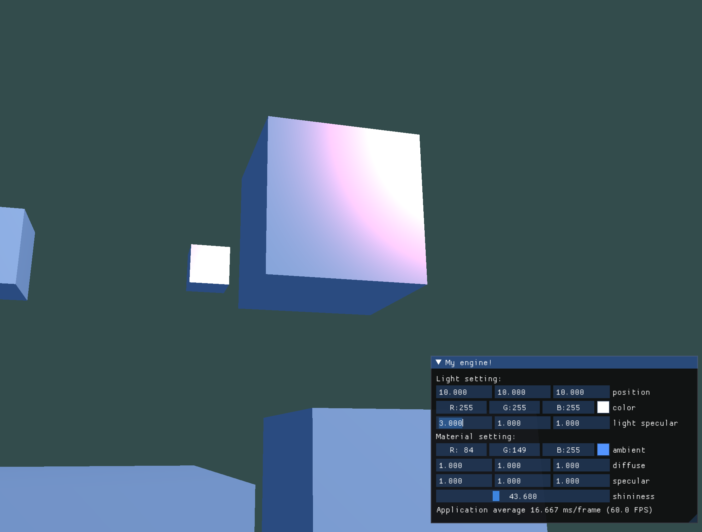
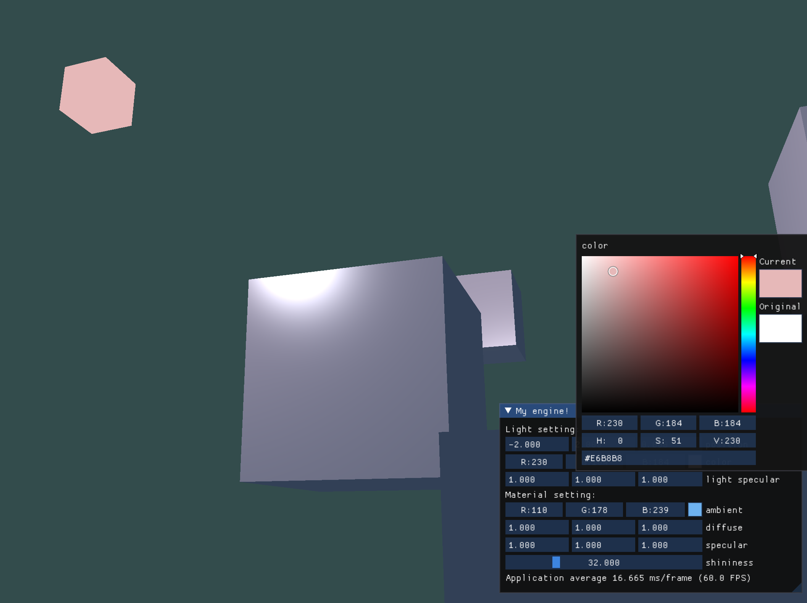

<br/>

参考教程：[Learn OpenGL](https://learnopengl.com/)

Github：[Friedsoda/LearnEngine: opengl](https://github.com/Friedsoda/LearnEngine)

<br/>

## 1. 基础功能

首先是教程里面VAO和VBO等缓冲区的抽象示意图：




### 1.1 着色器

着色器类`Shader.h`：


```c++
class Shader
{
public:
    Shader(const char* vertexPath, const char* fragmentPath);
    std::string vertexString;
    std::string fragmentString;
    const char* vertexSource;
    const char* fragmentSource;
    unsigned int ID;   // Shader program ID
    void use();
    
private:
    void checkCompileErrors(unsigned int ID, std::string type);
};
```


可以通过ID去读取类的功能，在Shader类中完成着色器编译和绑定。

<br/>


### 1.2 读取纹理

使用了stb_image库，注意在render loop里面需要对指定的纹理缓冲位置进行active再绑定使用它。

（好像没什么好写的）

<br/>

### 1.3 摄像机

摄像机类`Camera.h`：


```c++
class Camera
{
public:
    Camera(glm::vec3 position, glm::vec3 target, glm::vec3 worldup);
    Camera(glm::vec3 position, float pitch, float yaw, glm::vec3 worldup);
    ~Camera();
    
    // camera attributes
    glm::vec3 Position;
    glm::vec3 Forward;
    glm::vec3 Right;
    glm::vec3 Up;
    glm::vec3 WorldUp;
    // euler angles
    float Pitch;
    float Yaw;
    // camera options
    float KeySensitivity = 0.1;
    float MouseSensitivity = 0.001;
    float speedZ = 0;
    float speedX = 0;
    float speedY = 0;
    
    glm::mat4 GetViewMatrix();
    void ProcessMouseMovement(float xOffset, float yOffset);
    void UpdateCameraPos();
    
private:
    void UpdateCameraVectors();
};
```


涉及到坐标变换，另外增加了光标移动视角以及方向键移动摄像机位置的功能。


<br/>

### 1.4 初步结构

`main.cpp`：（只是大致思路）


```c++
int main()
{
    // MARK: Open window
    // glfw的窗口操作，省略了
    
    // MARK: Init Shader
    Shader* myShader = new Shader("vertexSource.vert", "fragmentSource.frag");
    
    // MARK: Init and Load Models to VAO, VBO
    unsigned int VAO;
    glGenVertexArrays(1, &VAO);
    glBindVertexArray(VAO);
    
    unsigned int VBO;
    glGenBuffers(1, &VBO);
    glBindBuffer(GL_ARRAY_BUFFER, VBO);
    glBufferData(GL_ARRAY_BUFFER, sizeof(vertices), vertices, GL_STATIC_DRAW);
    
    glVertexAttribPointer(6, 3, GL_FLOAT, GL_FALSE, 6 * sizeof(float), (void*)0);
    glEnableVertexAttribArray(6);
    glVertexAttribPointer(9, 3, GL_FLOAT, GL_FALSE, 6 * sizeof(float), (void*)(3 * sizeof(float)));
    glEnableVertexAttribArray(9);
    
  
    // MARK: Init and Load Textures
    unsigned int texBufferA;
    texBufferA = LoadImageToGPU("container.jpg", GL_RGB, GL_RGB, 0);
    unsigned int texBufferB;
    texBufferB = LoadImageToGPU("awesomeface.jpg", GL_RGBA, GL_RGBA, 3);

    
    // MARK: Prepare MVP Matrices
    glm::mat4 modelMat(1.0f);
    glm::mat4 viewMat(1.0f);
    glm::mat4 projMat(1.0f);
    projMat = glm::perspective(glm::radians(45.0f), (float)SCR_WIDTH / (float)SCR_HEIGHT, 0.1f, 100.0f);

    
    // MARK: Render loop
    while(!glfwWindowShouldClose(window))
    {
        // Input
        processInput(window);
        
        // Clear screen
        glClearColor(0.2f, 0.3f, 0.3f, 1.0f);
        glClear(GL_COLOR_BUFFER_BIT | GL_DEPTH_BUFFER_BIT);
        
        viewMat = camera.GetViewMatrix();

        for (int i = 0; i < 10; i++)
        {
            // Set model matrix
            modelMat = glm::translate(glm::mat4(1.0f), cubePositions[i]);
            // Set view and projection matrices if you want.
            //
            
            // Set material -> shader program
            myShader->use();
            // Set material -> textures
            glActiveTexture(GL_TEXTURE0);
            glBindTexture(GL_TEXTURE_2D, texBufferA);
            glActiveTexture(GL_TEXTURE3);
            glBindTexture(GL_TEXTURE_2D, texBufferB);
            // Set material -> uniform
            glUniformMatrix4fv(glGetUniformLocation(myShader->ID, "modelMat"), 1, GL_FALSE, glm::value_ptr(modelMat));
            // ...中间省略了所有的uniform
            glUniform3f(glGetUniformLocation(myShader->ID, "lightColor"), 1.0f, 1.0f, 1.0f);
            glUniform3f(glGetUniformLocation(myShader->ID, "cameraPos"), camera.Position.x, camera.Position.y, camera.Position.z);
            
            // Set model
            glBindVertexArray(VAO);
            
            // Draw call
            glDrawArrays(GL_TRIANGLES, 0, 36);
        }
         
        // Clean up, prepare for next render loop
        glfwSwapBuffers(window);
        glfwPollEvents();
        camera.UpdateCameraPos();
    }
    
    // Exit program
    glfwTerminate();
    return 0;
}
```


<br/>

<br/>

## 2. 光照

### 2.1 基础光照模型

先使用经典的Phong光照模型。


顶点着色器`vertexSource.vert`：


```glsl
#version 330 core
layout (location = 6) in vec3 aPos;
layout (location = 9) in vec3 aNormal;

uniform mat4 modelMat;
uniform mat4 viewMat;
uniform mat4 projMat;

out vec3 FragPos;
out vec3 Normal;

void main()
{
    gl_Position = projMat * viewMat * modelMat * vec4(aPos, 1.0);
    FragPos = (modelMat * vec4(aPos, 1.0)).xyz;
    Normal = mat3(modelMat) * aNormal;
}
```


片元着色器`fragmentSource.frag`：


```glsl
#version 330 core
in vec3 FragPos;
in vec3 Normal;

out vec4 FragColor;

uniform vec3 objColor;
uniform vec3 ambient;
uniform vec3 lightPos;
uniform vec3 lightColor;
uniform vec3 cameraPos;

void main()
{
    vec3 lightDir = normalize(lightPos - FragPos);
    vec3 reflectVec = reflect(-lightDir, Normal);
    vec3 cameraVec = normalize(cameraPos - FragPos);
    
    vec3 diffuse = max(dot(lightDir, Normal), 0) * lightColor;
    vec3 specular = pow(max(dot(reflectVec, cameraVec), 0), 1) * lightColor;

    FragColor = vec4((ambient + diffuse + specular) * objColor, 1.0);
}
```


<br/>


注意vertex shader里法线的这个操作：


```glsl
Normal = mat3(transpose(inverse(modelMat))) * aNormal;
```


是因为如果模型矩阵执行了不等比缩放，顶点的改变会导致法向量不再垂直于表面，如下图：


需要使用一个为法向量专门定制的模型矩阵，叫**法线矩阵（Normal Matrix）**，使用线性代数的操作来移除对法向量错误缩放的影响，具体参考这篇文章：

[The Normal Matrix >> Light House](http://www.lighthouse3d.com/tutorials/glsl-12-tutorial/the-normal-matrix/)

法线矩阵被定义为「模型矩阵左上角的逆矩阵的转置矩阵」。


<br/>

效果：




好像看不清楚高光点之类的.. 所以打算弄个GUI来灵活调节一下光源之类的设置。


<br/>


### 2.2 引入GUI

使用到[imgui](https://github.com/ocornut/imgui)。

目前设置的调节项：光源颜色和位置、漫反射系数、高光系数。




通过调整可以清楚看到高光的位置。


<br/>


### 2.3 材质

如果我要在OpenGL中模拟多种类型的物体，则必须为每个物体分别定义一个材质。在片元着色器里设置Material属性，为了方便调节，也把光照的信息单独设置出来了。


```glsl
#version 330 core
out vec4 FragColor;

struct Material{
    vec3 ambient;
    vec3 diffuse;
    vec3 specular;
    float shininess;
};

struct Light{
    vec3 position;
    
    vec3 ambient;
    vec3 diffuse;
    vec3 specular;
};

in vec3 FragPos;
in vec3 Normal;

uniform Material material;
uniform Light light;
uniform vec3 viewPos;


void main()
{
    // ambient
    vec3 ambient = light.ambient * material.ambient;
      
    // diffuse
    vec3 norm = normalize(Normal);
    vec3 lightDir = normalize(light.position - FragPos);
    float diff = max(dot(norm, lightDir), 0.0);
    vec3 diffuse = light.diffuse * (diff * material.diffuse);
    
    // specular
    vec3 viewDir = normalize(viewPos - FragPos);
    vec3 reflectDir = reflect(-lightDir, norm);
    float spec = pow(max(dot(viewDir, reflectDir), 0.0), material.shininess);
    vec3 specular = light.specular * (spec * material.specular);
        
    vec3 result = ambient + diffuse + specular;
    FragColor = vec4(result, 1.0);
}
```


修改之后就可以自由的调节物体材质和光源了！比如蓝色的箱子：


还可以调节一下高光的颜色，调节R通道分量和shininess来形成可爱小粉红高光。这里调的是整体光源的颜色，也可以在物体那里调。





<br/>


然后做了一个光源小cube，比较方便看灯光在哪里！调节光源颜色的时候让light cube也跟着改了，当然示例也是可爱粉红色。





<br/>


### 2.4 光照贴图

