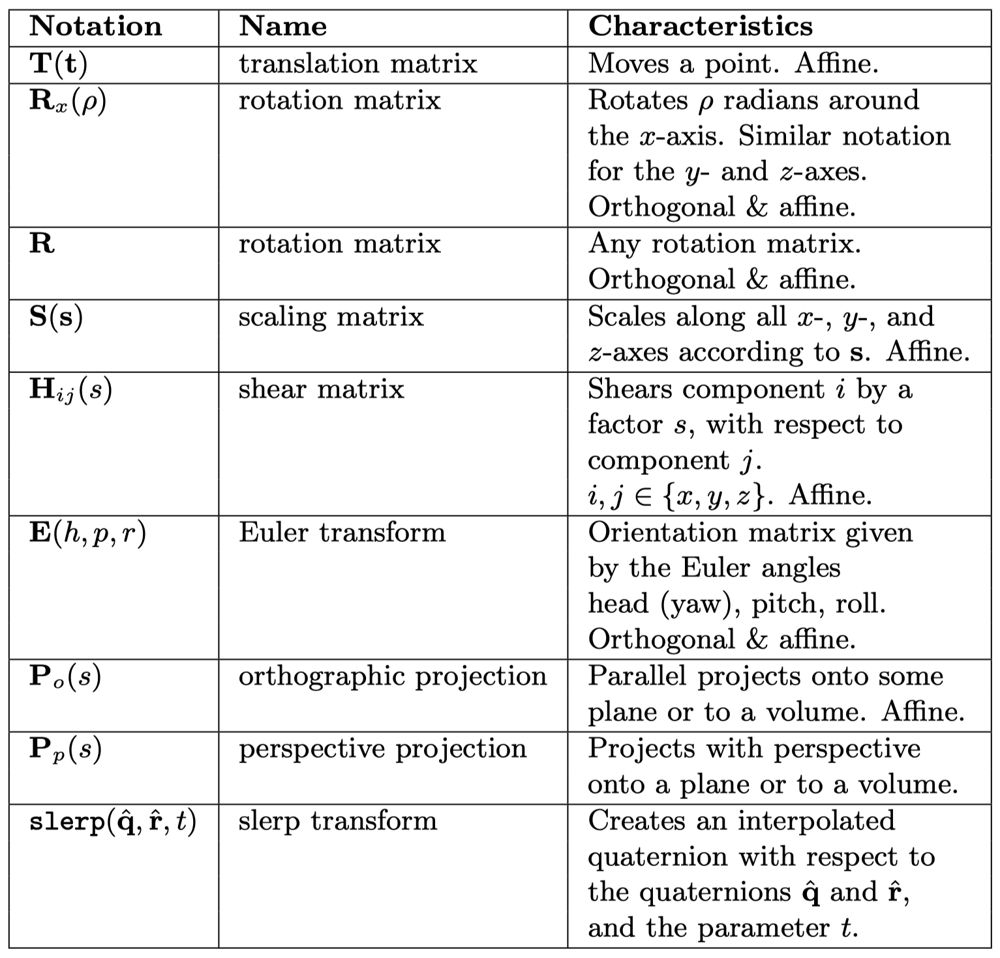
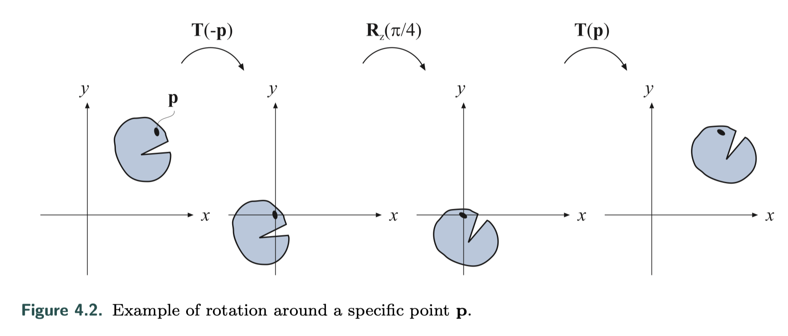
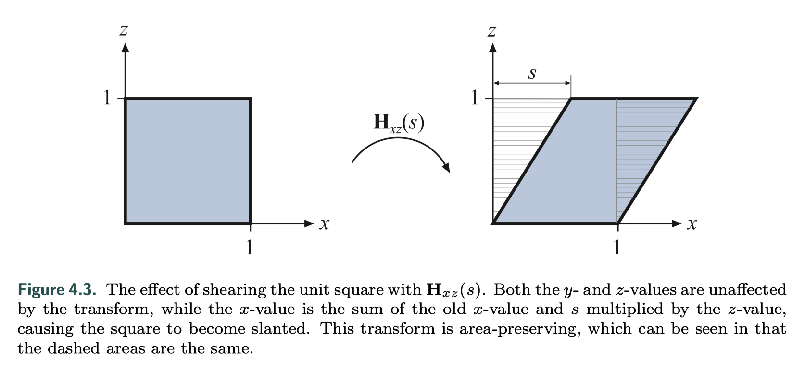
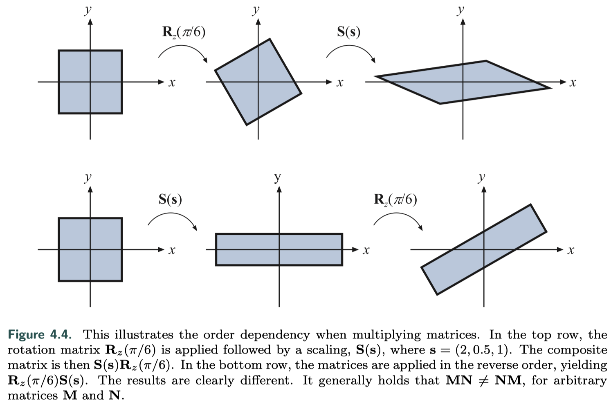

 

这是《Real-time Rendering》的笔记系列第四章：Transform。

 

## 1. 基础变换 Basic Transforms

### 1.1 Translation 平移

用一个变换矩阵$\textbf{T}$来表示一个位置到另外一个位置的平移：

$$
\textbf{T}(\textbf{t})=\textbf{T}(t_x,t_y,t_z)=
\begin{pmatrix}
1 & 0 & 0 & t_x \\
0 & 1 & 0 & t_y \\
0 & 0 & 1 & t_z \\
0 & 0 & 0 & 1 
\end{pmatrix}
$$

平移变换的逆是${\textbf{T}}^{-1}(\textbf{t})=\textbf{T}(-\textbf{t})$，即向量$\textbf{t}$取反。注意一个方向向量$\textbf{v}=(v_x,v_y,v_z,0)$不会被$\textbf{T}$影响。

 

### 1.2 Rotation 旋转

三维中常用的旋转矩阵是$\textbf{R}_x(\phi)$、$\textbf{R}_y(\phi)$和$\textbf{R}_z(\phi)$，表示绕坐标轴旋转：

$$
\textbf{R}_x(\phi)=\begin{pmatrix}
1 & 0 & 0 & 0 \\
0 & cos{\phi} & -sin{\phi} & 0 \\
0 & sin{\phi} & cos{\phi} & 0 \\
0 & 0 & 0 & 1 
\end{pmatrix}
$$

$$
\textbf{R}_y(\phi)=\begin{pmatrix}
cos{\phi} & 0 & sin{\phi} & 0 \\
0 & 1 & 0 & 0 \\
-sin{\phi} & 0 & cos{\phi} & 0 \\
0 & 0 & 0 & 1 
\end{pmatrix}
$$

$$
\textbf{R}_z(\phi)=\begin{pmatrix}
cos{\phi} & -sin{\phi} & 0 & 0 \\
sin{\phi} & cos{\phi} & 0 & 0 \\
0 & 0 & 1 & 0 \\
0 & 0 & 0 & 1 
\end{pmatrix}
$$

对任意轴的旋转会在2.4节里讨论。所有旋转矩阵的行列式都是1，而且是正交矩阵；另一种求逆方法是：${\textbf{T}}^{-1}(\textbf{t})=\textbf{T}(-\textbf{t})$，即沿相反方向旋转。

假设绕z轴旋转$\phi$弧度，旋转中心为某点$\textbf{p}$：

这个变换实际上可以视为用$\textbf{T}(\textbf{p})$平移对象$\textbf{p}$到原点，执行旋转$\phi$，再用$\textbf{T}(-\textbf{p})$平移回原始位置，得到的变换$\textbf{T}$如下式：

$$
\textbf{X}=\textbf{T}(\textbf{p})\textbf{R}_z(\phi)\textbf{T}(-\textbf{p})
$$

 

### 1.3 Scaling 缩放

缩放变换矩阵$\textbf{S}(\textbf{s})$表示沿xyz轴分别缩放$s_x$、$s_y$和$s_z$因子：

$$
\textbf{S}(\textbf{s})=
\begin{pmatrix}
s_x & 0 & 0 & 0 \\
0 & s_y & 0 & 0 \\
0 & 0 & s_z & 0 \\
0 & 0 & 0 & 1 
\end{pmatrix}
$$

如果$s_x=s_y=s_z$则缩放操作称为**均匀的（uniform）**，否则为**非均匀（nonuniform）**操作，有时也使用**等向性（isotropic）**和**各向异性（anisotropic）**来形容。矩阵的逆用$\textbf{S}^{-1}(\textbf{s})=\textbf{S}(1/s_x,1/s_y,1/s_z)$表示。

使用齐次坐标，创建均匀缩放矩阵的另一种有效方法是通过操作位置$(3,3)$处的矩阵元素。该值会影响齐次坐标的w分量，因此会缩放矩阵转换后的点（非方向矢量）的每个坐标。例如，要均匀缩放5倍，可以将缩放矩阵中$(0,0)$、$(1,1)$、$(2,2)$的元素设置为5，或将$(3,3)$设置为$1/5$。执行此操作的两个不同矩阵如下所示：

$$
\textbf{S}=\begin{pmatrix}5 & 0 & 0 & 0 \\0 & 5 & 0 & 0 \\0 & 0 & 5 & 0 \\0 & 0 & 0 & 1 \end{pmatrix}, \ \ \ \  \textbf{S}'=\begin{pmatrix}0 & 0 & 0 & 0 \\0 & 0 & 0 & 0 \\0 & 0 & 0 & 0 \\0 & 0 & 0 & 1/5 \end{pmatrix}
$$

 

### 1.4 Shearing 错切/推移

错切变换可以用于扭曲整个场景来实现某些物理效果，或者扭曲单个物体的外观。例如一个变换$\textbf{H}_{xz}(s)$：

$$
\textbf{H}_{xz}(s)=\begin{pmatrix}1 & 0 & s & 0 \\0 & 1 & 0 & 0 \\0 & 0 & 1 & 0 \\0 & 0 & 0 & 1 \end{pmatrix}
$$

参考3Blue1Brown的线代系列[Essence of linear algebra](https://www.youtube.com/playlist?list=PLZHQObOWTQDPD3MizzM2xVFitgF8hE_ab)，这个变换矩阵可以理解成原来z方向的单位分量变成了$(s,0,1)$如下图所示。

错切的逆变换是：

$$
\textbf{H}_{ij}^{-1}(s)=\textbf{H}_{ij}(-s)
$$

如果是以下形式的变换：

$$
\textbf{H}'_{xy}(s,t)=\begin{pmatrix}1 & 0 & s & 0 \\0 & 1 & t & 0 \\0 & 0 & 1 & 0 \\0 & 0 & 0 & 1 \end{pmatrix}
$$

实际上要表示的是

$$
\textbf{H}’_{ij}(s,t)=\textbf{H}_{ik}(s) \textbf{H}_{jk}(t)
$$

任何错切变换矩阵的行列式都是1，从图中也可以知道错切是体积不变的变换。

 

### 1.5 Concatenation of Transforms 变换的级联

由于矩阵乘法的不可交换性，变换的级联被认为是顺序相关的。像下图的两种变换调转顺序，就会产生不一样的结果。

在实际应用中为了提高效率，会把所有变换连接到单个矩阵里，再对所有顶点进行处理。比如复合矩阵$\textbf{C}=\textbf{T}\textbf{R}\textbf{S}$，意味着$\textbf{T}\textbf{R}\textbf{S}\textbf{p}=(\textbf{T}(\textbf{R}(\textbf{S}\textbf{p})))$，即右边的缩放矩阵$\textbf{S}$最先应用于顶点$\textbf{p}$。另外，$\textbf{T}\textbf{R}\textbf{S}$是场景图形系统（？）中常用的顺序。

虽然矩阵级联依赖于顺序，但可以根据需要进行分组。比如用$\textbf{T}\textbf{R}\textbf{S}\textbf{p}$计算一次刚体变换$\textbf{T}\textbf{R}$，就可以分组成$(\textbf{T}\textbf{R})(\textbf{S}\textbf{p})$，使用中间结果。因此，矩阵级联是符合[结合律（associative）](https://en.wikipedia.org/wiki/Associative_property)的。

 

### 1.6 The Rigid-Body Transform 刚体变换

刚体变换指的是仅由平移和旋转组成的变换，它不影响物体的形状。任何刚体变换矩阵$\textbf{X}$都可以写作平移$\textbf{T}(\textbf{t})$和旋转$\textbf{R}$的级联：

$$
\textbf{X}=\textbf{T}(\textbf{t})\textbf{R}=\begin{pmatrix}r_{00} & r_{01} & r_{02} & t_x \\r_{10} & r_{11} & r_{12} & t_y \\r_{20} & r_{21} & r_{22} & t_z \\ 0 & 0 & 0 & 1 \end{pmatrix}
$$

$\textbf{X}$的逆计算方法：

$$
\textbf{X}^{-1}=(\textbf{T}(\textbf{t})\textbf{R})^{-1}=\textbf{R}^{-1}\textbf{T}(\textbf{t})^{-1}=\textbf{R}^T\textbf{T}(-\textbf{t})
$$

 

### 1.7 Normal Transform 法线变换

 

### 1.8 Computation of Inverses 逆的计算

 

 

## 2. Special Matrix Transforms and Operations

### 2.1 The Euler Transform 

 

### 2.2 Extracting Parameters from the Euler Transform

 

### 2.3 Matrix Decomposition

 

### 2.4 Rotation about an Arbitrary Axis

 

 

## 3. Quaternions 四元数

四元数的解释：

[quaternion.pdf](https://krasjet.github.io/quaternion/quaternion.pdf)

[Visualizing quaternions (4d numbers) with stereographic projection - YouTube](https://www.youtube.com/watch?v=d4EgbgTm0Bg)

对万向节死锁（gimbal lock）的解释：

[Euler (gimbal lock) Explained - YouTube](https://www.youtube.com/watch?v=zc8b2Jo7mno)

 

 

 

## 4. Vertex Blending 顶点混合

