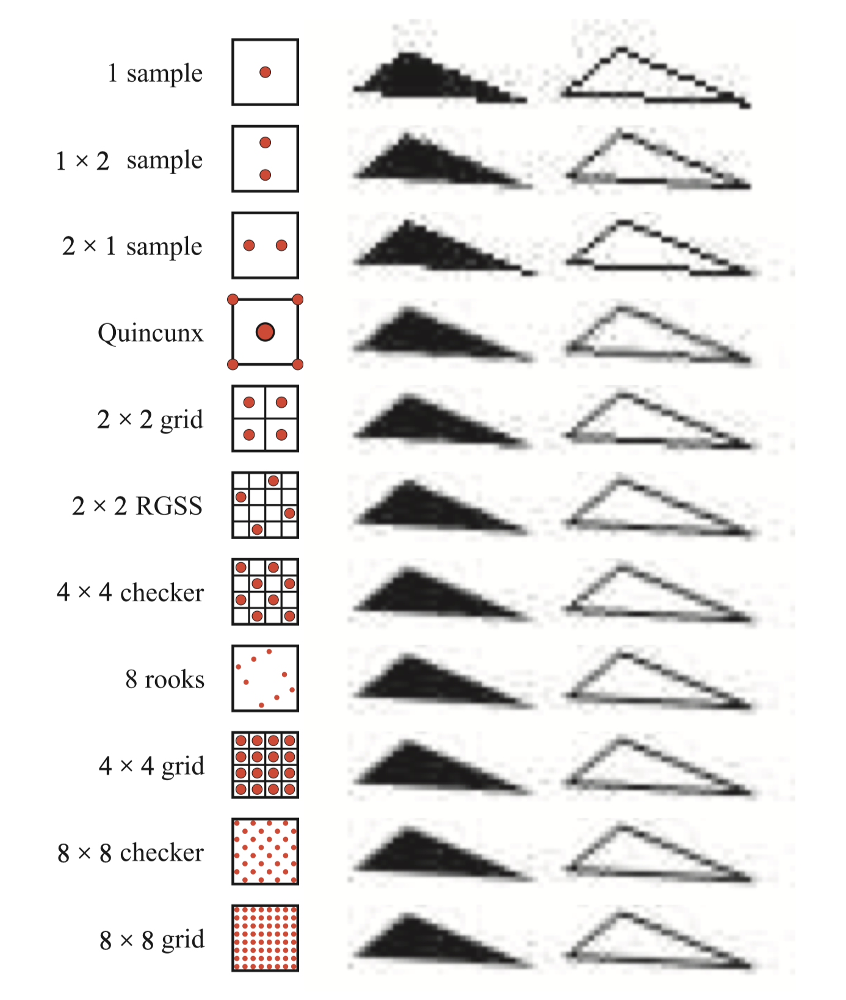
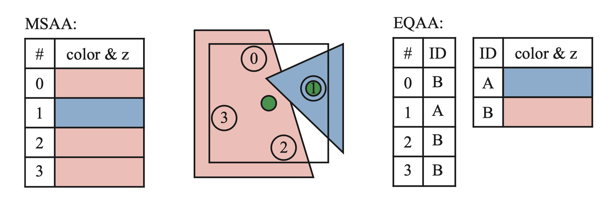

 

抗锯齿（Anti-Aliasing，简称AA），也译为边缘柔化、消除混叠、抗图像折叠有损，反走样等。它是一种消除显示器输出的画面中图物边缘出现凹凸锯齿的技术，那些凹凸的锯齿通常因为高分辨率的信号以低分辨率表示或无法准确运算出3D图形坐标定位时所导致的图形混叠（aliasing）而产生的，抗锯齿技术能有效地解决这些问题。

没有一种最佳的抗锯齿技术，因为每种技术在质量、捕获细节的能力、移动时的外观、内存成本、GPU要求和速度方面都具有不同的优势。一般来说，抗锯齿技术采用对像素点取样的方法，然后按照权重计算出该像素点的颜色：

$$
\textbf{p}(x,y)=\sum_{i=1}^nw_i\textbf{c}(i,x,y)
$$

在一个像素内取>1个采样点的抗锯齿方法称为超采样（Supersampling）技术，

 

### Super-Sampling Antialiasing（SSAA）

**超级采样抗锯齿（SSAA）**是比较早期的抗锯齿方法，比较消耗资源，但简单直接。先把图像映射到缓存并把它放大，再把放大后的图像像素按照某些采样规则进行采样（见下图），把采样混合起来生成最终像素。接着把最终像素还原回原来大小的图像，并保存到帧缓存也就是显存中，替代原图像存储起来，最后输出到显示器。

 

### Multisampling Antialiasing（MSAA）

**多重采样抗锯齿（MSAA）**是基于SSAA的改进方法，首先来自于OpenGL。

在SSAA方法中，每个采样点都需要进行单独着色，而MSAA的改进方法就是对每个像素仅进行一次表面着色计算，对于子采样点只计算覆盖（coverage）和遮挡（occlusion）信息。

就光栅化而言，MSAA跟SSAA的方式差不多，覆盖和遮挡信息都是在一个更大分辨率上进行的。三角形会与像素的每个子采样点进行覆盖测试，生成二进制覆盖掩码，代表三角形覆盖当前点的比例。对于遮挡测试来说，三角形的深度在每一个覆盖的子采样点的位置进行插值，并且跟z-buffer中的深度信息进行比较。由于深度测试是在每个子采样点的级别而不是像素级别进行的，深度buffer必须相应的增大以来存储额外的深度值。在实现中，这意味着深度缓冲区是非MSAA情况下的n倍。

MSAA可以简单理解为只对多边形的边缘进行抗锯齿处理。这样的话，相比SSAA对画面中所有数据进行处理，MSAA对资源的消耗需求大大减弱，不过在画质上可能稍有不如SSAA。

详细的原理参考这篇文章：

[深入剖析MSAA - 博客园](https://www.cnblogs.com/ghl_carmack/p/8245032.html)

 

### CSAA & EQAA

**覆盖采样抗锯齿（CSAA）**是NVIDIA于2006年在G80及其衍生产品首次推向实用化的AA技术，也是目前NVIDIA GeForce 8/9/G200系列独享的AA技术；AMD随之推出了**增强质量抗锯齿（EQAA）**。原理是以更高的采样率只存储片元的覆盖情况。（These techniques work by storing only the coverage for the fragment at a higher sampling rate.不太确定是不是这么翻译）

例如EQAA的2f4x模式存储两个颜色和深度值，在四个样本位置之间共享。颜色和深度不再存储在特定位置，而是保存在表格中，每个样本仅需要1bit来指定与哪个存储值相对应，如下图所示。

 

### Custom Flter Antialiasing（CFAA）

将所有几何图形渲染到多样本缓冲区后，便会执行解析操作，此过程将样本颜色平均在一起以确定像素的颜色。默认情况下，MSAA会用box filter解决，而**自定义滤波器抗锯齿（CFAA）**支持对影响锯齿效果较大的像素进行缩放。这种滤波器支持访问包括临近像素的其他采样点，目前这个功能已经被EQAA支持所取代。

 

### Fast Approximate Anti-Aliasing（FXAA）

快速近似抗锯齿(Fast Approximate Anti-Aliasing，简称FXAA) ，是传统MSAA(多重采样抗锯齿)效果的一种高性能近似。它是一种单程像素着色器，和MLAA一样运行于目标游戏渲染管线的后期处理阶段，但不像后者那样使用DirectCompute，而只是单纯的后期处理着色器，不依赖于任何GPU计算API。正因为如此，FXAA技术对显卡没有特殊要求，完全兼容NVIDIA、AMD的不同显卡(MLAA仅支持A卡)和DirectX 9.0、DirectX 10、DirectX 11。

 

### Multi-Frame Sampled Anti-Aliasing（MFAA）

**多帧采样抗锯齿（MFAA）**是 NVIDIA根据MSAA改进出的一种抗锯齿技术，目前仅搭载 Maxwell 架构GPU的显卡才能使用。可以将MFAA理解为MSAA的优化版，能够在得到几乎相同效果的同时提升性能上的表现。MFAA与MSAA最大的差别就在于在同样开启4倍效果的时候MSAA是真正的针对每个边缘像素周围的4个像素进行采样，MFAA则是仅仅只是采用交错的方式采样边缘某个像素周围的两个像素。

 

### TAA & TXAA 

NVIDIA内置的TXAA支持类似地在比单个像素更宽的区域上使用更好的重建过滤器，和较新的多帧抗锯齿（MFAA）方案都还使用了**时间抗锯齿（TAA）**，这是一类通用技术，可使用先前帧的结果来改善图像。TXAA将 MSAA、时间滤波以及后期处理相结合，用于呈现更高的视觉保真度。此外，TXAA还能够对帧之间的整个场景进行抖动采样，以减少闪烁情形，闪烁情形技术上又称作时间性锯齿。

