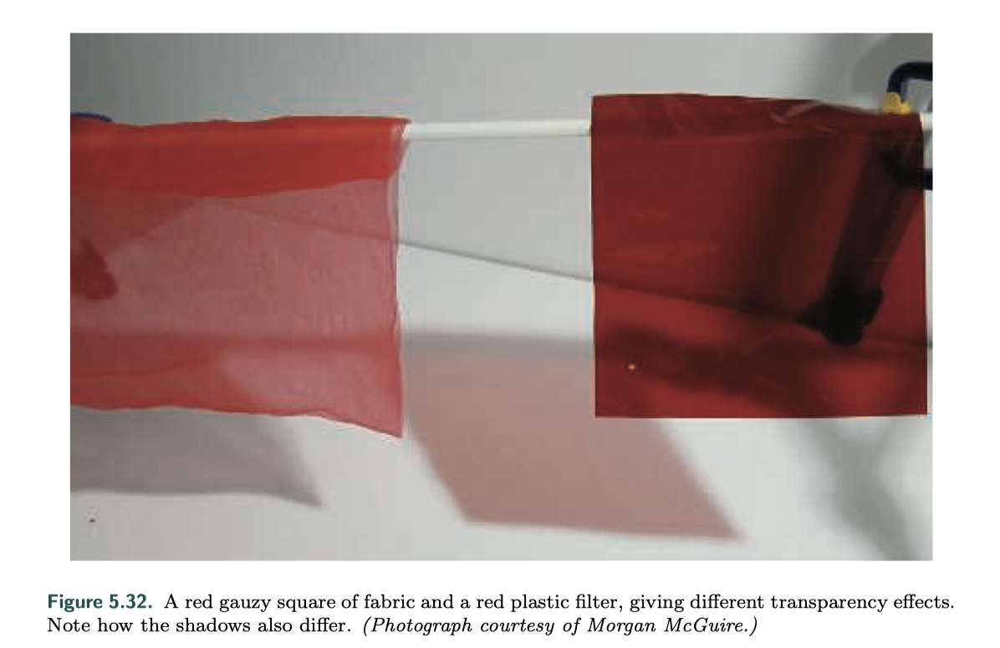
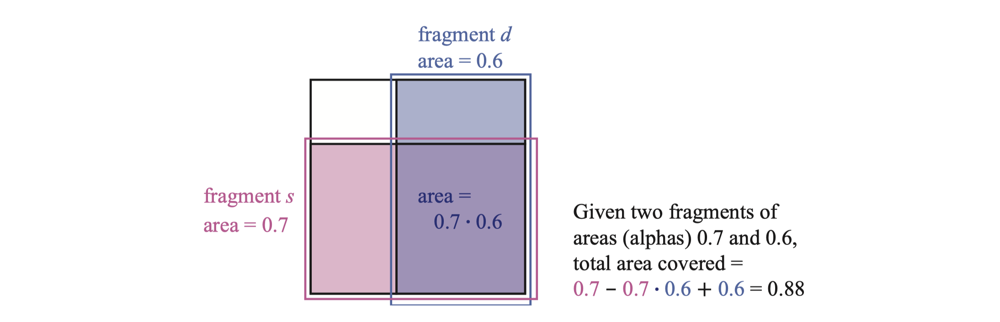

 

半透明物体的渲染算法可以大致分为基于光和基于视图两种。基于光的方法是计算对象使光衰减或转向，从而导致场景中的其他对象被照亮；基于视图的效果是呈现半透明对象本身的效果。本节中讨论的是基于视图的透明性的最简单形式——半透明对象充当它后面对象颜色的衰减器。更复杂的效果如毛玻璃、光的折射等会在后面章节讨论到。

大多数透明度算法是将对象和后面物体颜色混合的效果，因此引入透明度混合的概念：alpha是一个值，描述片元的不透明度和覆盖度。alpha值为1.0表示对象是不透明的，即完全覆盖像素； 值为0.0表示完全不遮盖像素，即片段是完全透明的。

之前写过的Unity实现：[透明度测试和混合](https://friedsoda.github.io/blog/s2)

 

### Blending Order 混合模式和顺序

混合当前片元和原像素颜色的计算：

$$
\textbf{c}_o=\alpha_s\textbf{c}_s+(1-\alpha_s)\textbf{c}_d
$$

这种计算方式称为$\textbf{over}$操作。

对于线不透明的织物遮挡的情况，$\alpha$值模拟了材质覆盖像素的程度，具有较好的效果；但这种操作不适用于透过有色玻璃或者塑料的情况。如下图所示，对于蓝色物体，左边是织物遮挡，右边是红色玻璃遮挡。右边的蓝色物体看起来很暗，因为该物体反射的能穿过红色玻璃的光很少，用$\textbf{over}$操作将蓝色和红色混合显然不适合这种情形。正确做法是将这两种颜色相乘，并添加透明对象本身的反射，具体会在第十四章讨论。

还有另一种混合方式是**Additive blending**，简单地把两个颜色相加：

$$
\textbf{c}_o=\alpha_s\textbf{c}_s+\textbf{c}_d
$$

这种模式适用于发光效果，如闪电或者火花，这些情况下后面的像素不是衰减而是变亮，即提高饱和度的效果。

 

透明和不透明物体需要遵循渲染顺序，先关闭blending渲染所有不透明物体，之后再打开去渲染透明对象。

z-buffer的局限性在于每个像素只能存储一个对象，存在多个透明物体的情况下，通常需要按照从后到前的顺序进行渲染。一种方法是按照单个对象质心沿视图方向的距离进行排序，但这样只是粗略排序，不能具体到物体的所有网格上。

不过由于它简单快速，并且不需要额外内存或特殊GPU支持，因此仍然经常执行对透明度的粗略排序。通常最好在执行透明性时进行深度测试，但不进行深度写入，这样一来所有透明对象至少都会以某种形式出现。其他技术也可以帮助改善效果，例如每次绘制两次透明网格时，首先渲染背面，然后渲染正面。

还可以修改$\textbf{over}$方程，以便从前向后混合得到相同的结果，这种混合模式称为$\textbf{under}$运算：

$$
\textbf{c}_o=\alpha_d\textbf{c}_d+(1-\alpha_d)\alpha_s\textbf{c}_s \\
\textbf{a}_o=\alpha_s(1-\alpha_d)+\alpha_d=\alpha_s-\alpha_s\alpha_d+\alpha_d
$$

$\textbf{under}$要求目标保留$α$值，而$\textbf{over}$不需要。公式把$α$看作是覆盖范围，由于不清楚每个片元覆盖区域的形状，所以假设每个片段都按其alpha比例覆盖另一个片段。如下图所示，覆盖片元将与源片元成比例地重叠。

 

 

### Order-Independent Transparency

$\textbf{under}$用于把所有的透明对象绘制到单独的颜色缓冲区，然后使用$\textbf{under}$把这个颜色缓冲合并到不透明视图之上。另外一个用法是Order-Independent Transparency（OIT），也称为**深度剥离（Depth peeling）**。

深度剥离使用两个z-buffer和多个pass。首先，用一个渲染pass把所有表面（包括透明物体）的深度值存储到第一个z-buffer中；

 

 

### Premultiplied Alphas and Compositing