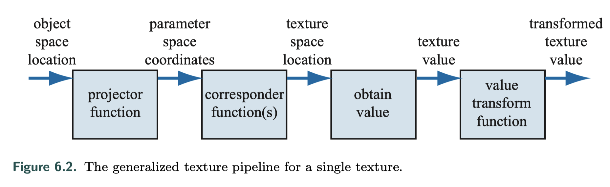
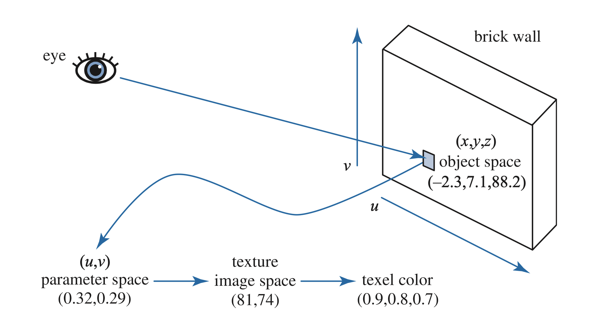
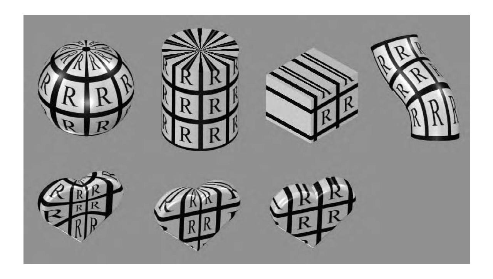
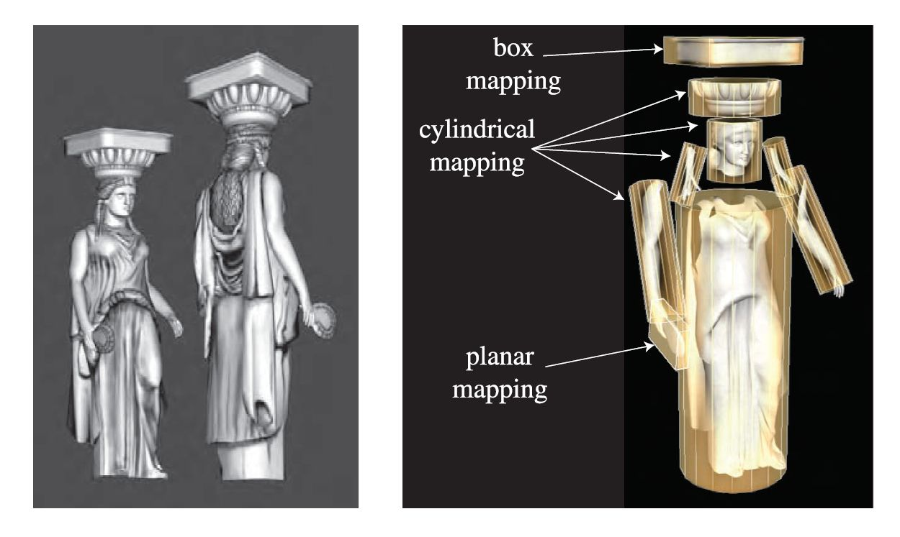
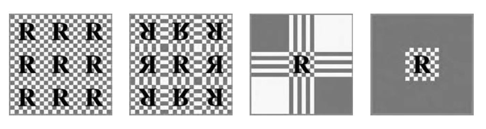

 



## 1. The Texturing Pipeline 纹理管线

过程的起点是在空间中的位置，可以是世界空间，但大多数情况下是模型空间，因此纹理会随着模型移动。接着利用投影函数得到纹理坐标，即映射（mapping）的概念。在获得纹理之前，还需要用相应函数把纹理坐标转换到纹理空间。得到纹理值后，再经过转换应用到颜色或法线等等。

例如下面的砖墙，projector把$(x,y,z)$转换为二维向量$(u,v)$，接着将uv值乘以纹理图片的分辨率，得到所求图片中的位置，取得颜色值。

 

### 1.1 The Projector Function 投影函数

纹理处理的第一步是获取表面位置并将其投影到纹理坐标空间，通常是二维空间。 投影函数通常在美术建模阶段使用，美术人员可以逐顶点定义uv坐标并将投影结果存储于顶点数据中，当然也有例外的情况，比如：

- OpenGL的glTexGen函数提供了一些不同的投影函数，包括球形函数和平面函数。利用空闲时间可以让图形加速器来执行投影过程，而这样做的优点是不需要将纹理坐标送往图形加速器，从而可以节省带宽。

- 更一般的情况， 可以在顶点或者像素着色器中使用投影函数，这可以实现各种效果，包括一些动画和一些渲染方法（比如如环境贴图有自身特定的投影函数，可以针对每个顶点或者每个像素进行计算）。

通常在建模中使用的投影函数有球形、圆柱、以及平面投影，还有自然uv投影（下图第一行）；下面一行所示为把不同的投影运用于同一个物体的情形。

**非交互式渲染器（Noninteractive renderers）**通常将这些投影函数称为渲染过程本身的一部分。一个单独的投影方程就有可能适用于整个模型，但其实实际上，美术同学不得不使用各种各样的工具将模型进行分割，针对不同的部分，分别使用不同的投影函数：

各种常见投影的要点：

- 球形投影（The spherical projection）：球形投影将点投射到一个中心位于某个点的虚拟球体上，这个投影与Blinn与Newell的环境贴图方法相同。
- 圆柱投影（Cylindrical projection）：与球体投影一样，圆柱投影计算的是纹理坐标u，而计算得到的另一个纹理坐标v是沿该圆柱轴线的距离。这种投影方法对具有自然轴的物体比较适用，比如旋转表面，如果表面与圆柱体轴线接近垂直时，就会出现变形。
- 平面投影（The planar projection）：平面投影非常类似于x-射线幻灯片投影，它沿着一个方向进行投影，并将纹理应用到物体的所有表面上。这种方法通常使用正交投影，用来将纹理图应用到人物上，其把模型看作一个用纸做的娃娃，将不同的纹理粘贴到该模型的前后。

 

### 1.2 The Corresponder Function 映射函数

映射函数的作用是将参数空间坐标（Parameter-space coordinates）转换为纹理空间位置（Texture space locations）。我们知道图像会出现在物体表面的(u,v)位置上，且uv值的正常范围在[0,1)范围内。超出这个值域的纹理，其显示方式便可以由映射函数（The Corresponder Function）来决定。

在OpenGL中，这类映射函数称为封装模式（Warapping mode）；在Direct3D中叫做寻址模式（Texture addressing mode）。最常见的映射函数有以下几种：

- **Wrap** (DirectX) / **Repeat** (OpenGL)：重复寻址，图像在表面上重复出现。
- **Mirror**：镜像寻址模式，图像在物体表面上不断重复，每次重复时对图像进行镜像反转。
- **Clamp** (DirectX) / **Clamp to edge** (OpenGL)：夹取纹理寻址模式将纹理坐标夹取在[0.0，1.0]之间，位于[0.0，1.0]之外时将边缘的内容沿着u轴和v轴进行延伸。
- **Border** (DirectX) / **Clamp to border** (OpenGL)：边框颜色寻址模式中[0.0，1.0]之外的内容用边框颜色填充。

另外，每个纹理轴可以使用不同的映射函数。例如在u轴使用重复寻址模式，在v轴使用夹取寻址模式。

 

 

## 2. Image Texturing 图像纹理

 

 

## 3. Procedural Texturing 程序纹理

 

 

## 4. Texture Animation 纹理动画

 

 

## 5. Material Mapping 材料贴图

 

 

## 6. Alpha Mapping 透明度贴图

 

 

## 7. Bump Mapping 凹凸贴图

 

 

## 8. Parallax Mapping

 

 

## 9. Textured Lights

 

 