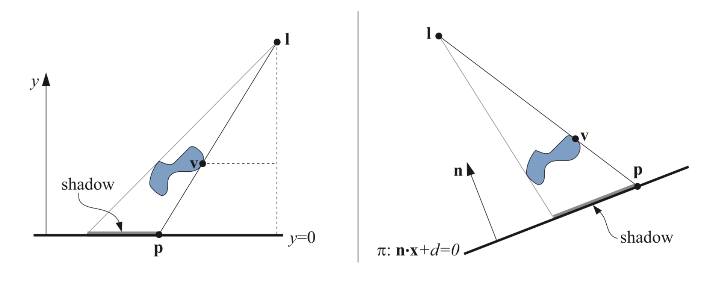

 

## 1. Planar Shadows 平面阴影

在投影计算当中，最简单的情况是物体投影到一个平面上。

### 1.1 Projection Shadows 投影阴影

通过将三维物体再次渲染来创建阴影。如下图，

$$
\textbf{M}=\begin{pmatrix} l_y & -l_x & 0 & 0 \\ 0 & 0 & 0 & 0 \\ 0 & -l_z & l_y & 0 \\ 0 & -1 & 0 & l_y \end{pmatrix}
$$

 

### 1.2 Soft Shadows 软阴影

 

 

## 2. Shadows on Curved Surfaces

 

 

