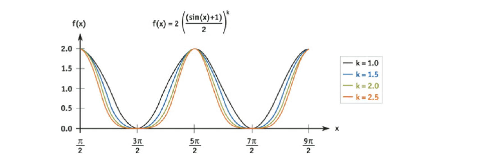
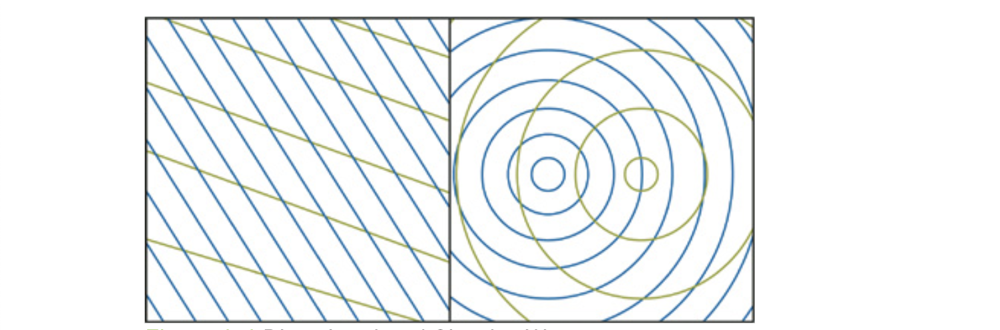
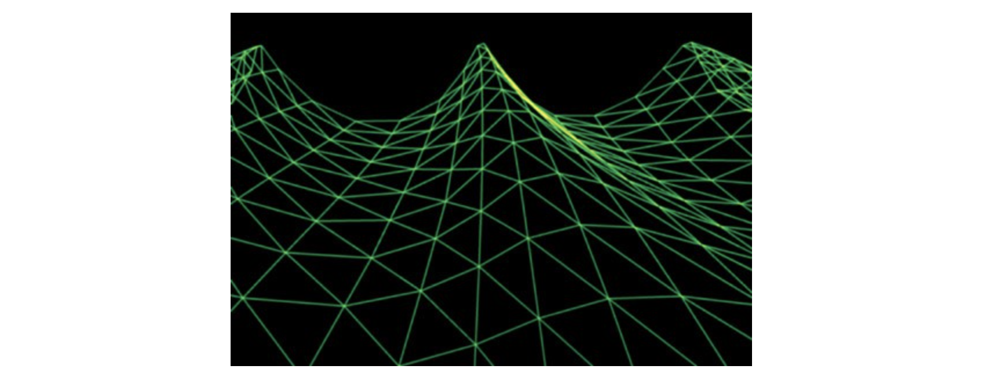

 

Links：

[Chapter 1. Effective Water Simulation from Physical Models](https://developer.nvidia.com/gpugems/gpugems/part-i-natural-effects/chapter-1-effective-water-simulation-physical-models)

[真实感水体渲染技术总结 - 知乎](https://zhuanlan.zhihu.com/p/95917609)

[实时水面模拟与渲染(一) - 知乎](https://zhuanlan.zhihu.com/p/31670275)

[Unity Flow Tutorials](https://catlikecoding.com/unity/tutorials/flow/)

 

本章是关于在GPU中模拟大水体的系统，结合了基本网格几何波动和动态法线贴图生成，适用于实时游戏。

由计算简单的正弦函数之和对水面进行近似模拟开始，逐步扩展到更复杂的函数如Gerstner波，也扩展到像素着色器。主要思路是使用周期波的加和，来创建动态的平铺（tiling）凹凸贴图，从而获得优质的水面细节。

 

## 1. The Sum of Sines Approximation

需要运行两个表面模拟：一个用于表面网格的几何波动，另一个是网格上法线图的扰动。两个模拟本质上是相同的。

水面高度由简单的周期波叠加表示。正弦函数叠加后得到一个连续函数，这个函数描述了水面上所有点的高度和方向。在处理顶点时，基于每个顶点的水平位置对函数取样，使得网格细分形成连续水面。在几何分辨率之下，将该技术继续应用于纹理空间。通过对近似正弦叠加的法线取样，用简单像素着色器渲染到**渲染目标纹理（render target texture）**，从而产生表面的法线图。对每帧渲染法线图，允许有限数量的正弦波组相互独立地运动，大大提高了渲染的逼真度。

 

### 1.1 波的选择

对于每个波的组成，有如下几个参数需要选择：

- 波长Wavelength (L)：世界空间中波峰到波峰之间的距离。波长$L$与角频率$ω$的关系为$ω=2π/L$。
- 振幅Amplitude (A)：从水平面到波峰的高度。
- 速度Speed (S)：每秒种波峰移动的距离。为了方便，把速度表示成相位常数$φ=S\times 
  2π/L$。
- 方向Direction (D)：垂直于波峰沿波前进方向的水平矢量。

波的状态定义为水平位置$(x,y)$和时间$t$的函数：

$$
W_i(x,y,t)=A_i\times sin(\textbf{D}_i \cdot(x,y)\timesω_i+t\timesφ_i)
$$

包括所有波$i$的总表面是：

$$
H(x,y,t)=\sum(A_i \times sin(\textbf{D}_i \cdot (x,y)\times ω_i + t \timesφ_i))
$$

为了提供场景动力学的变量，我们将在约束中随机产生这些波的参数，随着时间的变化，我们会不断将某个波淡出，然后再以一组不同的参数将其淡入。且此过程的这些参数是相关联的，必须仔细地产生一套完整的参数组，才能使各个波以可信的方式进行组合。

 

 

### 1.2 Normals and Tangents 法线和切线

因为表面有定义明确的函数，所以可以直接计算任意给定点处的曲面方向，而不是依赖于有限差分技术。

副法线（Binormal）$\textbf{B}$和正切矢量$\textbf{T}$分别是x和y方向上的偏导数。对于2D水平面中的任意点$(x,y)$，表面上的三维位置$\textbf{P}$为：

$$
\textbf{P}(x,y,t)=(x,y,H(x,y,t))
$$

求副法线$\textbf{B}$方向，即对上式对x方向求偏导；而求正切矢量$\textbf{T}$方向，即对上式对y方向求偏导。

法线$\textbf{N}$由副法线$\textbf{B}$和切线$\textbf{T}$的叉积给出：

$$
\textbf{N}(x,y)=\textbf{B}(x,y) \times \textbf{T}(x,y)
$$

 

直接叠加正弦波产生的波浪有很多roll（？），实际中的波峰比较尖，波谷比较宽，用正弦函数的变形可以达到这种效果，将正弦函数修改为非负然后加上指数k：

$$
W_i(x,y,t)=2A_i\times \left( \frac{sin(\textbf{D}_i \cdot(x,y)\times ω_i+t \times φ_i)+1}{2} \right)^k \\
\frac{\partial}{\partial x}(W_i(x,y,t))=k \times \textbf{D}_i \cdot x \times ω_i \times A_i \times \left( \frac{sin(\textbf{D}_i \cdot(x,y)\times ω_i+t\timesφ_i)+1}{2} \right)^{k-1} \\ \times cos( \textbf{D}_i \cdot (x,y) \times ω_i + t \times φ_i )
$$

下图展示了改变k产生的波形。

 

 

### 1.3 Geometric Waves 几何波

将几何波限制为4个，因为添加更多的波并不能增加新的概念，只不过增加更多相同的顶点Shader处理指令和常数而已。

 

#### 1.3.1 Directional or Circular 方向/圆形波

 

对于两种类型的波，视觉特性和复杂性都是由干涉条纹引起的。

方向波需要的顶点shader处理指令较少，但是究竟选择何种波需要取决于模拟的场景。对于大的水体，方向波往往更好，因为它们是风吹动产生的波较好的模型。对于较小的池塘的水，产生波的原因不是由于风，而是诸如例如瀑布，水中的鱼，圆形波则更好一些。对于方向波，波的方向是在风向的一定范围内任意绘制的；对于圆形波，波中心是在某些限定的范围内任意绘制的。

 

#### 1.3.2 Gerstner Waves 

正弦波看起来圆滑，用于渲染平静池塘一类的水体；而对于粗犷的海洋，需要形成较尖的浪头和较宽的浪槽，则可以选择Gerstner波。

 

#### 1.3.3 波长等参数选择

- **波长**

  要点是不追求波在真实世界中的分布，而是要使用现在的少数几个波达到最大效果。对波长相似的波进行叠加可以突显水面的活力。于是文中选择中等的波长，然后从它的1/2至两倍之间产生任意波长。

- **波速**

  基于波长的公式，忽略高次项的水的传播关系计算：$ω=\sqrt{g \times \frac{2\pi}{L}}$

- **振幅**

  主要是在Shader中指定一个系数，由美术人员对波长指定对应的合适振幅。

- **方向**

  运动方向与其他参数完全独立，因此可以自由选择。

 

 

### 1.4 Texture Waves 纹理波

 

 

## 2. Authoring 编辑

 

 

