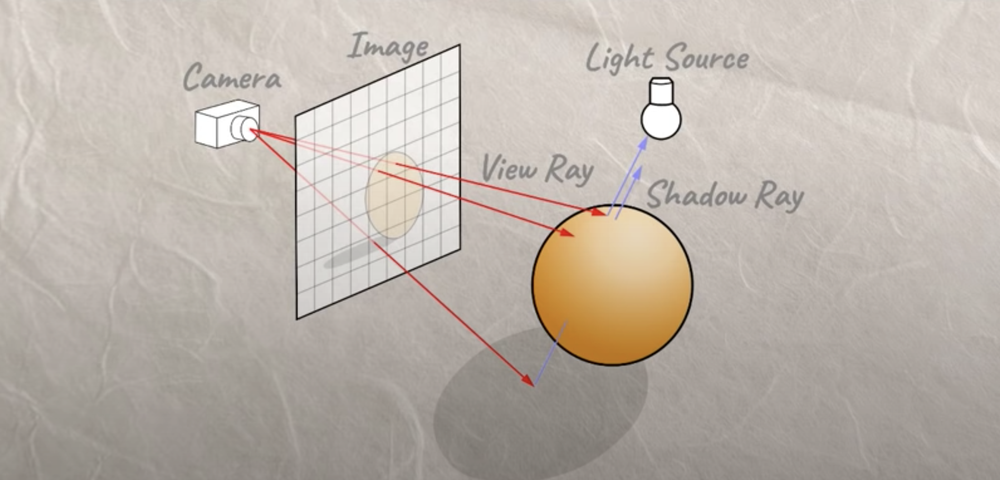
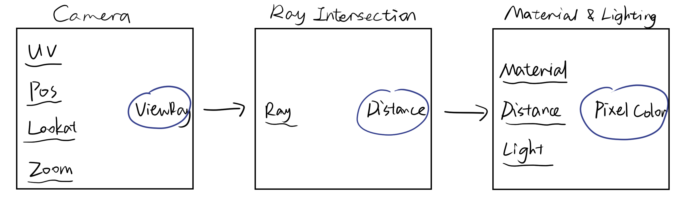
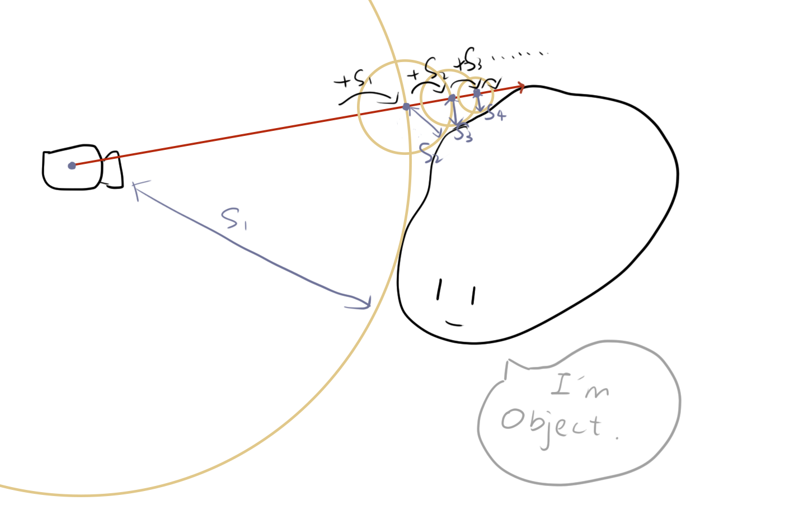
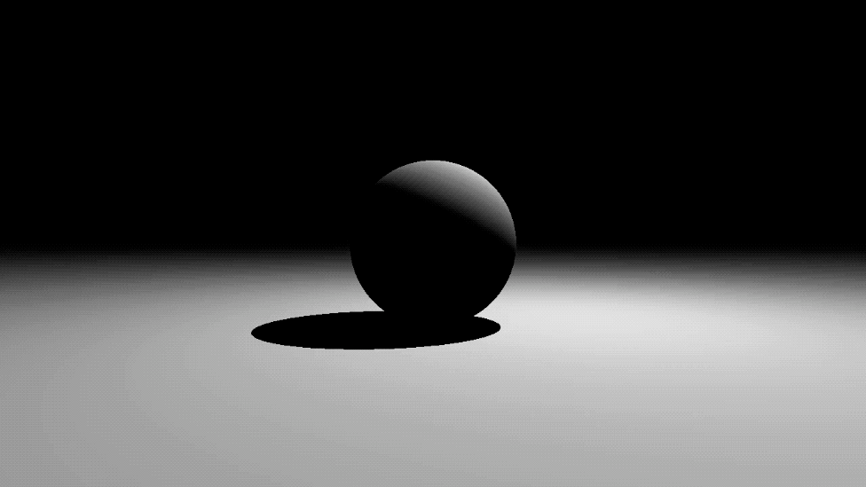

<br/>

### Ray Marching

在Shadertoy里只处理片元着色器，输入FragCoord，通过自己的操作输出该点的颜色值，因此处理3d物体必须用到Ray Marching。

如图所示：



 

连接摄像机和像素点，向前延伸，和物体求交点，符合相交条件则进行处理，利用distance去计算该点上的颜色。





光线步进的大概原理如下：



```glsl
float RayMarch(vec3 ro, vec3 rd)
{
    float dO = 0.;

    for (int i = 0; i < MAX_STEPS; i++)
    {
    	vec3 p = ro + dO * rd;
    	float dS = GetDist(p);
    	dO += dS;
    	if (dS < SURF_DIST || dO > MAX_DIST) break;
    }

    return dO;
}
```


<br/>

<br/>

用`RayMarch()`函数获取步进距离d，计算出当前像素点所在的世界坐标p，接着用`GetLight()`函数就可以进行颜色计算辣。

```glsl
vec3 ro = vec3(0, 1, 0); // Camera
vec3 rd = normalize(vec3(uv.x, uv.y, 1)); // Light direction

float d = RayMarch(ro, rd);
vec3 p = ro + rd * d;

vec3 col = vec3(GetLight(p, ro));

fragColor = vec4(col, 1.0);
```


<br/>

值得一提的是在`GetLight()`里可以计算阴影，方法就是从当前点沿着光线方向再进行一次RayMarch，得到距离值d，如果d小于像素点到光源的距离，则说明从光源到该点之间有物体遮挡，即该点处于阴影中。

```glsl
float d = RayMarch(p + n * SURF_DIST * 2., l);
if (d < length(lightPos - p)) return 0.;
```

<br/>

球体示例（[源码](https://github.com/Friedsoda/ShaderToys/blob/main/sphere.glsl)）




<br/>

<br/>


### 简单物体

